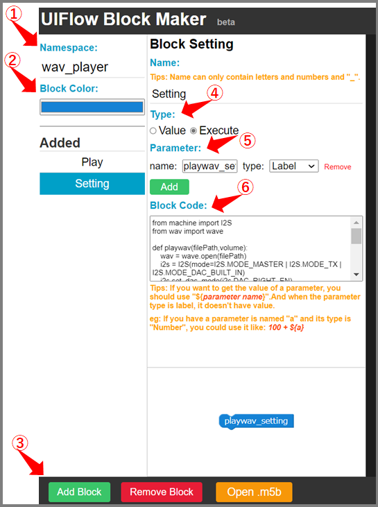
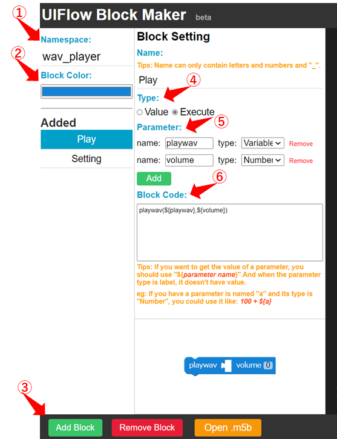

Title: M5Stack UIFLOWのカスタムブロックを作る
Tag: M5Stack
layout: /_tils_layout.cshtml
RedirectFrom: posts/20210823-UIFLOW-CustomBlock
---

2021/08/23
# M5Stack向けのVisual Programming「UIFLOW」でカスタムブロックを作成する

---

## M5Stackについて

&nbsp;
← M5Stackはこんなやつ。  

M5Stackとは、ESP32を使用しwifi/LCD/各種センサなどを一体化させた、使いやすいマイコンボードです。  
LCDが標準装備なのが一番の特徴かと思います。  
センシングした値を表示させたり、顔をつけてみたりと、いろいろ遊べます。

参考　<span class="link"></span>[公式HP](https://m5stack.com/)  

## UIFLOWについて

UIFLOWとは、M5Stackのプログラミング環境の一つで、スクラッチのようにビジュアルプログラミングでM5Stackのコードが書ける優れものです。  
更にwebベースでプログラミングできるので、プログラム環境の準備がお手軽です。  
使い方、プログラミングの仕方などは下記のHPを参照ください。

参考1 <span class="link"></span> [公式HP](https://m5stack.github.io/UIFlow_doc/ja/)  
参考2 <span class="link"></span> [プログラミングページ](https://flow.m5stack.com/)

<br>

UIFLOWでは、事前に用意されたブロックを組み合わせてプログラミングしますので、ブロックに用意されていない機能は、自分でカスタムブロックを作る必要があります。  
以降、UIFLOWでカスタムブロックを作成する方法を記載しています。

## カスタムブロックのサンプル

<span class="link"></span> [github](https://github.com/yamaccu/UIFLOW-wavplayer)にWAVファイルを再生するためのカスタムブロックをあげています。

## カスタムブロックの作成手順

<span class="link"></span> [こちらのカスタムブロック作成ページ](http://block-maker.m5stack.com/)から作成します。

作成手順は

1. Pythonでプログラムを書く
2. 初期設定用のブロックを作る
3. 関数を実行するブロックを作る

### 1. Pythonでプログラムを書く
まずはブロック化したい機能のプログラムをpythonで書きます。  
処理は関数にして呼び出しできるようにしておきます。

### 2. 初期設定用のブロックを作る
import、defを行うブロックを作成します。  
このブロックは最初のsetupで実行するものです。  

<div style="display:flex;flex-wrap:wrap">
<div>
  
<br>
<br>
</div>
<div Style="max-width:450px;">

1. NameSpace：Blockmaker上だけの識別名なので何でもOK
2. BlockColor：ブロックの色を設定
3. Add Block/Remove Block：ブロックの追加・削除
4. Type：Executeにする
5. Parameter：まずブロック名をtype:Labelで設定する  
   変数があれば、type:String/Number/Variableで設定する
6. BlockCode：作ったプログラムをコピペ

</div>
</div>

### 3. 関数を実行するブロックを作る
defで定義した関数を実行するブロックを作ります。  
Add Blockをクリックするとブロックが増えますので、設定していきます。  
引数がある場合は、parameterで設定します。

<div style="display:flex;flex-wrap:wrap">
<div>
  
<br>
<br>
</div>
<div Style="max-width:450px;">

1. NameSpace：Blockmaker上だけの識別名なので何でもOK
2. BlockColor：ブロックの色を設定
3. Add Block/Remove Block：ブロックの追加・削除
4. Type：Executeにする
5. Parameter：まずブロック名をtype:Labelで設定する  
   変数があれば、type:String/Number/Variableで設定する
6. BlockCode：自作関数の呼び出しを行う  
   引数は上記のParameterで設定して、  
   BlockCode内で"\$(hoge)"の形で記述する  

```C#
ex)playwav(${playwav},${volume})
```
</div>
</div>

### 完成したら

ページ右下のDownloadボタンをおして、DownloadファイルをUIFLOWの<span class="link"></span>[プログラミングページ](https://flow.m5stack.com/)のCustomから開きます。  
そうすると、UIFLOWで自作のカスタムブロックが使用できるようになります。


<br>
<br>
  

<br>
<br>

---