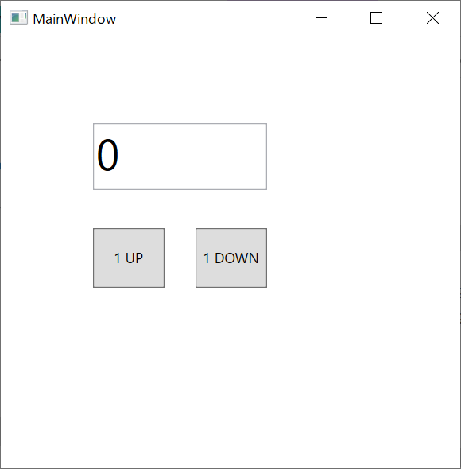
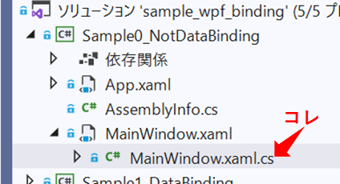

Title: C# WPFでBindingを使う
Published: 9/16/2021
Tag: Csharp/WPF
layout: /_tils_layout.cshtml
RedirectFrom: posts/20210916-Csharp-WPFBinding
---

2021/09/16

# WPFでBindingを使用する

---

WPFは、Windows上で動作するGUIアプリケーションを作成できるフレームワークです。  
ToDoリストを管理する、ボタンを押すとTCP/IPでデータを送信する、など様々なGUIアプリが作成可能です。  
画面はxaml、処理部はC#で作成します。  

WPFの特徴の一つとして「Bindingを使用した画面部と処理部の分離」があげられます。  
分離により管理が容易になったり、処理部でのテストが用意になったりといったメリットがあります。

以降、WPFでBindingを使用する方法について記載しています。


## 準備
開発環境はVisualStudioを使用します。  
VisualStudioのインストールおよびWPFのHello Worldまではこちらを参考にしてください。

<span Class="link"></span> [チュートリアル: C# で単純なアプリケーションを作成する](https://docs.microsoft.com/ja-jp/visualstudio/get-started/csharp/tutorial-wpf?view=vs-2019)


## 今回作成したGUIアプリ
今回、Bindnigの確認用に、以下のアプリを作成しました。 
- 数字の0が初期値で表示されているテキストボックス
- 数字を＋１するボタン
- 数字を－１するボタン  


  

<br>
<br>

このアプリを、5つの実装方法で作成していきます。

1. Bindingなし（コードビハインドにべた書き）
2. DataBindingを実装
3. DataBindingとCommandBindingを実装
4. CommandBindingを少しスマートに実装（Delegate使用）
5. ReactivePropertyを使用

作ったアプリはGithubに上げています。  
<span Class="link"></span> [github](https://github.com/yamaccu/WPF-BindingSample)   


## 1. Bindingなし
コードビハインドに処理を記述します。  
コードビハインドとは、xaml.csファイルのことです。  

  

<br>
<br>

<span Class="cbtitle">*MainWindow.xaml*</span>
```C# MainWindow.xaml
<Button Content="1 UP" Click="OneUp_Click"/>
<Button Content="1 DOWN" Click="OneDown_Click"/>
<TextBox x:Name="Counter" Text="0" />
```

<br>

<span Class="cbtitle">*MainWindow.xaml.cs(コードビハインド)*</span>
```C#
private void OneUp_Click(object sender, RoutedEventArgs e)
{
  var numValue = Convert.ToString(Convert.ToInt32(Counter.Text) + 1);
  Counter.Text = numValue;
}

private void OneDown_Click(object sender, RoutedEventArgs e)
{
  var numValue = Convert.ToString(Convert.ToInt32(Counter.Text) - 1);
  Counter.Text = numValue;
}
```

<br>

これで完了です。  
これは直観的でわかりやすいかなと思います。


## 2. DataBindingを実装
1から、TextBoxの数値をBindingに変更します。  
MainWindow.xaml（画面部）とViewModel.cs（処理部）の間でBindingします。  

<br>

&nbsp;  


### 2-1. DataContextの設定


Bindingするためには、まずDataContextの設定が必要です。  
DataContextとは、画面部のコントロールのBinding値と処理部の変数を紐づけをしてくれるプロパティです。  

設定方法は、まずはViewModel.csというファイルを作成します。  
（作成するファイル名は何でもいいですが、MVVMモデルに沿ってViewModel.csという名前が良く使われます。）  
その後、MainWindow.xamlのデータコンテキストにViewModelを設定します。  

<br>

<span Class="cbtitle">*MainWindow.xaml.cs*</span>
```C#
ViewModel viewModel = new ViewModel();

public MainWindow()
{
  InitializeComponent();
  // データコンテキストの設定
  DataContext = viewModel;
}
```


### 2-2. xaml側のコード実装
TextBoxのTextに変数をBindigします。  
ここでは、"Counter"という名前の変数とします。

<span Class="cbtitle">*MainWindow.xaml*</span>
```C#
<TextBox Text="{Binding Counter}"/>
```


### 2-3. ViewModel側のコード実装
Bindingした変数と同じ"Counter"という名前の変数を宣言します。  

次に、ViewModelBaseクラスを作成します。  
これは最初は、必ずコピペする定型処理、と覚えてしまって大丈夫です。  

ViewModelクラスにViewModelBaseクラスを継承して、変数"Counter"のSetterに”RaisePropertyChanged("Counter")”を入れます。  
これで、"Counter"の値が変更になったときに、変更をxaml側に反映できるようになります。  


<span Class="cbtitle">*ViewModel.cs*</span>
```C#
public class ViewModel : ViewModelBase
{
  private string counter = "0";
  public string Counter
  {
    get { return counter; }
    set
    {
      counter = value;
      RaisePropertyChanged("Counter");
    }
  }
}

public class ViewModelBase : INotifyPropertyChanged
{
  public event PropertyChangedEventHandler PropertyChanged;
  protected virtual void RaisePropertyChanged(string propertyName)
  {
    var h = this.PropertyChanged;
    if (h != null)
      {
        h(this, new PropertyChangedEventArgs(propertyName));
      }
  }
}
```

<br>

以上で、DataBindingは完了です。  
ViewModel.csの"Counter"の値が変わると、画面のTextboxの数値も変更されるようになりました。  

<br>

※ 変数"Counter"をViewModel.csの方で宣言しているので、
クリックイベントの処理もViewModel.csの方へ移しておきます。

<label Class="cbtitle">*MainWindow.xml.cs（コードビハインド）*</span>
```C#
private void OneUp_Click(object sender, RoutedEventArgs e)
{
  viewModel.OneUp();
}

private void OneDown_Click(object sender, RoutedEventArgs e)
{
  viewModel.OneDown();
}
```

<br>

<span Class="cbtitle">*ViewModel.cs*</span>
```C#
public void OneUp()
{
  var numValue = (Convert.ToString(Convert.ToInt32(Counter) + 1));
  Counter = numValue;
}

public void OneDown()
{
  var numValue = (Convert.ToString(Convert.ToInt32(Counter) - 1));
  Counter = numValue;
}
```


## 3. DataBindingとCommandBindingを実装
2から、ボタンをクリックしたときのイベント処理もBindingに変更します。  
CommandBindingもDataContextの設定は必須です。 

<br>

&nbsp;  

<br>
<br>

### 3-1. ICommandについて
CommandBindingにはICommandインターフェースを使用します。  
これでないと画面部と処理部の間をBindingできません。

ICommandインターフェースは3つのメンバがいます。  
継承先クラスにはこれらを実装する必要があります。

```C#
public interface ICommand
{
  event EventHandler CanExecuteChanged;
  bool CanExecute(object parameter);
  void Execute(object parameter);
}
```

- Executeメソッド：コマンド実行
- CanExecuteメソッド：コマンドの実行可否の状態
- CanExecuteChangedイベント：コマンドの実行状態が変化したことを通知するイベント


### 3-2. xaml側のコード実装
ボタンのClickイベントは削除して、Commandプロパティに変数をBindingします。

<span Class="cbtitle">*MainWindow.xaml*</span>
```C#
<Button Content="1 UP" Command="{Binding OneUpCommand}" />
<Button Content="1 DOWN" Command="{Binding OneDownCommand}"/>
```


### 3-2. ViewModel側のコード実装
ICommandで変数を宣言します。  
その後、コンストラクタでICommand変数に処理を登録します。

<span Class="cbtitle">*ViewModel.cs*</span>
```C#
public ICommand OneUpCommand { get; set; }
public ICommand OneDownCommand { get; set; }

public ViewModel()
{
  OneUpCommand = new OneUpCommandImpl(this);
  OneDownCommand = new OneDownCommandImpl(this);
}
```

<br>

処理の実態のコード（上でいうOneUpCommandImpl）には、ICommandを継承します。

<span Class="cbtitle">*ViewModel.cs*</span>
```C#
public class OneUpCommandImpl : ICommand
{
  public OneUpCommandImpl(ViewModel viewmodel)
  {
    vm = viewmodel;
  }
  private ViewModel vm;
  public bool CanExecute(object parameter)
  {
    return true;
  }
  public event EventHandler CanExecuteChanged;

  //処理の実体
  public void Execute(object parameter)
  {
    vm.OneUp();
  }
}
```

<br>

OneDownの方も同じように記述します。  
これで、画面部のボタンをクリックするとOneUp/OneDownの処理が実行されるようになりました。


## 4. CommandBindingを少しスマートに実装（Delegate使用）
3は、CommandBindingごとにICommandインターフェースを実装しないといけないので、コード量が増えてくると煩雑になります。  
デリゲードを使用することで少しすっきり記述することができます。

下記のようなICommandを継承したCommandクラスを作成します。  
作ったCommandクラスの中にActionデリゲードがあって、インスタンス化時にActionに処理を登録するようにします。  

<span Class="cbtitle">*ViewModel.cs*</span>
```C#
public class Command : ICommand
{
  private Action execute;
  private bool canExecute = true;

  public Command(Action execute)
  {
    this.execute = execute;
  }

  public void Execute(object parameter)
  {
    execute();
  }

  public bool CanExecute(object parameter)
  {
    return canExecute;
  }

  public void SetCanExecute(bool canExecute)
  {
    this.canExecute = canExecute;
    if (CanExecuteChanged != null)
    {
      CanExecuteChanged(this, EventArgs.Empty);
    }
  }

  public event EventHandler CanExecuteChanged;
}
```

<br>

ViewModelのコンストラクタは以下のようになります。

<span Class="cbtitle">*ViewModel.cs*</span>
```C#
public ViewModel()
{
  OneUpCommand = new Command(OneUp);
  OneDownCommand = new Command(OneDown);
}
```

<br>

これで、画面部のボタンをクリックするとOneUp/OneDownの処理が実行されます。


## 5. ReactivePropertyを使用
ReactivePropertyとは、Bindingを補佐してくれるライブラリです。  
nugetからインストール可能です。  
2~4で記載してきたBindingのコードを大幅に削減することができます。

以下のリンクも参考にしてください。

参考1<span class="link"></span> [公式](https://github.com/runceel/ReactiveProperty)  
参考2<span class="link"></span> [qiita ReactiveProperty全然分からねぇ！って人向けのFAQ集](https://qiita.com/YSRKEN/items/5a36fb8071104a989fb8)


### 5-1. メモリリーク対策

PropertyChangedを実装しないと、ViewModelが破棄されずにメモリリークするとのことです。  
以下のコードは必ず実行してください。

<span Class="cbtitle">*ViewModel.cs*</span>
```C#
class ViewModel : INotifyPropertyChanged
{
  public event PropertyChangedEventHandler PropertyChanged;
　　・・・
}
```

参考<span class="link"></span> [【WPF】ViewModelがINotifyPropertyChangedを実装していないとメモリリークする件](https://aridai.net/articles/15.html)


### 5-2. DataBinding

変数"Counter"は以下のように宣言します。  
RaisePropertyChangedは不要です。

<span Class="cbtitle">*ViewModel.cs*</span>
```C#
public ReactiveProperty<string> Counter { get; set; } 
      = new ReactiveProperty<string>("0");
```

<br>

"Counter"の値を変更するには、Valueプロパティに値を入れます。

<span Class="cbtitle">*ViewModel.cs*</span>
```C#
private void OneUp()
{
  var numValue = (Convert.ToString(Convert.ToInt32(Counter.Value) + 1));
  Counter.Value = numValue;
}
```

<br>

MainWindow.xamlの"Counter"も、Valueプロパティにします。

<span Class="cbtitle">*MainWindow.xaml*</span>
```C#
<TextBox Text="{Binding Counter.Value}"/>
```

<br>

これで、"Couter"の値の変更が画面に反映されるようになりました。  
とてもシンプルになります。


### 5-3. CommandBinding

Commandは以下のように宣言します。

<span Class="cbtitle">*ViewModel.cs*</span>
```C#
public ReactiveCommand OneUpCommand { get; set; } = new ReactiveCommand();
public ReactiveCommand OneDownCommand { get; set; } = new ReactiveCommand();
```

<br>

処理の登録は、下記のようにします。  
Subscribeに処理を登録することで、ボタンを押したときに登録した処理が実行されるようになります。  
ICommandとか不要です。

<span Class="cbtitle">*ViewModel.cs*</span>
```C#
public ViewModel()
{
  OneUpCommand.Subscribe(_ => OneUp());
  OneDownCommand.Subscribe(_ => OneDown());
}
```
<br>

これで、ボタンを押したときに処理が実行されるようになりました。  
こちらもとてもシンプルです。


## 終わりに
1~5のサンプルを見て、実は1のコードビハインドに書くやり方が最もシンプルかつ直観的でわかりやすいと感じるかと思います。  
しかし、少し複雑なアプリになってくると、画面部と処理部を分離した方が可読性がよく、修正もしやすくなってきます。  

ササっと簡単なアプリを作る際はコードビハインドを使ってしまうことがありますが、なるべくBindingしていく方が長い目で見たときに良い結果になるかと思います。

<br>

以上です。  
<br>

---


