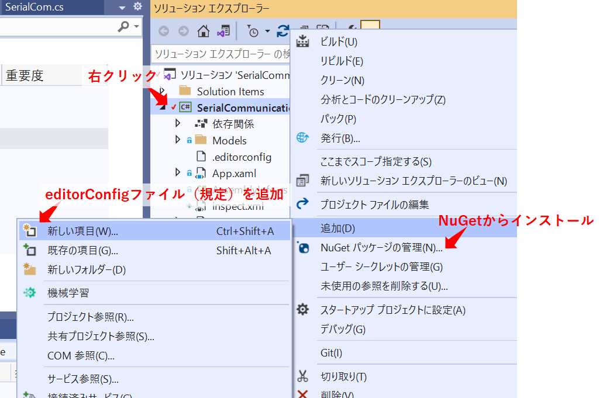
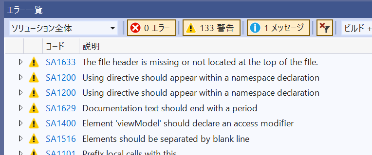
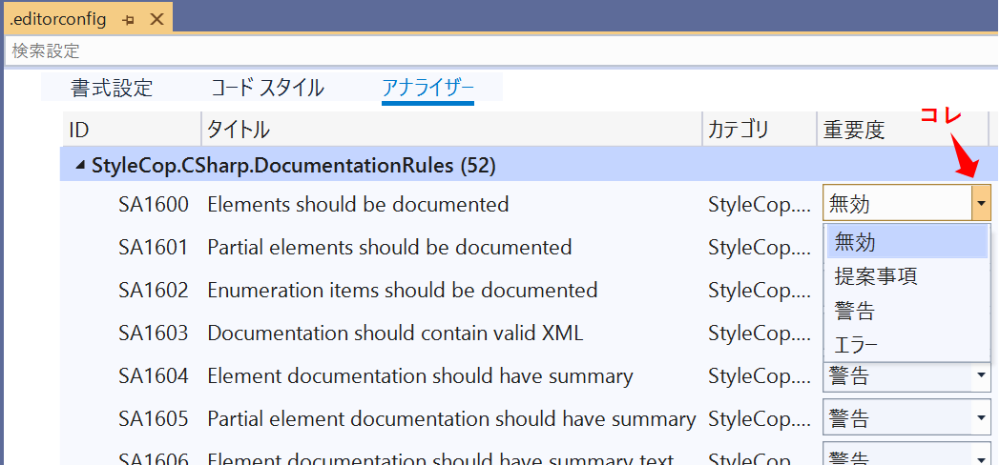

Title: C# StyleCop Analyzersを使う
Tag: Csharp/ツール
layout: /_tils_layout.cshtml
RedirectFrom: posts/20210925-Csharp-StyleCop
---

2021/09/25

# C#のコードスタイルチェックツール「StyleCop Analyzers」を使う

---

StyleCop Analyzersとは、Visual Studioのツールで、C#のコードを分析し、コーディングルールから逸れた記述をリアルタイムに指摘してくれるものです。  
書き方の統一ができるので、見た目が統一され読みやすいコードを書けるようになります。  
また、チームでコーディングする際も導入することで、コードの書き方の個人差を減らすことができます。

StyleCop Analyzersはオープンソースです。  
プロジェクトのURLは下記になります。  
 [StyleCopAnalyzers](https://github.com/DotNetAnalyzers/StyleCopAnalyzers)

 

導入も簡単で、気軽に使用できます。  
以降、StyleCop Analyzersの使い方についてまとめています。

## 準備
Visual StudioのNuGetからインストールしたら、すぐに使うことができます。  

コーディングルールの編集はeditorconfigファイルで行います。  
ファイルの追加方法は、ソリューションを右クリック→追加→新しい項目で、editorConfigファイル（規定）を追加します。

  

## 警告内容の確認

エラー一覧ウィンドウに警告が表示されます。  
エラーコードをクリックすると、エラーの詳細ページに飛ぶことができます。

  

## 警告を出ないようにする

警告の種類はかなり多く、中には不要なものも存在します。  

例えば、SA1200のエラーは、「Usingディレクティブは名前空間の中に書く」という指摘ですが、外に書いてあるものがほとんどで、Microsoftのデフォルトプロジェクトなどでも外に書いてあります。  
（SA1200　Using directive should appear within a namespace declaration）

準備の項目で作った.editorconfigファイルをVisual Studio上で開くと、このような不要な警告を出なくすることができます。

  

## 個人的に無効にした方がよさげな警告

※適宜追加していきます。

- SA1101　クラスメンバの呼び出しには必ずthisをつける
- SA1200　Usingディレクティブは、名前空間宣言の中に記述
- SA1629　コメントの末尾にピリオドがない
- SA1633　ファイルのトップにファイルヘッダ（作者とか会社名とか書くやつ）がない

 

---
