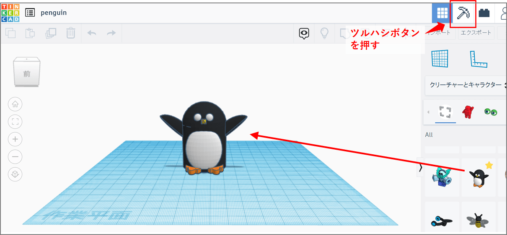
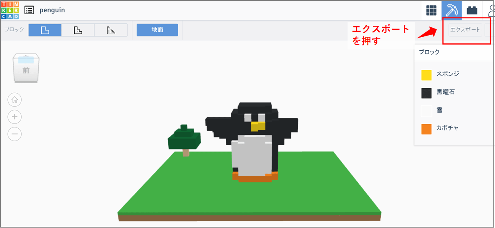
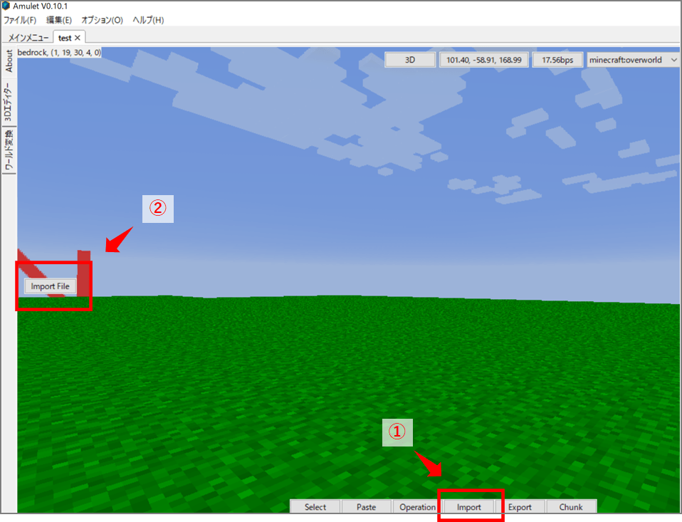
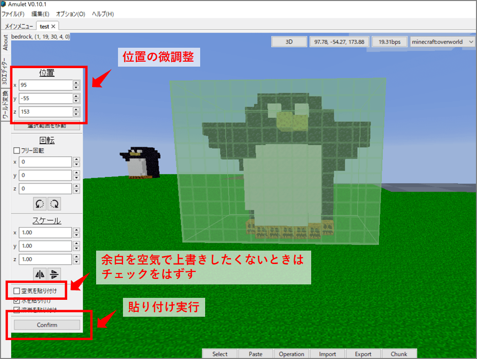
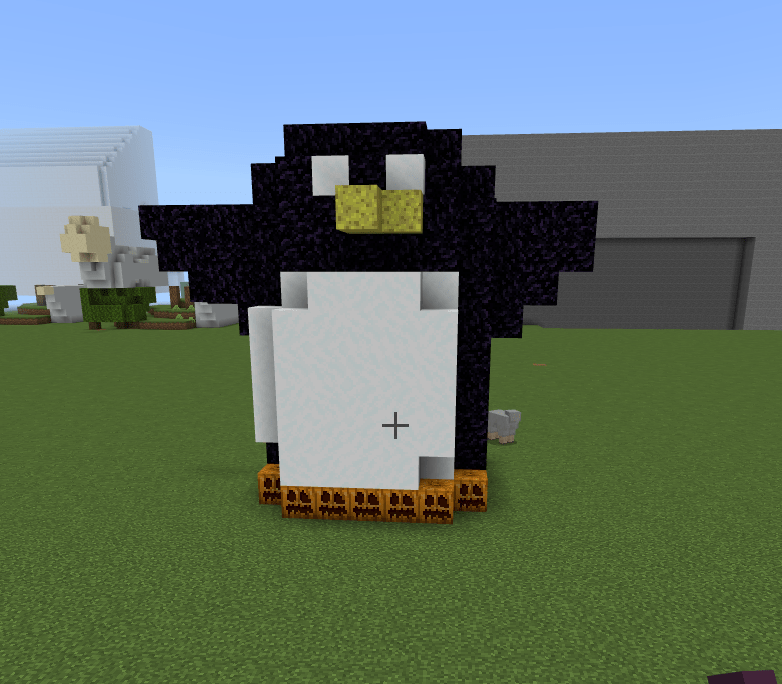
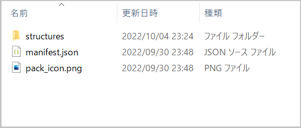
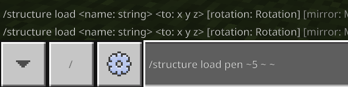
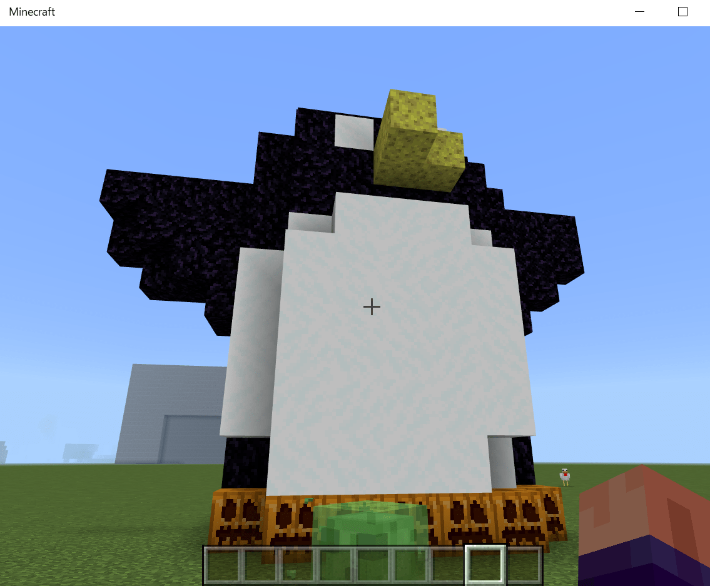

Title: Tinker CADのデータをマイクラ統合版にインポート
Date: 2022/10/5
tag: TinkerCad
Image: /img/20221005_minecraft-3DCAD-4.png
description: Tinker CADで作成した3D CADデータをマイクラ統合版に取り込みます
IndexTitle: 3D CADデータのインポート
---


2022/10/5

# Tinker CADで作った3Dデータをマイクラ統合版にインポートする

---

子供が最近、3D CADのお絵描きにはまっていて自分の家とかを作っているのですが、  
Tinker CADというフリーの3D CADソフトを使うと、3Dデータをマインクラフトのワールドに取り込むことができます。  

以下、方法をまとめています。  
自分で作ったデータがマイクラの世界で再現されると、面白いですよ。  

## 1. Tinker CADにサインアップする

以下のサイトにアクセスして、右上の「サインアップ」から新規登録します。  

<a href="https://www.tinkercad.com/" style="text-decoration: none;"><div class="link-box"><div class="img-box"><div style="background-image: url('https://www.tinkercad.com/img/tinkercad-logo.png');"></div></div><div class="text-box"><p class="title">Tinkercad | From mind to design in minutes</p><p class="description">Tinkercad is a free, easy-to-use app for 3D design, electronics, and coding.</p></div></div></a>


## 2. 3Dデザインを作る

3Dデザインを新規作成します。  
作業画面が出てきたら、マイクラにインポートしたいものを作ります。  
右側にあるシェイプから、面白そうなものを選んでんも良いと思います。  

ペンギンのシェイプをコピーして、右上のマイクラツルハシボタンを押すと  
&nbsp;&nbsp;

マイクラの形状になります。右上のエクスポートボタンを押すと.schematicファイルが出力されます。  
&nbsp;&nbsp;

## 3. マイクラにインポートする

上記の手順でエクスポートされる.schematicファイルは、マイクラJAVA版向けのファイル形式なので、マイクラ統合版にそのままインポートできません。  
マイクラ統合版にインポートするには、調べたところ2通りの方法があります。  


### 3-1. Amulet editor というフリーソフトを使う

PC限定ですが、Amulet editorというワールド編集アプリを使用すると、.schematicファイルを読み込んでマイクラ統合版のワールドに配置することができます。  

<a href="https://www.amuletmc.com/" style="text-decoration: none;"><div class="link-box"><div class="img-box"><div style="background-image: url('https://static.wixstatic.com/media/048dc9_85ff7d61ff44477192ed6293f27de48f~mv2.png/v1/fill/w_2500,h_962,al_c/048dc9_85ff7d61ff44477192ed6293f27de48f~mv2.png');"></div></div><div class="text-box"><p class="title">Amulet Editor</p><p class="description">Amulet Map Editor is a Minecraft map editor made by the Amulet Team, a team created by MCEdit-Unified contributers.</p></div></div></a>

ダウンロードして実行すると、下のようにワールドマップを開くことができますので、importボタンを押します。  
&nbsp;&nbsp;

.schematicファイルを選択すると、下記のように貼り付けることができます。  
位置ウィンドウで、位置の微調整ができます。（地面に埋まってたりする時は、y座標をプラスします）  
また、回転や拡大なども設定できます。  
余白を空気ブロックで上書きしたくないときは、空気を貼り付けのチェックをはずします。  
&nbsp;&nbsp;

上記の作業後にマイクラを起動してワールドに行くと、こんな感じでデータが配置されていると思います。  
&nbsp;&nbsp;


## 3-2. アドオンを作成してインポートする

.schematicファイルを、統合版向けの.mcstructureファイルに変換し、アドオンに組み込んでマイクラにインポートすると、/structure loadのコマンドで3Dデータを呼び出すことができます。  
こちらの方法であれば、PC版でも携帯版でも両方で使うことができます。  
以下、アドオンの作り方を説明します。  

### ① アドオンの元ファイルをダウンロードする  

以下のページの最下段の「バニラ　ビヘイビアーパック」をダウンロードします。  

<a href="https://learn.microsoft.com/ja-jp/minecraft/creator/" style="text-decoration: none;"><div class="link-box"><div class="img-box"><div style="background-image: url('https://learn.microsoft.com/en-us/media/logos/logo-ms-social.png');"></div></div><div class="text-box"><p class="title">Minecraft: Bedrock Edition クリエイター ドキュメント</p><p class="description">アドオンを使用して Minecraft に MOD を入れる方法を学びましょう。 スキンを作成したり、ユニークな体験を設計したり、最新機能を入手したりしながら、Minecraft のクリエイターとしてスキルを磨いていくことができます。</p></div></div></a>  

### ② structuresフォルダを作成する  

ダウンロードしたファイルを解凍し、内部のフォルダは全部削除します。  
新たに「structures」フォルダを作成します。  

  
<br>

### ③ .schematicファイルを.mcstructureに変換して、structuresフォルダに保存する

変換するアプリは以下を使用できます。  
アプリを使って生成した.mcstructureファイルを上記のstructuresフォルダに保存します。  

<a href="https://github.com/yamaccu/Minecraft-SchematicToMcstructure" style="text-decoration: none;"><div class="link-box"><div class="img-box"><div style="background-image: url('https://opengraph.githubassets.com/4f9b88def71d78d01afd219655ea1cc2e61c283effee50086998adcb6ede6246/yamaccu/Minecraft-SchematicToMcstructure');"></div></div><div class="text-box"><p class="title">GitHub - yamaccu/Minecraft-SchematicToMcstructure</p><p class="description">JAVA版のストラクチャーデータ（.Schematic）を、BE版のストラクチャーデータ（.mcstructure）に変換するプログラム</p></div></div></a>  

### ⑥ UUIDを変更する

アドオンにはUUIDというものがあり、ビヘイビアーパック内のmanifest.jsonファイル内に設定箇所があります。    
以下のサイトで取得することができます。  


<a href="https://www.uuidgenerator.net/" style="text-decoration: none;"><div class="link-box"><div class="img-box"><div style="background-image: url('https://yamaccu.github.io/img/20221005_minecraft-3DCAD-10.png');"></div></div><div class="text-box"><p class="title">Online UUID Generator</p><p class="description"></p></div></div></a>  

manifest.jsonを開いて、下記の2か所のUUIDを取得した値に書き換えます。  
"dependencies"の項目は不要なので消してしまいます。  
（上記ページをリロードすると新しいUUIDが表示されますので、2 ID取得します。）  

  

ちなみに、headerの項目の下の、descriptionを変えるとマイクラ内でのアドオンの説明文を、  
nameの項目を変えるとマイクラで呼び出すときのパック名称が変更できます。  


### ⑤ zip圧縮して、拡張子をzip⇒mcpackに変更する

ビヘイビアーパックをzipファイルに圧縮して、拡張子をzip⇒mcpackに変更します。  
（windowsであれば、右クリック⇒圧縮⇒zipで圧縮できます。）  

  

### ⑥ 実行する

PC、android携帯に⑤で作成したmcpackファイルをコピーして実行すれば、インポート完了です。  
アドオンを有効にして以下のコマンドを実行すれば、3Dデータがマイクラワールドに出現します。  

```C#
/structure load <ファイル名> ~5 ~ ~
```

<br>
  

<br>


## （おまけ）他の3D CADデータをマイクラへインポートする

Tinker CADで読み込める3Dデータであれば、他のCADデータもTinker CAD経由でマイクラへインポートできます。  
Tinker CADは.stl、.obj、.svgファイルを読み込むことができます。  

※ただし、読み込みデータは全体を1ブロックと認識するようで、一部分を違うブロックに変えたりといった操作はできないようです。 

以下は、SketchUpという3D CADのデータをTinker CAD経由でマイクラにインポートしています。  

<div style="width:100%; max-width:350px;">
<blockquote class="twitter-tweet"><p lang="ja" dir="ltr">息子が作った3Dファイルをマイクラにインポートしてみました。結構たのしい。色々インポートして遊べるかな。<a href="https://twitter.com/hashtag/%E3%83%9E%E3%82%A4%E3%83%B3%E3%82%AF%E3%83%A9%E3%83%95%E3%83%88?src=hash&amp;ref_src=twsrc%5Etfw">#マインクラフト</a> <a href="https://twitter.com/hashtag/%E3%83%9E%E3%82%A4%E3%82%AF%E3%83%A9?src=hash&amp;ref_src=twsrc%5Etfw">#マイクラ</a> <a href="https://t.co/E0MIY0Dx5M">pic.twitter.com/E0MIY0Dx5M</a></p>&mdash; やまっく (@YY87750722) <a href="https://twitter.com/YY87750722/status/1577315572966363136?ref_src=twsrc%5Etfw">October 4, 2022</a></blockquote> <script async src="https://platform.twitter.com/widgets.js" charset="utf-8"></script>
</div>

<br>

## マインクラフトの購入先

マインクラフトはアマゾンで購入できます。  
最近、JAVA版と統合版がワンパッケージになったようで、購入すると両方プレイができます。  

<!-- START MoshimoAffiliateEasyLink -->
<script type="text/javascript">
(function(b,c,f,g,a,d,e){b.MoshimoAffiliateObject=a;
b[a]=b[a]||function(){arguments.currentScript=c.currentScript
||c.scripts[c.scripts.length-2];(b[a].q=b[a].q||[]).push(arguments)};
c.getElementById(a)||(d=c.createElement(f),d.src=g,
d.id=a,e=c.getElementsByTagName("body")[0],e.appendChild(d))})
(window,document,"script","//dn.msmstatic.com/site/cardlink/bundle.js?20220329","msmaflink");
msmaflink({"n":"Minecraft (マインクラフト): Java \u0026 Bedrock Edition | オンラインコード版","b":"マイクロソフト","t":"","d":"https:\/\/m.media-amazon.com","c_p":"\/images\/I","p":["\/51BKnFRzWYL._SL500_.jpg","\/51i8VAIlmJL._SL500_.jpg","\/41aEk6RsfjL._SL500_.jpg","\/51kL8WFwl2L._SL500_.jpg","\/41DJcerCroL._SL500_.jpg","\/51JGdCj3tTL._SL500_.jpg"],"u":{"u":"https:\/\/www.amazon.co.jp\/dp\/B0B3R5PL2Y","t":"amazon","r_v":""},"v":"2.1","b_l":[{"id":2,"u_tx":"Amazonで見る","u_bc":"#f79256","u_url":"https:\/\/www.amazon.co.jp\/dp\/B0B3R5PL2Y","a_id":2991341,"p_id":170,"pl_id":27060,"pc_id":185,"s_n":"amazon","u_so":1}],"eid":"TXkHv","s":"s"});
</script>
<div id="msmaflink-TXkHv">リンク</div>
<!-- MoshimoAffiliateEasyLink END -->

## さいごに

マイクラはただ遊ぶだけでなく、こういうクリエイティブ要素が多分に含まれているので、工夫次第で少し高度に楽しむことができます。  
子供と一緒にやっていますが、遊びながらITリテラシーが高まってきており、いい感じです。  
是非、3D CADと合わせて試してみて下さい。  

<br>

以上です。

<br>
<br>

---
