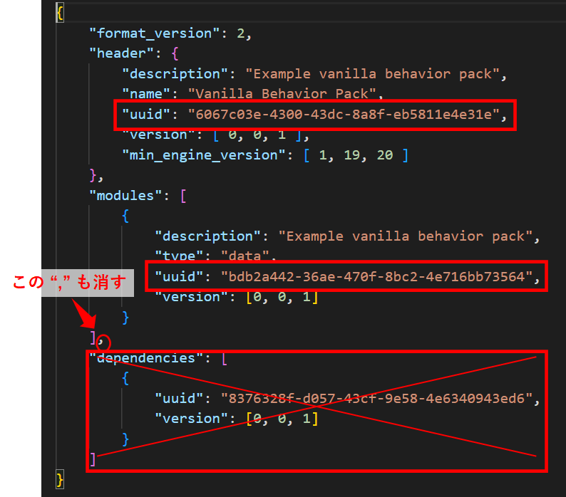
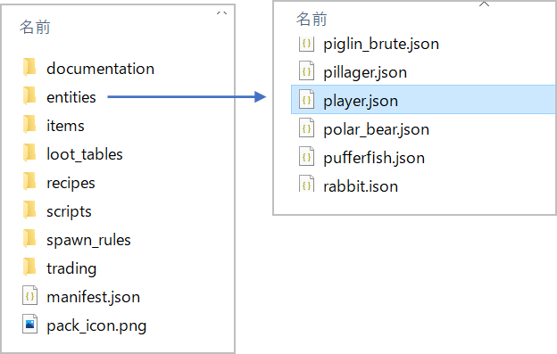
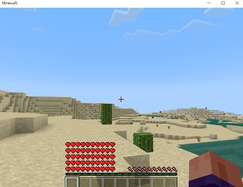
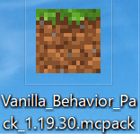

Title: マイクラ統合版（BE）のアドオンの作り方② プレイヤー強化
Date: 2022/10/24
tag: addon
Image: /img/20221021-minecraft-addon1-1.png
description: マイクラ統合版のアドオンで、プレイヤーを強化する方法をまとめています。
IndexTitle: アドオン作成② プレイヤー強化
---


2022/10/24


# マイクラ統合版のアドオンを作る② プレイヤー強化編

---

マイクラ統合版のアドオン作成方法の2回目です。  

1. [アドオンを作るための準備](https://yamaccu.github.io/minecraft/20221021_minecraft-addon1) <span class="link"></span>
2. アドオンでプレイヤーを強化　　←今ここ
3. 作成中・・・

## 概要

今回は、ビヘイビアパックの中にあるentitiesのplayer.jsonファイルを修正して、プレイヤーを強化してみます。  
以下の手順で説明しています。  

* ビヘイビアパックのバニラを入手する
* manifest.jsonファイルのUUIDを修正する
* player.jsonファイルを修正する
* マインクラフトに適用する

<br>

↓パンチ一発でエンダードラゴンを倒せるようになります。

<video src="../video/20221024-minecraft-addon2-1.mp4" style="width:100%;" controls></video>

## ビヘイビアパックのバニラを入手する

以下のページから、ビヘイビアパックのバニラをダウンロードします。  
一番下からダウンロードできます。  

バニラとは、アドオンのベースとなるデータで、これを編集してアドオンを作っていきます。  

<a href="https://learn.microsoft.com/ja-jp/minecraft/creator/" style="text-decoration: none;"><div class="link-box"><div class="img-box"><div style="background-image: url('https://learn.microsoft.com/en-us/media/logos/logo-ms-social.png');"></div></div><div class="text-box"><p class="title">Minecraft: Bedrock Edition クリエイター ドキュメント</p><p class="description">アドオンを使用して Minecraft に MOD を入れる方法を学びましょう。 スキンを作成したり、ユニークな体験を設計したり、最新機能を入手したりしながら、Minecraft のクリエイターとしてスキルを磨いていくことができます。</p></div></div></a>


## manifest.jsonファイルのUUIDを修正する

アドオンにはUUIDというものがあり、ビヘイビアーパック内のmanifest.jsonファイル内に設定箇所があります。    
アドオンごとに固有のものを記載する必要があり、以下のサイトで取得することができます。  

<a href="https://www.uuidgenerator.net/" style="text-decoration: none;"><div class="link-box"><div class="img-box"><div style="background-image: url('https://yamaccu.github.io/img/20221005_minecraft-3DCAD-10.png');"></div></div><div class="text-box"><p class="title">Online UUID Generator</p><p class="description"></p></div></div></a>  

manifest.jsonを開いて、下記の2か所のUUIDを取得した値に書き換えます。  
"dependencies"の項目は不要なので消してしまいます。  
（上記ページをリロードすると新しいUUIDが表示されますので、2 ID取得します。）  

  

ちなみに、headerの項目の下の、descriptionを変えるとマイクラ内でのアドオンの説明文を、  
nameの項目を変えるとマイクラで呼び出すときのパック名称が変更できます。  

## player.jsonを修正する

entitiesフォルダのなかに、「player.json」というファイルがあります。  
これはプレイヤーの設定が書かれているファイルで、これを書き換えることで普段とは違ったふるまいを実現できます。  

  

今回は、攻撃力とハートの数を変更してみます。  

### player.jsonの構成の説明

ファイル内の構成は、以下のようになっています。  

```json
{
  "format_version": "1.18.20",
  "minecraft:entity": {
    "description": {
//      ・・・中略
    },

    "component_groups": {
//      ・・・中略
    },

    "components": {
//      ・・・中略
    },

    "events": {
//      ・・・中略
    }
  }
}
```

* "description"：　ファイルの基本的な設定が入ります。
* "component_groups"：　componentsで、条件によってON/OFFしたいものはここに入ります。条件はeventsで設定します。  
  例）旗を持つピリジャーを倒したら、「不吉な予感」状態の設定を追加する、など
* "components"：　プレイヤーのふるまいの設定ができます。  
  例）ハートの数、日光で燃える、マグマに入るとダメージを受ける、などの設定
* "events"：　条件を設定してcomponent_groupsの追加・削除を行うことができます。

### 攻撃力を上げる

"compornents"の下にある、「minecraft:attack 」という項目を変更します。  
"damage"が1となっていますが、これは、素手で殴った時にハート半分のダメージを与えられる、という設定です。  

```json
"minecraft:attack": {
    "damage": 1
},
```

これを1000に変更します。  
素手で殴ってハート500個分のダメージを与えられるので、既存のmobは全て一発で倒せます。  

```json
"minecraft:attack": {
    "damage": 1000
},
```


### ハートの数を増やす

"compornents"の下に、「minecraft:health」という項目を追加します。  
例えば、以下のようにします。  

```json
"components": {
    "minecraft:health": {
        "value": 100,
        "max": 100
    },
//・・・(中略)
}
```

これは、ハート50個の設定になります。  

  


<br>

これで、何でもワンパンで倒せてハートが50個になるアドオンが完成です！

## アドオンをマイクラに適用する

ビヘイビアーパックをzipファイルに圧縮して、拡張子をzip⇒mcpackに変更します。  
（windowsであれば、右クリック⇒圧縮⇒zipで圧縮できます。）  
このファイルを実行すれば、マイクラが起動して自動でアドオンが取り込まれます。

  

<br>
<br>
<br>

以上です。  

その３では、アニメーションコントローラという機能を使って、攻撃したときにパーティクルを発生させるコマンドを実行します。  


## マインクラフトの購入先

マインクラフトはアマゾンで購入できます。  
最近、JAVA版と統合版がワンパッケージになったようで、購入すると両方プレイができます。  

<!-- START MoshimoAffiliateEasyLink -->
<script type="text/javascript">
(function(b,c,f,g,a,d,e){b.MoshimoAffiliateObject=a;
b[a]=b[a]||function(){arguments.currentScript=c.currentScript
||c.scripts[c.scripts.length-2];(b[a].q=b[a].q||[]).push(arguments)};
c.getElementById(a)||(d=c.createElement(f),d.src=g,
d.id=a,e=c.getElementsByTagName("body")[0],e.appendChild(d))})
(window,document,"script","//dn.msmstatic.com/site/cardlink/bundle.js?20220329","msmaflink");
msmaflink({"n":"Minecraft (マインクラフト): Java \u0026 Bedrock Edition | オンラインコード版","b":"マイクロソフト","t":"","d":"https:\/\/m.media-amazon.com","c_p":"\/images\/I","p":["\/51BKnFRzWYL._SL500_.jpg","\/51i8VAIlmJL._SL500_.jpg","\/41aEk6RsfjL._SL500_.jpg","\/51kL8WFwl2L._SL500_.jpg","\/41DJcerCroL._SL500_.jpg","\/51JGdCj3tTL._SL500_.jpg"],"u":{"u":"https:\/\/www.amazon.co.jp\/dp\/B0B3R5PL2Y","t":"amazon","r_v":""},"v":"2.1","b_l":[{"id":2,"u_tx":"Amazonで見る","u_bc":"#f79256","u_url":"https:\/\/www.amazon.co.jp\/dp\/B0B3R5PL2Y","a_id":2991341,"p_id":170,"pl_id":27060,"pc_id":185,"s_n":"amazon","u_so":1}],"eid":"TXkHv","s":"s"});
</script>
<div id="msmaflink-TXkHv">リンク</div>
<!-- MoshimoAffiliateEasyLink END -->

<br>
<br>

---
