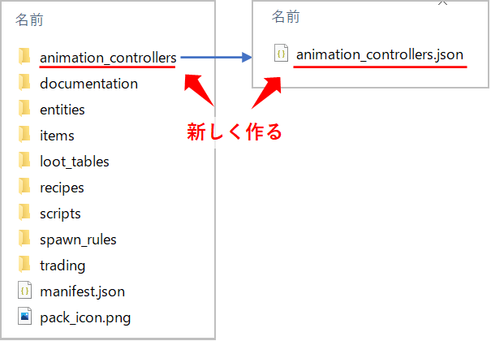
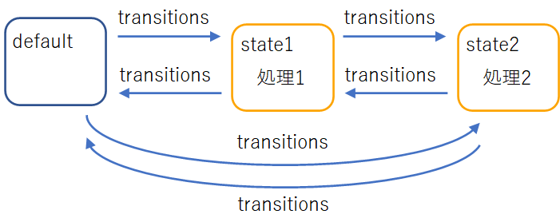
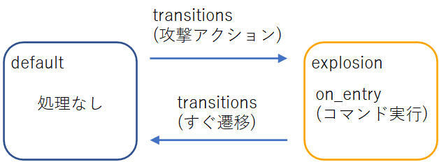

Title: マイクラ統合版 アドオンの作り方③ アニメーションコントローラでコマンド実行
Date: 2022/10/27
tag: addon
Image: /img/20221027-minecraft-addon3-1.png
description: アニコンで、プレイヤーの周りにパーティクルを発生させるコマンドを実行します
IndexTitle: アドオン作成③ アニコンでコマンド実行
---

2022/10/27


# マイクラ統合版のアドオンを作る③ アニメーションコントローラでコマンドを実行する

---

**◆マイクラ統合版のアドオンを作る目次◆**

1. [アドオンを作るための準備](https://yamaccu.github.io/minecraft/20221021_minecraft-addon1) <span class="link"></span>
2. [アドオンを作るのに便利なVSCode拡張機能](https://yamaccu.github.io/minecraft/20221030_minecraft-vscode) <span class="link"></span>
3. [アドオンでプレイヤーを強化](https://yamaccu.github.io/minecraft/20221024_minecraft-addon2) <span class="link"></span>
4. アドオンでアニコンを使ってコマンドを実行　★今ここ
5. 作成中・・・

## 概要

今回は、アニメーションコントローラ（以下アニコンと呼びます）という機能を使って、プレイヤーが攻撃したときにパーティクルを出現させるコマンドを実行します。  
以下の手順で説明しています。  

* ビヘイビアパックにアニコンのファイルを追加
* player.jsonファイルを修正してアニコンを紐づけする

<br>

↓攻撃したときに周りにパーティクルが出現します。  

<video src="../video/20221027-minecraft-addon3-1.mp4" style="width:100%; max-width:600px;" controls></video>

## ビヘイビアパックにアニコンのファイルを追加する

ビヘイビアパックの中に、「animation_controllers」という名前のフォルダを作成します。  
そのフォルダの中に、jsonファイルを作成します。  
ファイル名は何でも良いのですが、とりあえずフォルダ名と同じ「animation_controllers.json」としておきます。  

  

<br>

作成した「animation_controllers.json」を開いて、下記のテキストをコピペします。  

```json
{
    "format_version" : "1.10.0",
    "animation_controllers" : {
        "controller.animation.attack" : {
            "initial_state" : "default",
            "states" : {
                "default" : {
                    "transitions" : [
                        {
                            "attack" : "variable.attack_time"
                        }
                    ]
                },
                "attack" : {
                    "on_entry": [
                        "/execute @s ~2 ~1 ~ /particle minecraft:sonic_explosion",
                        "/execute @s ~-2 ~1 ~ /particle minecraft:sonic_explosion",
                        "/execute @s ~ ~1 ~2 /particle minecraft:sonic_explosion",
                        "/execute @s ~ ~1 ~-2 /particle minecraft:sonic_explosion"
                    ],
                    "transitions" : [
                        {
                            "default" : "(1.0)" 
                        }
                    ]
                }
            }
        }
    }
}
```

* "controller.animation.attack"：  
  　今回作るアニコンです。  
  　"attack"の箇所は、好きな名前にして大丈夫です。  
  　プレイヤーやモブにアニコンを紐づけるときに、ここの名前を使います。  

* "default"、"attack"：  
  　この二つはstateと呼ばれるものです。  
  　stateを作って処理を登録し、stateを変更していくことで各処理を実施する仕組みとなっています。  
  　一度に複数のstateをとることはできません。  

<br>

  

<br>

それぞれについて、以降で説明していきます。


### state（状態）について

stateとは、自分がいまとっている状態のことです。  
最初は「default」状態にいます。  
 （"initial_state" : "default"　で最初の状態を決めています。）  

例えば、攻撃動作をしたらパーティクルを発生させるアニコンを作成するとします。  
この場合、まず初めに「攻撃した」というstateを作ります。  
そして、「パーティクル発生」という処理を追加します。  

```json
"attack" : {
    "on_entry": [
        "/execute @s ~2 ~1 ~ /particle minecraft:sonic_explosion",
        "/execute @s ~-2 ~1 ~ /particle minecraft:sonic_explosion",
        "/execute @s ~ ~1 ~2 /particle minecraft:sonic_explosion",
        "/execute @s ~ ~1 ~-2 /particle minecraft:sonic_explosion"
    ],
```

これがstateとなります。  
他にも「ジャンプした」「動いている」「アイテムを使った」など、大体の動作はstateとして作ることができます。  

各stateでの処理の追加方法は下記の3通りあります。  

* on_entry：　stateに入ったら最初に一度だけ実施する
* animations：　stateにいる間はずっと実施する
* on_exit：　stateから抜けるときに一度だけ実施する

上記の例ではon_entryを使っているので「attack stateに入ったら、4つのexecuteコマンドを一回実行する」という内容になっています。  

/execute コマンドの詳細については、ここでは省略します。  

### transitions

stateを作ったら、stateを移動する条件を追加します。  
この、移動する条件が「transitions」です。  

default stateからattack stateへ遷移するには、default stateに以下のtransitionsを追加します。  

```json
"transitions" : [
    {
        "attack" : "variable.attack_time"
    }
]
```

"variable.attack_time"は、攻撃動作を判定するものです。  
「攻撃動作」を行ったら、attack stateへ遷移する、という意味になります。  
この、動作を判定する記述は「Molang Queries」と呼ばれていて、下記に一覧があります。  

<a href="https://wiki.bedrock.dev/documentation/queries.html#variable-attack-time" style="text-decoration: none;">
<div class="link-box"><div class="img-box"><div style="background-image: url('https://wiki.bedrock.dev/assets/images/homepage/wikilogo.png');"></div></div><div class="text-box"><p class="title">Molang Queries | Bedrock Wiki</p><p class="description">Technical bedrock knowledge-sharing wiki.</p></div></div>
</a>

また、attack stateで処理を行ったらすぐdefault stateへ戻りたいので、以下のように記述します。  

```json
"transitions" : [
    {
        "default" : "(1.0)" 
    }
]
```

これは、無条件にdefault stateに遷移するという意味になります。  
attack stateに入ってon_entryの処理を実施したら、すぐdefault stateに戻ります。  

これで、攻撃したらattack stateに入ってon_entryの処理を実施し、すぐdefalut stateに入る、という動作を繰り返すことになります。  

このようにして、stateと実行処理を作って、transitionsの条件で遷移させていくことでアニコンは動作します。  

  

<br>

ちなみに、このようなstateを作って色々な処理を実施する手法はState Machineと呼ばれていて、規模の大きいプログラムではよく見かける方法です。  


## player.jsonファイルにアニコンを紐づけする

上記では、「攻撃アクションをしたときにパーティクルを発生させるコマンドを実行する」アニコンを作成しました。  
これをentitiesのplayer.jsonに紐づけることで、プレイヤーが攻撃したときにパーティクルを発生させることができます。  

player.jsonを以下のように変更します。  

```json
{
  "format_version": "1.18.20",
  "minecraft:entity": {
    "description": {
      "identifier": "minecraft:player",
      "is_spawnable": false,
      "is_summonable": false,
      "is_experimental": false
      "animations": {
        "attack": "controller.animation.attack"
      },
      "scripts": {
        "animate": [
          "attack"
        ]
      }
    },
    ・・・
```

* "animations"で、先ほど作成したアニコンを宣言します。  
  呼び出すための名づけ（attack）と、今回作成したアニコンの名前（controller.animation.attack）を記載します。  

* "scripts"で、使用するアニコンを紐づけます。  
  先ほどの「呼び出すための名づけ（attack）」をここで使用します。  

<br>

これで、プレイヤーとアニコンの紐づけができました。  
冒頭の動画のように、攻撃アクションをするとパーティクルが表示されるようになりました。  


## まとめ

今回はプレイヤーにアニコンを紐づけましたが、もちろんentities内のjsonファイルを修正すれば、全てのmobで同様のことができます。  
また、アニコンでの処理はコマンド実行でしたが、他にもentityのイベント発生や、compornents_groupのadd/removeなどにも使えるようです。  
この辺りもいずれ記事にできたらと思います。  

第2回と第3回で作成したaddonは下記にアップしてあります。  
<a href="https://github.com/yamaccu/minecraft-addon/tree/main/OnePunchBP" style="text-decoration: none;">
<div class="link-box"><div class="img-box"><div style="background-image: url('https://opengraph.githubassets.com/b524917d4be99e68b3325bf5d7ebbd5b1bbce33ca25b6546e9007373417c07b0/yamaccu/minecraft-addon');"></div></div><div class="text-box"><p class="title">minecraft-addon/OnePunchBP</p><p class="description">マインクラフト統合版のaddon置き場. Contribute to yamaccu/minecraft-addon development by creating an account on GitHub.</p></div></div>
</a>
<br>

その４では、ゲーム内で使える新しいアイテムを作りたいと思います。  


## マインクラフトの購入先

マインクラフトはアマゾンで購入できます。  
最近、JAVA版と統合版がワンパッケージになったようで、購入すると両方プレイができます。  

<!-- START MoshimoAffiliateEasyLink -->
<script type="text/javascript">
(function(b,c,f,g,a,d,e){b.MoshimoAffiliateObject=a;
b[a]=b[a]||function(){arguments.currentScript=c.currentScript
||c.scripts[c.scripts.length-2];(b[a].q=b[a].q||[]).push(arguments)};
c.getElementById(a)||(d=c.createElement(f),d.src=g,
d.id=a,e=c.getElementsByTagName("body")[0],e.appendChild(d))})
(window,document,"script","//dn.msmstatic.com/site/cardlink/bundle.js?20220329","msmaflink");
msmaflink({"n":"Minecraft (マインクラフト): Java \u0026 Bedrock Edition | オンラインコード版","b":"マイクロソフト","t":"","d":"https:\/\/m.media-amazon.com","c_p":"\/images\/I","p":["\/51BKnFRzWYL._SL500_.jpg","\/51i8VAIlmJL._SL500_.jpg","\/41aEk6RsfjL._SL500_.jpg","\/51kL8WFwl2L._SL500_.jpg","\/41DJcerCroL._SL500_.jpg","\/51JGdCj3tTL._SL500_.jpg"],"u":{"u":"https:\/\/www.amazon.co.jp\/dp\/B0B3R5PL2Y","t":"amazon","r_v":""},"v":"2.1","b_l":[{"id":2,"u_tx":"Amazonで見る","u_bc":"#f79256","u_url":"https:\/\/www.amazon.co.jp\/dp\/B0B3R5PL2Y","a_id":2991341,"p_id":170,"pl_id":27060,"pc_id":185,"s_n":"amazon","u_so":1}],"eid":"TXkHv","s":"s"});
</script>
<div id="msmaflink-TXkHv">リンク</div>
<!-- MoshimoAffiliateEasyLink END -->

<br>
<br>

---
