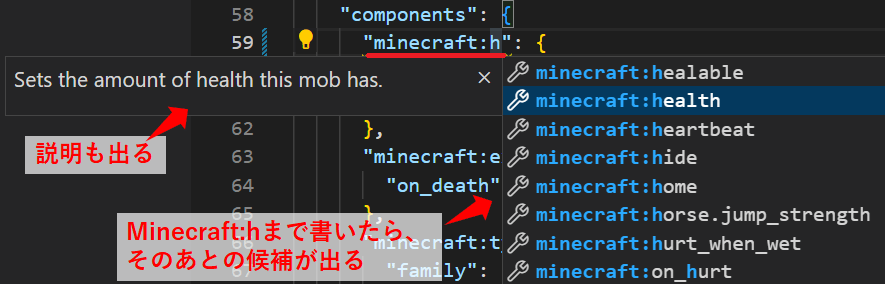
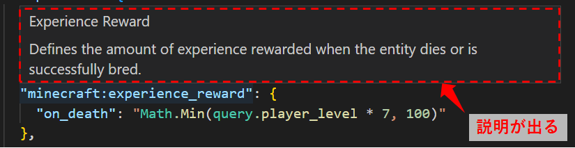
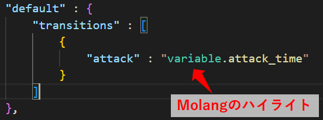
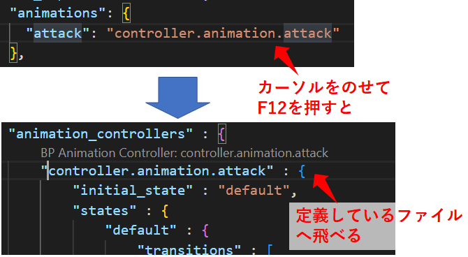
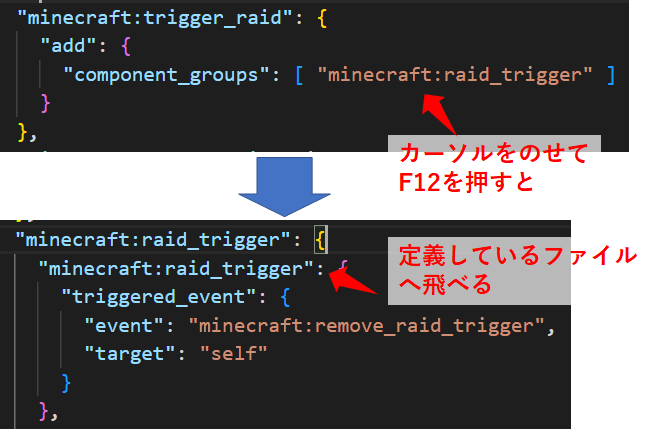
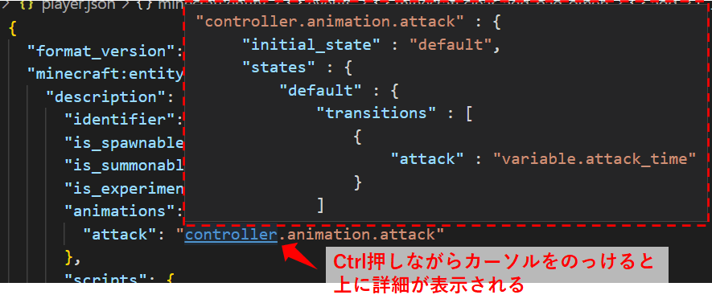
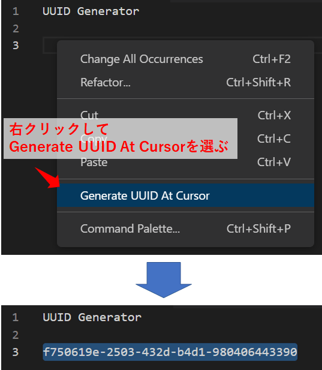

Title: マイクラ統合版(BE) アドオン作成に便利なVSCode拡張機能
Date: 2022/10/30
tag: addon
Image: /img/20221021-minecraft-addon1-1.png
description: VSCodeの拡張機能を3つ紹介します
IndexTitle: アドオン作成に便利なVSCode拡張機能
---

2022/10/30

# マインクラフトのアドオンを作るのに便利なVS Code拡張機能

---

**◆マイクラ統合版のアドオンを作る目次◆**

1. [アドオンを作るための準備](https://yamaccu.github.io/minecraft/20221021_minecraft-addon1) 
2. アドオンを作るのに便利なVSCode拡張機能　　★今ここ
3. [アドオンでプレイヤーを強化](https://yamaccu.github.io/minecraft/20221024_minecraft-addon2) 
4. [アドオンでアニコンを使ってコマンドを実行](https://yamaccu.github.io/minecraft/20221027_minecraft-addon3) 
5. 作成中・・

## 概要

マインクラフトのアドオンを作成するのにVSCodeというテキストエディタを使うと、jsonフォーマットエラーなどを通知してくれるので便利です。  
また、VSCodeには後から拡張機能を追加することができます。  
本記事では以下の3つのVSCode拡張機能を紹介します。  

* Blockception's Minecraft Bedrock Development
* Bedrock Definitions
* UUID Generator

## Blockception's Minecraft Bedrock Development

<a href="https://marketplace.visualstudio.com/items?itemName=BlockceptionLtd.blockceptionvscodeminecraftbedrockdevelopmentextension" style="text-decoration: none;">

Blockception's Minecraft Bedrock Development - Visual Studio Marketplace

Extension for Visual Studio Code - An extension that provides code completion, validations, formatters, diagnostics, cheat-sheets, code-actions, creation of files, and development tools to help develop Minecraft Bedrock content

</a>

※注意点

この拡張機能を使用するためには、ビヘイビアパックの場合はフォルダ名に"BP"または"bp"、リソースパックの場合はフォルダ名に"RP"または"rp"が入っている必要があります。  

### 自動補完

マイクラ関連のコードを認識して、途中まで書くとその先の候補を表示してくれます。  
以下はminecraft:healthと書こうとしたときに、hまで書いたときに次の候補と、その説明を表示してくれています。  

  

### コードの説明の表示

詳細を知りたいコードにカーソルをのっけると、説明を表示してくれます。  

  

### ハイライト

Molangのコードを色付けして表示してくれます。  

  

### 表示のジャンプ

他の場所で定義しているコード上にカーソルをのっけてF12を押すと、定義している箇所へジャンプします。  
例えば、entitiesのjsonでアニコンを紐づけているときに、F12を押すとアニコン側のファイルへ飛んでくれます。  

  

ただし、events内でadd/removeしているcompornent_groupを指定してF12を押してもジャンプできなかったので、飛べないものもあるようです。  
ジャンプ機能を多用する方は次の「Bedrock Definitions」を入れると良いです。  

## Bedrock Definitions

<a href="https://marketplace.visualstudio.com/items?itemName=destruc7i0n.vscode-bedrock-definitions" style="text-decoration: none;">

Bedrock Definitions - Visual Studio Marketplace

Extension for Visual Studio Code - Go-to definitions and auto-complete for Minecraft Bedrock Edition

</a>

### 表示のジャンプ

他の場所で定義しているコード上にカーソルをのっけてF12を押すと、定義している箇所へジャンプします。  
上記で紹介した「Blockception's Minecraft Bedrock Development」よりも強力で、試した限りでは何でもジャンプできました。  

  

### 定義先の表示

Ctrlを押しながらカーソルをコード上にのっけると、定義先が表示されます。  
ちょっと確認したい時に便利です。  

  

## UUID Generator

<a href="https://marketplace.visualstudio.com/items?itemName=netcorext.uuid-generator" style="text-decoration: none;">

UUID Generator - Visual Studio Marketplace

Extension for Visual Studio Code - Generate a UUID

</a>

UUIDをVS Code上で発行できます。  
manifest.jsonファイルを作成するときに便利です。  

  

  

以上です。  

## マインクラフトの購入先

マインクラフトはアマゾンで購入できます。  
最近、JAVA版と統合版がワンパッケージになったようで、購入すると両方プレイができます。  

<!-- START MoshimoAffiliateEasyLink -->

リンク

<!-- MoshimoAffiliateEasyLink END -->

 
 

---
