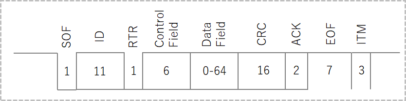
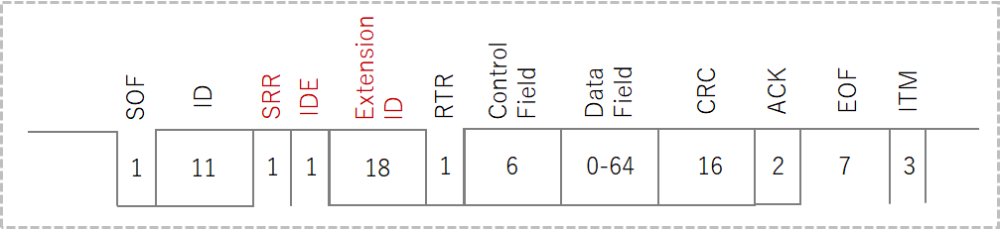
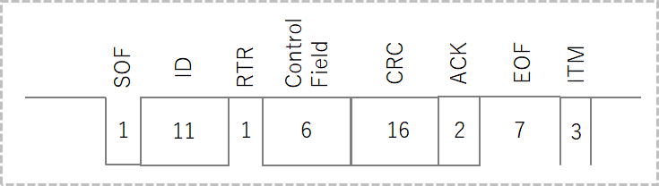
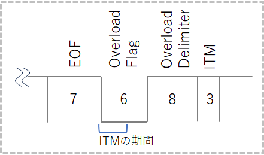
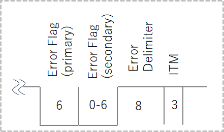

Title: 初心者向け 車載ネットワークCAN(ControlAreaNetwork)の基本
Tag: CAN
Date: 2023/7/23
description: CANの基本についてまとめました
Image: /img/20230723-can-bigener.png
IndexTitle: CANの基本
---

2023/07/23

# 車載ネットワーク CAN(ControlAreaNetwork)の基本

---

## はじめに

CANとは、「Controller Area Network」の略で、主に自動車の電子部品の制御に使われています。  
本ページでは、自分が調べたCANの基本仕様についてまとめています。  

## 概要

CANはBosch社によって仕様が公開され、主に自動車業界での車両制御に使用されています。  
現在はISOにて国際的に標準化された規格（ISO 11898）になっています。  

自動車の部品が電子化すると同時に、それらの通信に使用されているCANも急速に広がっていきました。  
また、自動車業界以外では、FA機器などでも使用されています。  

## CANの種類

### CAN 2.0a
CANの基本形で、後述する11bit IDの「標準フォーマット」を使用します。  

### CAN 2.0b
CAN 2.0aに対して、29bit IDの「拡張フォーマット」を使用します。  
標準フォーマットでも通信可能となっています。  

### J1939
バスやトラックなどの重車両や商用車両で広く使用される通信プロトコルです。  
SAE（Society of Automotive Engineers）が定めており、CAN 2.0bをベースにしています。  
車両のエンジン、トランスミッション、ブレーキ、サスペンションなどの様々な制御システム間での通信を規定しています。  

### CAN FD
CAN FDは、"Flexible Data-Rate"の略であり、データレートが可変で最大5Mbpsまでサポートします。  
また、1フレームのデータ長を8バイトから64バイトに拡張しており、従来のCANよりも高速、大容量通信を可能にしています。    

## CANの特徴

### マルチマスター

CANでは、どのデバイスもマスターとしてデータを送信するとともに、スレイブとしてデータを受信することが可能です。  
マルチマスターによって以下を実現できます。  

* 各ノードを同一仕様で設計できる
* 各ノードが自由なタイミングで通信の送受信が可能（ただし調停が必要）
* ノードの追加削除が容易
  
複数のデバイスが同時にバスアクセス可能なので、同時にデータが送信された場合は、適切な調停による優先順位付けが重要です。  

### 通信の優先順位付け

マルチマスターにおけるバスの調停方法がCSMA/CA（Carrier Sense Multiple Access with Cpllision Avoidance）です。  
ノードに優先順位をつけ、衝突が起きた場合は優先順位の高い通信を優先して送信する仕組みになっています。  

優先順位はIDによって判別します。  
具体的には、「ドミナントとレセシブ」の関係を使用します。  

* ドミナント：データ"0"、バスのLレベル  
* レセシブ：データ"1" 、バスのHレベル

ドミナントは"優性"、レセシブは"劣性"の意味で、ドミナントとレセシブが別のノードから同時に送信された場合は、ドミナントが優先されます。  
例えば、IDが0のノードと1のノードが同時にデータを送信した場合、IDの0と1が比較され、IDが0のノードが優先されます。  

### データの一貫性

通信時、もし1台のノードが受信に失敗した場合は、データを受信した全ノードがデータを破棄し、全ノードが受信に成功するまで送受信を繰り返します。  
これにより、ある制御を行う場合、全ノードにおいて使用するデータは同一ということになるので、データの一貫性を保つことができます。  

エラー検出は、CRCの整合、ACK、送信ビットのモニタリング、プロトコルのフォームチェック、ビットスタッフィングチェックなどで行います。  

### 同期

CANはクロック信号線がないため、各デバイスで通信速度を正確に合わせる必要があります。  
通信速度の「同期」は、信号がレセシブからドミナントへ変化する時（"1"->"0"変化時）に同期をとっています。    

### ビットスタッフィング

CANでは、データが"1"->"0"に変化するときに同期が行われるので、もし"0"もしくは"1"が長時間連続した場合は同期ができない状態になり、ビットずれが発生する可能性があります。  
そこで、CANでは「ビットスタッフィング」を採用しています。  
ビットスタッフィングとは、バス上で同じ状態が5回連続した場合、それまで送信されていた状態と反対の状態のビットを1つ挿入する仕組みのことです。  

たとえば、"000000111111"と連続する場合、実際には"00000101111101"と送信されることになります。  
これにより、確実に同期をとることができます。  

## CANのプロトコル

CANには、以下4つの通信タイプがあります。  

* データフレーム
* リモートフレーム
* オーバーロードフレーム
* エラーフレーム

### データフレーム

データを送信するフレームです。  
データフレームには「標準フォーマット（11ビットID）」と「拡張フォーマット（29ビットID）」の2つがあります。  

#### ■標準フォーマット

IDが11ビットです。  

  

* SOF  
  Start Of Frame、ドミナントを送信することで通信開始を他のデバイスに伝えます。  
* ID  
  送信ノードの識別、調停の優先順位に使用します。   
* RTR  
  Remote Transmission Request、データフレームの場合にはドミナント、リモートフレームはレセシブになります。  
* コントロールフィールド  
  1ビットのIDE（Identifier Extension）、1ビットの予約ビットr、4ビットのデータレングスコード（DLC：Data Length Code）から構成されます。標準フォーマットの場合、IDEはドミナントです。
* データフィールド  
  送信データです。DLC によって設定されたデータ長となります。  
* CRC  
  誤り検出の仕組みです。送信ノードがSOF、ID、コントロールフィールド、データフィールドの送信値より演算してCRCシーケン
スで演算結果を送信します。受信ノードはデータを受診したら同様に演算して、その結果を比較することで正常に受信できたかの判断を行うことができます。
* ACK  
  受信ノードがCRCフィールド部分まで正常に受信できた場合は、ACKをドミナントとすることで確認応答となります。
* EOF  
  End Of Frame、7ビットのレセシブとなっています。
* ITM  
  3ビットのレセシブ、このITM終了後にバスアイドルとなります。「オーバーロードフレーム」のみITMにおいて唯一送信可能となっています。

#### ■拡張フォーマット

標準フォーマットは11bit IDで2048種類となりますが、拡張フォーマットは29bit IDで約5億4千万種類となります。  

  

* SRR  
  Substitute Remote Request、1bitのレセシブとなります。
* IDE  
  Identifier Extension、1bitのレセシブとなります。
* 拡張ID  
  標準フォーマットでの11bitに、拡張IDの18bitを加えて、IDは合計で29bitとなります。 

その他は標準フォーマットとおなじです。  

### リモートフレーム

リモートフレームはデータフレームの要求に使用されます。  
基本構造はデータフレームからデータフィールドを除いたもので、IDは要求先のデバイスのIDを指定します。  
RTRはレセシブになります。    

  

近年ではリモートフレームはとほんど使わず、各デバイスが定期的にデータフレームを送信する方式の方が一般的のようです。  

### オーバーロードフレーム

オーバーロードフレームは、CANコントローラが前回のフレームの処理をまだ完了していない時に、次のフレームの開始を遅延させるために用いられます。  
近年のCANコントローラは処理速度が向上しており、オーバーロードフレームはあまり使用されていないようです。  

  

* オーバーロードフラグ  
  6ビットのドミナントから構成され、ITMの3bit以内に開始されます。
* オーバーロードデリミタ  
  8ビットのレセシブから構成され、オーバーロードフレームの区切りを示します。  

### エラーフレーム

エラーフレームは、通信中に各種エラーが発生した時に送信されるフレームで、ビットスタッフィングルールに違反、または固定フォーム部分を破壊する形で、直近の送信を中断させます。  
これにより、ネットワークに接続されているノードに異常を知らせます。    

  

* エラーフラグ
  6ビットのドミナントを送信することでビットスタッフィングルールに違反し、他のノードにエラー発生を通知します。  
  他のノードもこれをみてエラーフラグを送信するので、結果として、最大12ビットのドミナントとなります。  
* エラーデリミタ
  8ビットのレセシブで、エラーフレームの終了を示します。  

## CANのエラー処理

CANではエラー状態というものが定義されており、接続しているデバイスは以下の3つのいずれかになっています。  

* エラーアクティブ： 正常
* エラーパッシブ： エラーを起こしやすい状態、通信優先度が下げられている状態
* バスオフ： 通信に参加できない状態

エラー状態は、エラー発生数によって決定されます。  
個々のデバイスでエラーカウントのパラメータを有しており、エラー発生時にカウントアップ、通信成功時にはカウントダウンしています。  
（詳細なカウントアップ・ダウンの仕様についてはここでは省きます）

## 参考文献

* [はじめてのCAN / CAN FD](https://cdn.vector.com/cms/content/know-how/VJ/PDF/For_Beginners_CAN_CANFD.pdf)

 
以上です。  
 
 

---