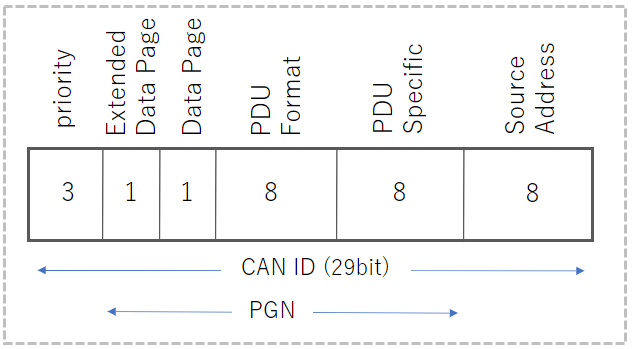
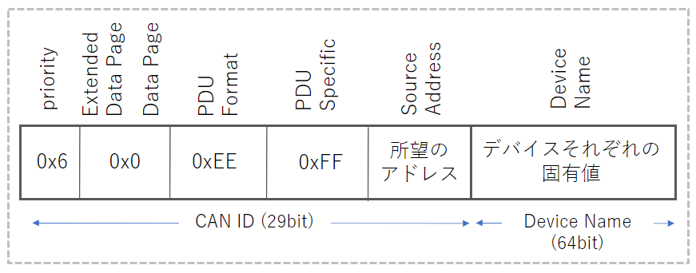

Title: 大型車向けCAN J1939の仕様について
Tag: CAN
Date: 2023/8/8
description: 大型車向けのCANであるJ1939の基本についてまとめました
Image: /img/20230808-can-J1939.png
IndexTitle: J1939の仕様
---

2023/08/08

# 大型車向けCAN J1939の仕様

---

## はじめに

J1939は、バスやトラックなどの重車両や商用車両で広く使用される通信プロトコルです。  
SAE（Society of Automotive Engineers）が定めており、CAN 2.0bをベースにしています。  

本ページでは、自分が調べたJ1939の仕様についてまとめています。  

CANについては、以下にまとめております。  

<a href="https://yamaccu.github.io/selfdriving/20230723-can-bigener" style="text-decoration: none;">

初心者向け 車載ネットワークCAN(ControlAreaNetwork)の基本

CANの基本についてまとめました

</a>

## J1939の特徴

* ベースはCAN 2.0b
* PGNによるグルーピング
* AddressやDeviceNameによるネットワークマネジメント

## PGN (Parameter Group Number)

Parameter Groupは、通信メッセージを機能でグルーピングしているものです。（エンジンデータ、ブレーキデータなど）  
18ビットのPGN（Parameter Group Number）によって識別され、通信時のCAN ID内で指定されています。  
内容は仕様書のJ1939-71で定義されています。  

PGNは、「Extended Data Page」、「Data Page」、「PDU Format」、「PDU Specific」の4つを合わせた18bitの値として表記されます。  

  

* priority: 通信の優先順位付けに使用します。0が最も優先順位が高くなっています。    
* Extended Data Page: 基本"0"です。
* Data page: PGNのページングを行います。  
  * 0: SAE J1939 Page0 のPGN
  * 1: SAE J1939 Page1 のPGN
* PDU Format: メッセージの中身を特定するための8ビットの識別子です。  
  例えば、エンジンに関するデータなのか、ブレーキシステムに関するデータなのか、などがわかります。  
  値が240～255の間の場合は、ブロードキャスト通信となります。  
* PDU Specific: PDU Formatによって値の扱いが変わります。  
  * PFが0～239の間 ⇒ PDU1、宛先アドレスが入ります。 (DE:Destination Address) 
  * PFが240～255の間 ⇒ PDU2、使用できるブロードキャストメッセージの数を増やすために使用されます。(GE:Group Extension)  
* Source Address: 送信元のデバイスのアドレスです。  

 

以下に、PGNの例を挙げてみます。  

■ XBR（External Brake Request）
* PGN: 1024 (0x000400)   
* Default Priority: 3  
* Extended Data Page: 0  
* Data Page: 0  
* PDU Format: 4  
* PDU Specific: Destination Address  

■ EBC1（Electronic Brake Controller 1）
* PGN: 61441 (0x00F001)   
* Default Priority: 6  
* Extended Data Page: 0  
* Data Page: 0  
* PDU Format: 250  
* PDU Specific: 1  (Group Extention)

## Address Claim

各デバイスは通信を開始する際に、自身のSource Addressを使用することをネットワーク上で宣言する必要があります。  
この宣言をAddress Claimと言います。  
以下のようなデータをネットワークに送信します。  

  

* priority: 優先順位、通常「0x6」となります。  
* Extended Data Page: 0  
* Data Page: 0  
* PDU Format: アドレスクレーム時は「0xEE」となります。  
* PDU Specific: アドレスクレーム時は「0xFF」となります。
* Source Address: 取得したいアドレスです。  
* Device Name: 64bitのデバイス固有の値です。通信のメッセージ部がDevice Nameとなります。

※"0x"は16進数の意味です。  

Source Addressが重複した場合は、Device Nameによって優先順位がきまります。  

## 参考文献

* [ソフテックだより技術レポート「SAE J1939プロトコルについて」](https://www.softech.co.jp/mm_181003_tr.htm)
* [ixxact.com SAE J1939](https://www.ixxat.com/ja/technologies/fieldbuses/sae-j1939)

 
以上です。  
 
 

---

