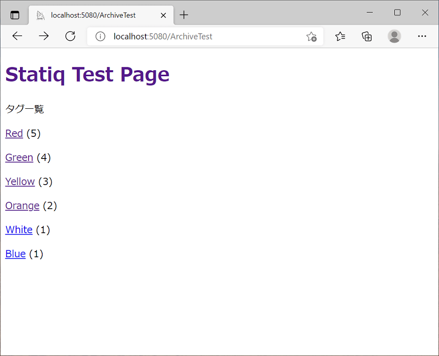
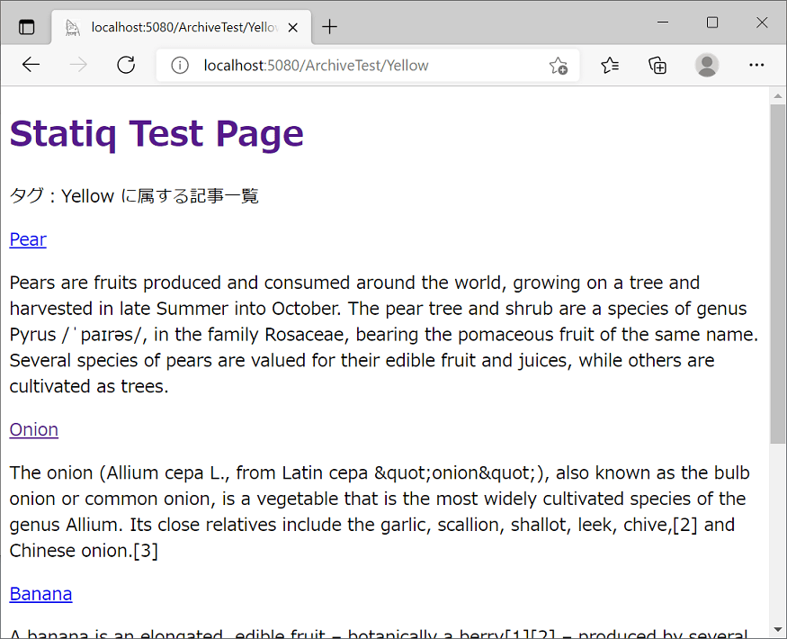
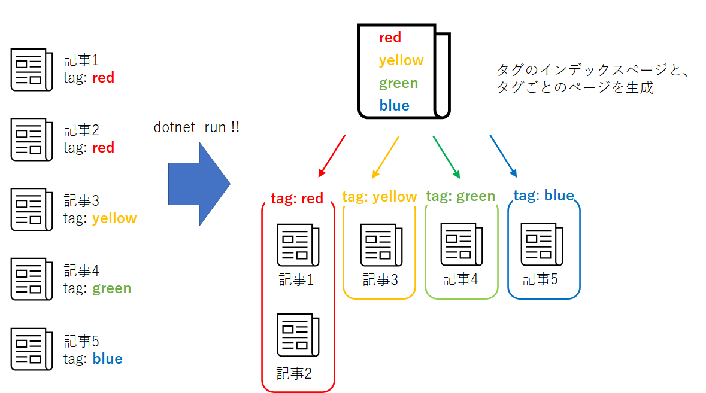
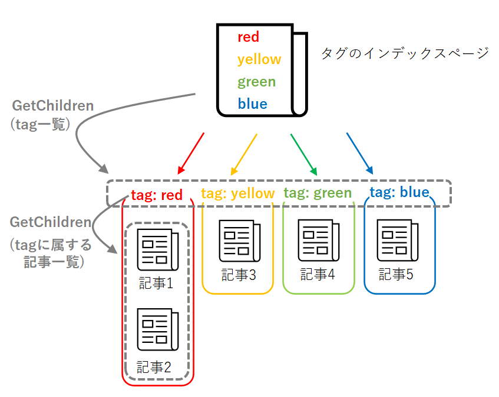

Title: C#製の静的サイトジェネレータ「Statiq」でブログ作成
Date: 2022/02/16
tag: statiq
Image: /img/20220216_statiqblog-index.png
description: C#製の静的サイトジェネレータ "Statiq" と "github pages" を使ってブログ作成します。
IndexTitle: Statiqでブログ作成
---

<br>

2022/2/16

# C#の静的サイトジェネレータ "Statiq" でブログを書く

---

## はじめに

この度、ソフトウェアの勉強のためにブログを作りました。  
エンジニアがブログを作ると、以下のようなメリットがあるらしいです。

- スキルが定着する
- 文章力があがる
- 収益が出る（らしい）

ただ、ブログを作ろう！といっても、やり方がいろいろあると思います。  
まずはブログを作る方法を考えてみます。  


## ブログを作る方法

調べたところ、3通りあります。

* ブログサービスを利用： はてなブログなど
* 動的サイト作成： WordPress＋レンタルサーバーなど
* 静的サイト作成： 静的サイトジェネレータ＋ホスティングサービスなど

それぞれメリット・デメリットあります。  
私の場合は、「無料であること」、「HTMLの勉強も兼ねたいこと」の2点から、静的サイトのブログを作成することにしました。  

静的サイトジェネレータは、C#を少しだけかじっていましたので、C#製の静的サイトジェネレータであるStatiqを使うことにします。  
また、ホスティングサービスは無料で使えて広告も貼れるGithub Pagesを使用します。  

といことで、この記事では、「Statiqという静的サイトジェネレータ」＋「github pages」の組み合わせでブログを作っていこうと思います。    


## Statiqの特徴とGet Started

Statiqはマイナーなのかネットに情報があまりないようです。  
とりあえず、簡単な紹介と導入方法をQiitaに投稿してみました。  
Statiqのブログテーマを適用してブログを書く方法です。  

<span class="link"></span>[qiita C#製の静的サイトジェネレータ「Statiq」でブログを書く](https://qiita.com/yamaccu/items/6ea0e09954bec8474a19)

この記事では、サイトにオリジナリティを出すために、ブログテーマを使わないで独自のサイトの作成にチャレンジしていきます。  

## layoutと記事について

Statiqでは、layoutと記事でファイルが別となります。  
layoutファイルを一つ作って、複数の記事へ適用することができます。  

layoutはRazor構文で作成します。  
Razor構文とは、HTML上にC#を埋め込んで実行するプログラミング構文です。  
layoutとして作成したファイルは、ファイル名の先頭にアンダーバー(_)をつけます。  
これをつけることで、記事として認識されなくなります。  

例）_layout.cshtml  

記事へのlayoutの適用は、Metadata上で設定します。  
Metadataの設定方法はたくさんあるのですが、以下の3つのうち、どれかで行えば十分かと思います。  

- Front matter　⇒記事ごとに設定する。
- Directory metadata　⇒ディレクトリごとに設定する
- Configuration files　⇒すべてのファイルに設定する

詳細は以下を参照ください。  

<span class="link"></span>[公式サイト MetaData](https://www.statiq.dev/web/content-and-data/metadata/)

layoutファイル内で「@RenderBody()」と記述すると、その部分に記事が呼び出されます。  


## Archive機能について

Archive機能は、Statiqでブログを作るうえで重要な機能です。  
一言でいうと  
「記事をタグで整理して、インデックスを作ってくれる」  
機能です。  

cshmtlファイルのFront Matterに、”ArchiveSources”で記事を保存しているフォルダを指定し、”ArchiveKey”でタグを設定すると、指定したフォルダ内の記事をタグでまとめて以下のHTMLを出力してくれます。

- タグを列挙したHTML　（<archiveファイル名.html>）
- タグごとの記事を列挙したHTML　（<archiveファイル名/tag名>.html）

出力HTML例




<br>

ファイルの例

```C#
ArchiveSources: posts/*
ArchiveKey: Colors
---

@if (Document.ContainsKey(Keys.GroupKey))
{
    <!-- Render a group page -->
    @foreach (IDocument document in Document.GetChildren())
    {
        <p>@Html.DocumentLink(document)</p>
        @Html.Raw(document.GetString(Keys.Excerpt))
    }
}
else
{
    <!-- Render an index page -->
    @foreach (IDocument document in Document.GetChildren())
    {
        <p>@Html.DocumentLink(document)</p>
    }
}
```


↓↓図解するとこのようなイメージです。




この機能を利用することで、ブログのタグ構造をつくることができます。  

## Achiveの子記事へのアクセス

上記のファイル例で、インデックスを作成するのに以下のコードを記述しています。  

```C#
@foreach (IDocument document in Document.GetChildren())
{
}
```

@Document.GetChildren で、ツリー構造の配下の記事を取得できます。  
それをforeachでひとつづつ取り出して処理しています。  




## MetaDataへのアクセス

Razor構文内で@Documentを使用することで、記事のMetaDataへアクセスすることができます。  
例えば以下のような感じです。  

- @Document.GetString("Title")　⇒　記事のタイトル
- @Document.GetString("Published")　⇒　記事の公開日

layoutファイルを多数の記事に適用するときに、記事ごとに表示を変えたいときなどに使用します。  
例えば、タイトルは以下のようにすると、記事ごとのMetaDataにあるTitleを表示できます。  

```C#
<title>@Document.GetString("Title") </title>
```


## サンプルを作ってみた

以上の情報を使って、ものすごいザックリなサンプルを作ってみました。   
記事はStatiqの <span class="link"></span>[公式example](https://github.com/statiqdev/Statiq.Web/tree/main/examples/Statiq.Web.Examples) から拝借しました。   

<span class="link"></span>[サンプル（github）](https://github.com/yamaccu/Statiq-test)


ちなみに、本サイトもStatiqで作成しています。


## まとめ

静的サイトジェネレータは、以前はPhtyon製のPelicanというものを使っていましたが、Statiqの方がページの自由度が高く使いやすいと感じています。  
Statiq、お勧めですので是非使ってみてください。  


Statiqでブログを作って公開してから半年になりますが、感じたことは  

- 記事を書くと知識が整理されて良いし、オンラインで見れるメモとして使える
- 文章力はあがる
- 収益はでない（今のところ月収30円程度。。）

というような感じで、勉強にはなるかなと思っています。  
また、静的サイトジェネレータは一度環境を作ってしまえば、あとはMarkDownで記事を書くだけで公開していけるのでお手軽です。  

ということで、気長にブログを続けていけたらいいなと思います。  


<br>

以上です。  

<br>
<br>

---
