Title: M5StickCを使ってダイソーの忍者刀を日輪刀に改造
Date: 2022/04/30
tag: M5StickC
Image: /img/20220430_diy-nichirinto-index.png
description: ダイソーに売っている忍者刀を改造して日輪刀にします
IndexTitle: 日輪刀をプログラミング
---

 

2022/4/30

# M5StickCを使ってダイソーに売っている忍者刀を改造する

---

## はじめに

うちの子供（小4）は鬼滅の刃が大好きです。  
登場人物を全員漢字でかけるくらいにはまっております。  

この熱量を何かに使えないかなと思い、プログラミングの勉強をかねて一緒に日輪刀を作ってみることにしました。  

↓↓つくったやつです。  

<blockquote class="twitter-tweet">
M5StickCとダイソーの忍者刀で、日輪刀を作ってみました。横斬り⇒水面切り、縦斬り⇒滝壺、3回目の技⇒碧羅の天が出ます。子供と一緒に作りました😀<a href="https://twitter.com/hashtag/m5stickC?src=hash&amp;ref_src=twsrc%5Etfw">#m5stickC</a> <a href="https://twitter.com/hashtag/m5stack?src=hash&amp;ref_src=twsrc%5Etfw">#m5stack</a> <a href="https://twitter.com/hashtag/%E6%97%A5%E8%BC%AA%E5%88%80?src=hash&amp;ref_src=twsrc%5Etfw">#日輪刀</a> <a href="https://t.co/p4QkxEEuyV">pic.twitter.com/p4QkxEEuyV</a>
&mdash; やまっく (@YY87750722) <a href="https://twitter.com/YY87750722/status/1520222302293864448?ref_src=twsrc%5Etfw">April 30, 2022</a></blockquote> 

## 日輪刀の材料

| 材料 | 購入先 | リンク |
| --- | --- | --- |
| 忍者刀 | ダイソー | 　 |
| M5StickC | Amazonなど | 　 |
| M5StickC Speaker Hat | Amazonなど | 　 |
| GROVEケーブル | Amazonなど | 　 |
| コモンタイプの赤・青2色LED 5p（リンク先はカソードコモン） | 秋月電子など | 　 |
| 定電流ダイオード 5p（LEDに合わせて電流値を選択）| 秋月電子など | 　 |
| pnpトランジスタ 2p（リンク先はデュアルタイプなので1pでok） | 秋月電子など | 　 |
| pnpトランジスタ用変換基板 | 秋月電子など | 　 |
| npnデジトラ 2p | 秋月電子など | 　 |
| CR2電池 2p | 秋月電子など | 　 |
| ダイオード（保護＆6V→5V電圧降下用） | 秋月電子など | 　 |
| ユニバーサル基板 | 秋月電子など | 　 |
| 抵抗 10kΩ | 秋月電子など | 　 |
| アイスの棒（電池固定用） | なんでもOK | 　 |  

 

ダイソーの忍者刀です。これを改造していきます。  

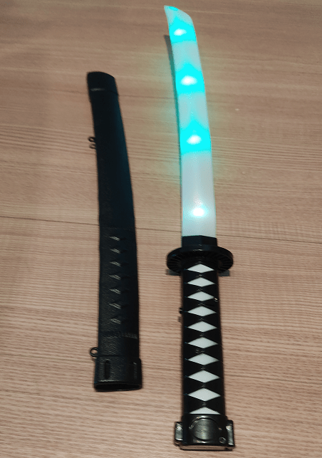
  

M5StickCです。これを忍者刀の中に仕込んでプログラミングします。  

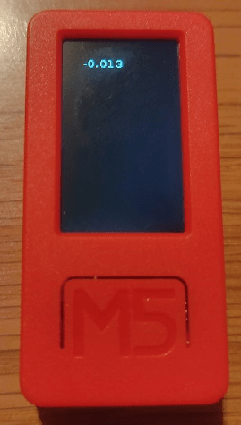
  

## 必要スキル

* はんだ付け
* プログラミング　UIFlowというビジュアルプログラミングを使用します
* 電気回路の知識　M5StickCのGPIOを操作して、トランジスタ・LEDを駆動します

## 回路

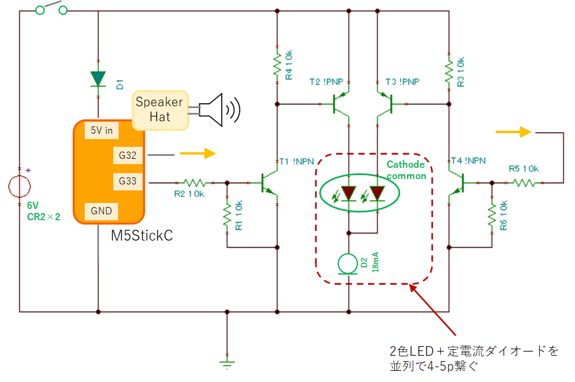  

* 2色LEDがカソードコモンのものしか入手できなかったため、LED駆動にPNPトランジスタを使っています。  
アノードコモンのものがあれば、NPNトランジスタ1段でシンプルに駆動可能かと思います。  
秋葉原を散策したのですが見つかりませんでした、アノードコモン。。    

* npnトランジスタはデジトラを使えば、ベースの入力抵抗とGND抵抗の10kΩが内蔵されています。  

## 1. 柄の部分の加工

忍者刀を分解するとこんな感じです。  
スピーカー、スイッチ、LEDの部分、電池の金具は再利用します。  

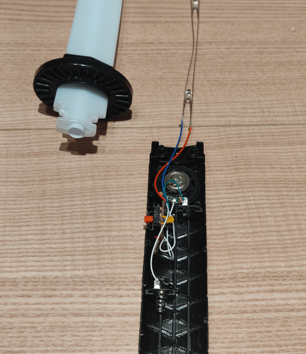
  

中をニッパーなどでくりぬくと、M5StickC＋Speaker Hat（ケースを外したもの）がピッタリ収まります。  
奇跡のジャストフィットです。  

  

電池を固定するのに、アイスの棒を切って、元からあった電池止め金具を貼り付けます。  
柄の内部にうまく切り込みを入れてはまるようにすれば、しっかり固定できます。  

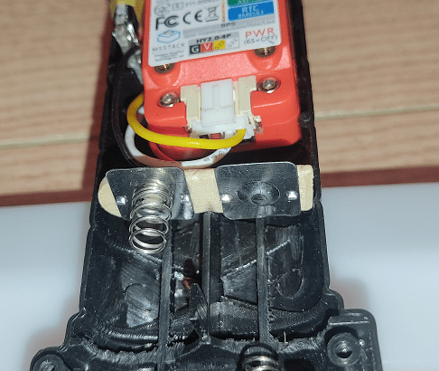
  

## 2. 刃の部分のLED付け替え

赤と青のLEDで、水の呼吸と日の呼吸を再現します。  
忍者刀に元からついているLEDの色は赤と緑なので、はんだごてを使って取り替えます。  

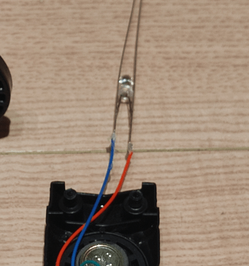
  

赤と青の2色LEDに定電流ダイオードをはんだ付けします。  
これで、LEDに定電流（今回は18mA）が流れます。  
赤と青の2色LEDだと、それぞれ光らせる電圧（順電圧）が違うので抵抗で電流調整するのが難しいのですが、定電流ダイオードを使うとそんなことは考えなくて良くなります。  
便利！

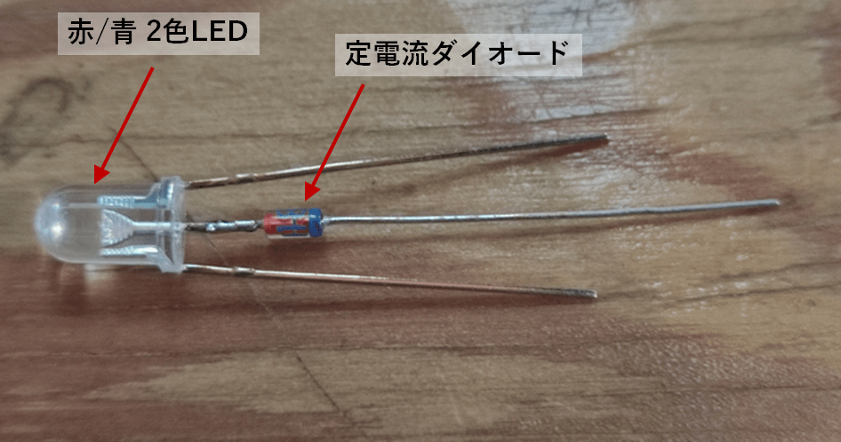
  

このLEDを、元々あるLEDの代わりに置き換えていきます。  
5p使うと、十分な光量が得られました。

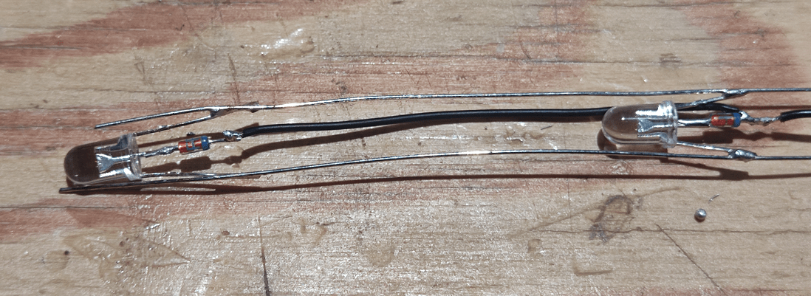
  

## 3. 回路図に沿ってはんだ付け

上記の回路図の通りに、部品をはんだ付けしていきます。  
下記はトランジスタと抵抗をユニバーサル基板にはんだづけしたものです。  
結構こまかい。

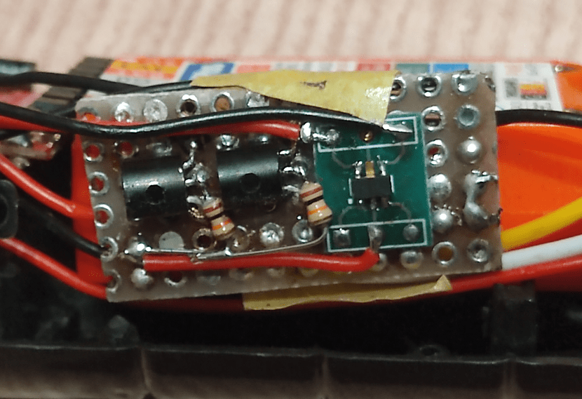
  

スピーカーは、Speaker Hatのものは外して、忍者刀に元から入っていたものに取り換えます。  
最終的にはこんな感じになります↓↓  

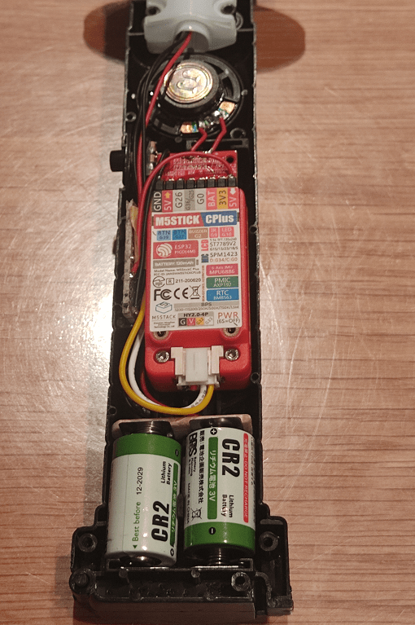
  

## 4. UIFlowでプログラミング

日輪刀のハードウェアが完成したので、次は中身のソフトを作ります。  
以下の機能を実装していきます。  

* スイッチを入れたら赤LED点灯＋wav再生（オープニング）
* 横に振ったら青LED点灯＋wav再生（壱ノ型 水面切り）
* 縦に振ったら青LED点灯＋wav再生（捌ノ型 滝壷）
* 三回目の技を出したときは赤LED点灯＋wav再生（ヒノカミ神楽 碧羅の天）

今回は子供と一緒にプログラミングするので、ビジュアルプログラミングのUIFlowを使用することにします。  

### 4-1. LED点灯する

回路図上のG32/G33でLEDの点灯・消灯を行うことができます。  

* G32/G33をHレベル：LED点灯
* G32/G33をLレベル：LED消灯

UIFlowでは下記のようにすると、G33が500msごとにHレベル⇔Lレベルとなり、LEDもそれに合わせて点滅します。  

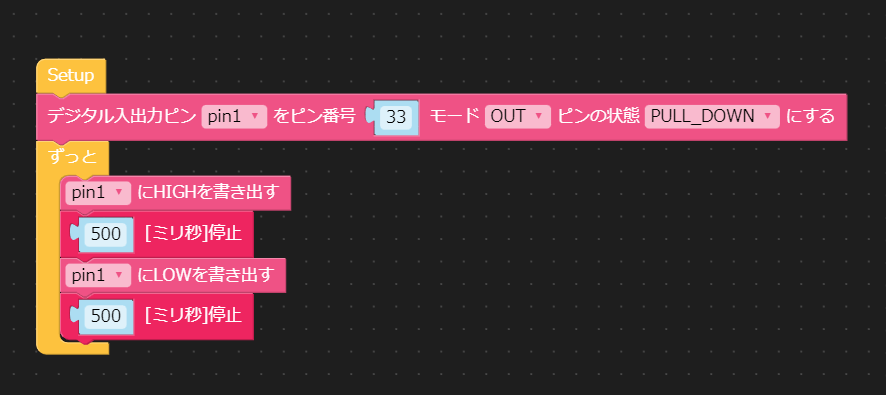
  

### 4-2. wav再生する

M5StickCでWAVファイルを再生する方法は、下記にまとめていますので参照ください。  
wav再生用のプログラムを用意していますので、wavファイルを準備してプログラムを実行します。  

　[M5StickCとSpeakerHatでwavを再生する](https://yamaccu.github.io/tils/20220310-M5stickc-playwav)

### 4-3. 縦斬りと横斬りを検知してLED点灯＆wav再生を行う

縦斬りと横斬りの検知には、M5StickCに入っている6軸センサを使用します。 

- Z方向の加速度がある　＝　水平  
- X方向およびY方向の加速度がある　＝　垂直  
- Z方向の角速度がある　＝　刀が振られている

と判定しています。  

これで水面切りと滝壷を使い分けできます。  

って書くと簡単なのですが、結構えぐい各パラメータの調整が必要でした。。  
プログラムは下記に置きましたので参照ください。  

　[github](https://github.com/yamaccu/UIFLOW-NichirinSword)

また、6軸センサについては下記にまとめていますので、宜しければご覧ください。  

　[M5StickCの6軸センサを使う](https://yamaccu.github.io/tils/20220307-M5stickc-6jiku)

### 4-4. 電源を切ったらM5StickCの電源も切れるようにする

M5StickCにはバッテリが入っているので、回路図上のスイッチを切っても動き続けてしまいます。  
M5StickCの電源を切るには、入力電圧を監視して、電圧が切れたら自分で電源を切るプログラムが必要です。  

↓↓こんな感じです。  

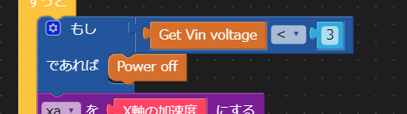
  

## まとめ

最初は子供と一緒に楽しくやろうと思っていたのですが、想像以上に難易度が高く、後半は自分ひとりで作業してしまいました。  
子供ができたのは

* はんだづけの簡単な箇所
* LEDを光らせる部分のプログラム

辺りです。  

ただ、ちょっとしかできなかったけど動いたときはとても喜んでいたので、今後も一緒に何か作っていけたらと思っています。  
次はもっと簡単なお題を見つけなくてはですね。

 

以上です。  

 
 

---
