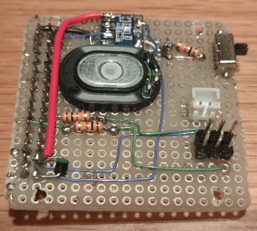
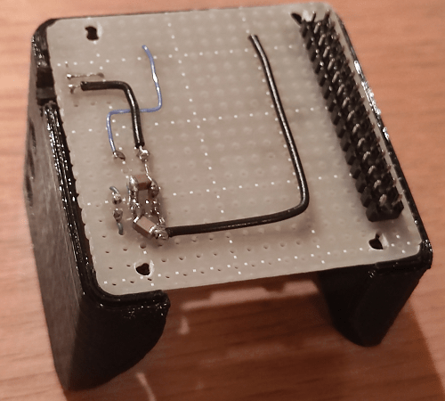

Title: ｽﾀｯｸﾁｬﾝを作ってみた
Date: 2022/9/9
tag: M5Stack
Image: /img/20220910-stackchan-HW.png
description: 手乗りサイズのロボット「ｽﾀｯｸﾁｬﾝ」を作ってみました。
IndexTitle: ｽﾀｯｸﾁｬﾝを作ってみた
---


2022/9/10

# スタックチャンを作ってみた

---


M5Stack界隈で爆発的な人気を誇る、ｽﾀｯｸﾁｬﾝを作ってみました。  


## スタックチャンとは

ｽﾀｯｸﾁｬﾝとは、オープンソースの手乗りサイズロボットです。  
詳細は下記のサイトをご覧ください。  

<a href="https://protopedia.net/prototype/2345" style="text-decoration: none;"><div class="link-box"><div class="img-box"><div style="background-image: url('https://protopedia.net/pic/aa9886bf-87a9-4312-a8db-3c11c6fe227a.jpg');"></div></div><div class="text-box"><p class="title">スタックチャン（Stack-chan） | ProtoPedia</p><p class="description">コミュニケーションロボットを、あなたの手に。</p></div></div></a>

オープンソースなので、設計データはgithubで公開されております。  
3Dプリンタ用のデータ、回路/基板の設計資料、ソフトウェアなど、作製に必要なデータが全て揃っています。  

<a href="https://github.com/meganetaaan/stack-chan" style="text-decoration: none;"><div class="link-box"><div class="img-box"><div style="background-image: url('https://repository-images.githubusercontent.com/374381865/15eebe83-6776-4e19-ae40-3197c7f7f681');"></div></div><div class="text-box"><p class="title">GitHub - meganetaaan/stack-chan</p><p class="description">A JavaScript-driven M5Stack-embedded super-kawaii robot.</p></div></div></a>

このｽﾀｯｸﾁｬﾝのコンセプトに大勢の方が賛同しており、各々が独自のｽﾀｯｸﾁｬﾝを産み出し、コミュニティを盛り上げています。  
twitterで <span class="link"></span>[#ｽﾀｯｸﾁｬﾝ](https://twitter.com/search?q=%23%EF%BD%BD%EF%BE%80%EF%BD%AF%EF%BD%B8%EF%BE%81%EF%BD%AC%EF%BE%9D&src=typed_query&f=top)  を検索してみてください。  
きっと作りたくなると思います。  


## 我が家のｽﾀｯｸﾁｬﾝ

4年位前に買って、そのまま眠っていたM5Stack Grayを使っています。  
我が家のｽﾀｯｸﾁｬﾝは仕事を与えられ、毎日子供と一緒に働いています。  

### 1. こどもの宿題のお手伝い

計算ドリルにかかった時間を測ってあげます。

<div style="max-width:350px">
<blockquote class="twitter-tweet"><p lang="ja" dir="ltr">子供の計算ドリルの時間を測ってあげる <a href="https://twitter.com/hashtag/%EF%BD%BD%EF%BE%80%EF%BD%AF%EF%BD%B8%EF%BE%81%EF%BD%AC%EF%BE%9D?src=hash&amp;ref_src=twsrc%5Etfw">#ｽﾀｯｸﾁｬﾝ</a> <a href="https://t.co/VMXPs1fQS1">pic.twitter.com/VMXPs1fQS1</a></p>&mdash; やまっく (@YY87750722) <a href="https://twitter.com/YY87750722/status/1540981514808094720?ref_src=twsrc%5Etfw">June 26, 2022</a></blockquote> <script async src="https://platform.twitter.com/widgets.js" charset="utf-8"></script>　
</div>


### 2. 明日の天気予報

天気と気温と降水確率を教えてくれます。  

<div style="max-width:350px">
<blockquote class="twitter-tweet"><p lang="ja" dir="ltr">先人の知恵を拝借しまして、<a href="https://twitter.com/hashtag/%EF%BD%BD%EF%BE%80%EF%BD%AF%EF%BD%B8%EF%BE%81%EF%BD%AC%EF%BE%9D?src=hash&amp;ref_src=twsrc%5Etfw">#ｽﾀｯｸﾁｬﾝ</a> に天気予報を入れてみました。<br>なんか毎朝、子供に「今日暑いかな？」って聞かれるので、これですぐ答えられるね。 <a href="https://t.co/ZpV6mBIPnm">https://t.co/ZpV6mBIPnm</a> <a href="https://t.co/AaU7ws9jel">pic.twitter.com/AaU7ws9jel</a></p>&mdash; やまっく (@YY87750722) <a href="https://twitter.com/YY87750722/status/1537826212956868608?ref_src=twsrc%5Etfw">June 17, 2022</a></blockquote> <script async src="https://platform.twitter.com/widgets.js" charset="utf-8"></script>
</div>

### 3. かわいくしゃべる

かわいいです。  

<div style="max-width:350px">
<blockquote class="twitter-tweet"><p lang="ja" dir="ltr">おはよー <a href="https://t.co/gWNURFBlal">pic.twitter.com/gWNURFBlal</a></p>&mdash; やまっく (@YY87750722) <a href="https://twitter.com/YY87750722/status/1563998002075025408?ref_src=twsrc%5Etfw">August 28, 2022</a></blockquote> <script async src="https://platform.twitter.com/widgets.js" charset="utf-8"></script>
</div>


## ハードウェア部分の作り方

本ページでは以下の方法で作っています。  
（ちょっと特殊で、参考にならない気もします。）

* ケース：近所のワーキングスペースの3Dプリンタでプリント  
* 基板：ユニバーサル基板を良いサイズに切り出して、部品をはんだ付け

<br>

ちなみに、有志の方のキット販売もありますので、そちらの方が簡単かもしれません。  
以下にリンクを貼っておきます。  

<a href="https://mongonta.booth.pm/" style="text-decoration: none;"><div class="link-box"><div class="img-box"><div style="background-image: url('https://booth.pximg.net/c/620x620/8d274102-a3dc-4d1c-ae0d-f2872c2a826d/i/3840834/585b8780-46eb-411f-87bb-37b16d306044_base_resized.jpg');"></div></div><div class="text-box"><p class="title">Arpeggio Factory - BOOTH</p><p class="description">ｽﾀｯｸﾁｬﾝの組み立てキットや電子部品を展開しています。 ご不明な点がございましたらお気軽にお問い合わせください。 </p></div></div></a>


### 材料

本ページで使った材料一式は下記になります。  
（このピンヘッダはデフォルトのスタックチャン基板には使えません）


| 材料 | 購入先 | リンク |
| --- | --- | --- |
| M5Stack | 秋月電子など | 　<a href="https://akizukidenshi.com/catalog/g/gM-17375/" target="_blank" class="link"></a> |
| ユニバーサル基板 | 秋月電子など | 　<a href="https://akizukidenshi.com/catalog/g/gP-03232/" target="_blank" class="link"></a> |
| 電源用コネクタ（PHコネクタ B2B-PH-K-S） | 秋月電子など | 　<a href="https://akizukidenshi.com/catalog/g/gC-12802/" target="_blank" class="link"></a> |
| メカスイッチ | 秋月電子など | 　<a href="https://akizukidenshi.com/catalog/g/gP-15704/" target="_blank" class="link"></a> |
| MOSFIT（IRLML6402） | 秋月電子など | 　<a href="https://akizukidenshi.com/catalog/g/gI-02553/" target="_blank" class="link"></a> |
| 抵抗 1kΩ | 秋月電子など | 　<a href="https://akizukidenshi.com/catalog/g/gR-25102/" target="_blank" class="link"></a> |
| コンデンサ 100uF 10V | 秋月電子など | 　<a href="https://akizukidenshi.com/catalog/g/gP-15633/" target="_blank" class="link"></a> |
| ピンヘッダ | 秋月電子など | 　<a href="https://akizukidenshi.com/catalog/g/gC-00082/" target="_blank" class="link"></a> |
| サーボモータ SG92R | Amazonなど | 　<a href="//af.moshimo.com/af/c/click?a_id=2991341&amp;p_id=170&amp;pc_id=185&amp;pl_id=4062&amp;url=https%3A%2F%2Fwww.amazon.co.jp%2Fdp%2FB00WQWZXKW" rel="nofollow" referrerpolicy="no-referrer-when-downgrade" class="link"></a> |
| リチウムポリマーバッテリー400mA | 千石電商など | 　<a href="https://www.sengoku.co.jp/mod/sgk_cart/detail.php?code=EEHD-4YZL" target="_blank" class="link"></a> |
| M2ねじ | 千石電商など | 　<a href="https://www.sengoku.co.jp/mod/sgk_cart/detail.php?code=7A24-6PH6" target="_blank" class="link"></a> |
| ｽﾀｯｸﾁｬﾝケース | 3Dプリンタで出力 | --- |


<br>


### ケース

以下のgithubにある3Dプリンタ用ファイルを、3Dプリンタで出力します。  
使用するサーボモータによって、プリントするファイルが異なりますのでご注意ください。  

<a href="https://github.com/meganetaaan/stack-chan/tree/main/case" style="text-decoration: none;"><div class="link-box"><div class="img-box"><div style="background-image: url('https://repository-images.githubusercontent.com/374381865/15eebe83-6776-4e19-ae40-3197c7f7f681');"></div></div><div class="text-box"><p class="title">stack-chan/case</p><p class="description">A JavaScript-driven M5Stack-embedded super-kawaii robot. - stack-chan/case at main · meganetaaan/stack-chan</p></div></div></a>

がしかし、普通の人は3Dプリンタを持っていないと思います。  
私は、近所のワーキングスペースに3Dプリンタがあったので、そこでプリントしました。  

3Dプリントしてくれるサービスなどもあるようです。  

<a href="https://jlcpcb.com/3d-printing" style="text-decoration: none;"><div class="link-box"><div class="img-box"><div style="background-image: url('https://jlcpcb.com/ssr/img/6060.f478d7c.png');"></div></div><div class="text-box"><p class="title">JLC3D - Online 3D Printing Service | Custom Electronics Enclosures | JLCPCB</p><p class="description">JLCPCB gives you the possibility to create a ready-to-market electronic product by producing 3D printed enclosures for your PCBs.</p></div></div></a>

<a href="https://raspberrypi.mongonta.com/how-to-order-jlcpcb-3dprinting-service/" style="text-decoration: none;"><div class="link-box"><div class="img-box"><div style="background-image: url('https://i0.wp.com/raspberrypi.mongonta.com/wp-content/uploads/2022/02/20220206_640JPG_0017-1.jpg?fit=600%2C600&ssl=1');"></div></div><div class="text-box"><p class="title">【JLCPCB 3Dプリントサービス】ユーザ登録の方法と注文を出す手順</p><p class="description">　　JLCPCBで注文を出すときの手順をまとめておきます。全て英語なのですが、DeepLやGoogle翻訳を使えば大丈夫だと思うので挑戦してみてください。</p></div></div></a>

### 基板

ユニバーサル基板をケースに入るサイズで切り出して、部品を回路通りにはんだ付けします。  
結構大変です。  
回路図は <span class="link"></span>[こちら。](https://github.com/meganetaaan/stack-chan/tree/main/schematics)  

下記の画像では、回路図に追加で、ノイズ対策のためGPIO26にD級アンプとスピーカーを接続しております。  

| 材料 | 購入先 | リンク |
| --- | --- | --- |
| スピーカー | 秋月電子など | 　<a href="https://akizukidenshi.com/catalog/g/gP-12494/" target="_blank" class="link"></a> |
| D級アンプ | 秋月電子など | 　<a href="https://akizukidenshi.com/catalog/g/gK-08217/" target="_blank" class="link"></a> |


<div style="display:flex; flex-wrap:wrap">


</div>

<br>

メカスイッチの部分は、ケースに穴をあけて外からON/OFFできるようにしています。  


## ソフトウェア部分について

ソフトウェアはArduinoで作製しています。  
ソースコードをGithubにまるっと上げていますので、宜しければ参照ください。  

<a href="https://github.com/yamaccu/myStackchan" style="text-decoration: none;"><div class="link-box"><div class="img-box"><div style="background-image: url('https://opengraph.githubassets.com/2debe9a1db81e5e3fbe3245eb854c35174aa161642eb75bcede473280111bd90/yamaccu/myStackchan');"></div></div><div class="text-box"><p class="title">GitHub - yamaccu/myStackchan</p><p class="description">スタックチャン（自分用）. Contribute to yamaccu/myStackchan development by creating an account on GitHub.</p></div></div></a>

ちなみに、オリジナルのｽﾀｯｸﾁｬﾝはModdableというJavaScriptで組み込みプログラミングができるツールで作成されています。  


### しゃべる

AquesTalkという音声合成ライブラリを使用してしゃべっています。  
AquesTalkによる音声出力、およびM5Stack-Avatarによる顔の表示は、こちらでまとめています。  

<a href="https://yamaccu.github.io/tils/20220829-M5Stack-AquesTalk" style="text-decoration: none;"><div class="link-box"><div class="img-box"><div style="background-image: url('https://yamaccu.github.io/img/20210823-UIFLOW-CustomBlock-1.png');"></div></div><div class="text-box"><p class="title">「M5Stack」AquesTalkを使う</p><p class="description">M5StackでAquesTalkを使用して音声出力する方法をまとめました。</p></div></div></a>

しゃべる内容については、ソースコードを変えなくても内容変更できるよう、Googleスプレッドシートにしゃべる内容を記載して、SSSAPIというwebサービスでAPI化して取り込んでいます。  
スプレッドシートを書き換えてあげると、しゃべる内容も変わります。  
（起動時に読み込んでいるので、スプレッドシートを変えたらｽﾀｯｸﾁｬﾝを再起動しています）  

<a href="https://sssapi.app/" style="text-decoration: none;"><div class="link-box"><div class="img-box"><div style="background-image: url('https://sssapi.app/ogp.png');"></div></div><div class="text-box"><p class="title">GoogleスプレッドシートのAPI化サービス -SSSAPI-</p><p class="description">ちょっとしたAPIならGoogle Spread Sheetでサクッと！ SSSAPIはGoogleスプレッドシートのAPI化サービスです。ノーコード/コードレスでスプシをAPI化。ドメイン制限や履歴も保存できます。まずは無料でおためしください。</p></div></div></a>

### 天気予報

以下の処理を実施しています。  

* wifi接続
* 天気予報API取得
* 天気予報を画面に表示

wifi接続、天気予報API取得については、こちらでまとめています。
<a href="https://yamaccu.github.io/tils/20220808-M5Stack-JSON" style="text-decoration: none;"><div class="link-box"><div class="img-box"><div style="background-image: url('https://yamaccu.github.io/img/20210823-UIFLOW-CustomBlock-1.png');"></div></div><div class="text-box"><p class="title">「M5Stack」wifi接続して天気予報JSONを取得する</p><p class="description">M5Stackでwifiに接続し、JSONを取得する方法をまとめました。
web APIなどはJSON形式であることが多いので、JSONを取り扱うことで様々な情報を取り込むことができます。
本ページでは例として、天気予報JSONを取得して画面に表示します。</p></div></div></a>

画像の表示については、こちらにまとめています。  

<a href="https://yamaccu.github.io/tils/20220908-M5Stack-image" style="text-decoration: none;"><div class="link-box"><div class="img-box"><div style="background-image: url('https://yamaccu.github.io/img/20210823-UIFLOW-CustomBlock-1.png');"></div></div><div class="text-box"><p class="title">「M5Stack」LCD画面に画像を表示する</p><p class="description">M5StackでLCDに画像を表示する方法をまとめました。</p></div></div></a>


### タイマー

ボタンを押してから最初の30秒と、あとは1分おきに経過時間をしゃべってお知らせしてくれます。  
millis()関数を使って経過時間を測っています。  


```Cpp
char talk[50]; // AquesTalk用
unsigned long startTime = millis();

while(true)
{
  unsigned long collapseTime = millis() - startTime;

  if (collapseTime / 1000 == 30)  // 30秒
  {
    playAquesTalk("<NUMK VAL=30 COUNTER=byo->/ke-ka.");
  }
  else if ((collapseTime / 1000) % 60 == 0 && collapseTime / 1000 != 0)  // 1分おき
  {
    int minutes = collapseTime / 60000;
    sprintf(talk, "<NUMK VAL=%d COUNTER=funn>/ke-ka.", minutes);
    playAquesTalk(talk);
  }
}
```

## まとめ

ｽﾀｯｸﾁｬﾝを作って、少し実用的な機能を実装してみました。  
子供には好評で、特にタイマーは良く使ってくれています。  

オープンソースなハードウェアというのはあまり見かけないのですが、作ってみてとても楽しかったです。  
勉強にもなりますし、こういうプロダクトがもっと増えるといいですね。  

<br>
<br>

---
