Title: M5StickCでテレビとCEC通信し、テレビのON時間をカウントする
Date: 2023/02/27
tag: M5StickC
Image: /img/20230227_TVONCounter.png
description: テレビのON時間をカウントして見過ぎをチェックします
IndexTitle: TVON時間カウンタ作成
---

<br>

2023/2/27

# M5StickCを使って子供のテレビの見過ぎを注意する

---

## はじめに

子供がいる世帯であれば必ず発生するのが、子供のテレビ見すぎ問題かと思います。  
放っておくと何時間でもYouTubeを見てしまうし、毎度注意するのも疲れてしまいます。  

そこで、テレビのON時間をカウントし、時間になったら注意してくれるものをM5StickCを使って作成しました。  
HDMI端子の中にCECという通信線があり、これを使うことでテレビのON/OFFを判別しました。  

<div Style="width:100%;max-width:300px;">
<blockquote class="twitter-tweet"><p lang="ja" dir="ltr">ずんだもんで喋らせてみました、m5unifiedのmp3再生サンプル＋m5stack-avatar使いました。感謝ですm(_ _)m<br>あとは、これで子供がテレビの時間を守れるかどうか・・。<a href="https://twitter.com/hashtag/m5stickc?src=hash&amp;ref_src=twsrc%5Etfw">#m5stickc</a> <a href="https://t.co/ewoHBOwX7x">pic.twitter.com/ewoHBOwX7x</a></p>&mdash; やまっく (@YY87750722) <a href="https://twitter.com/YY87750722/status/1625433899592724482?ref_src=twsrc%5Etfw">February 14, 2023</a></blockquote> <script async src="https://platform.twitter.com/widgets.js" charset="utf-8"></script>  
</div>

親の言うことは全然聞かないのに、M5StickCに言われると何故かいうことを聞きます。  


## 注意事項

テレビとの通信は自己責任の上でお願いいたします。  
何かしら問題が発生した場合、当方で補償はできません。  


## 材料

| 材料 | 購入先 | リンク |
| --- | --- | --- |
| M5StickC | Amazonなど | 　<a href="//af.moshimo.com/af/c/click?a_id=2991341&amp;p_id=170&amp;pc_id=185&amp;pl_id=4062&amp;url=https%3A%2F%2Fwww.amazon.co.jp%2Fdp%2FB09MVQD8QJ" rel="nofollow" referrerpolicy="no-referrer-when-downgrade" target="_blank" class="link"></a> |
| スピーカー | ダイソーなど | 　<a href="https://jp.daisonet.com/products/4549131578874?_pos=2&_sid=dcb52c50e&_ss=r" target="_blank" class="link"></a> |
| HDMIケーブル | ダイソーなど | 　<a href="https://jp.daisonet.com/products/4550480089157?_pos=3&_sid=f7058896c&_ss=r" target="_blank" class="link"></a> |
| GROVEケーブル | Amazonなど | 　<a href="//af.moshimo.com/af/c/click?a_id=2991341&amp;p_id=170&amp;pc_id=185&amp;pl_id=4062&amp;url=https%3A%2F%2Fwww.amazon.co.jp%2Fdp%2FB00CDFYD62" rel="nofollow" referrerpolicy="no-referrer-when-downgrade" target="_blank" class="link"></a> |
| D級アンプ PAM8012 | 秋月電子など | 　<a href="https://akizukidenshi.com/catalog/g/gK-08217/" target="_blank" class="link"></a> |
| Nch MOSFET 2SK4017 | 秋月電子など | 　<a href="https://akizukidenshi.com/catalog/g/gI-07597/" target="_blank" class="link"></a> |

<br>

M5StickCです。顔を表示させると、ちょっとしたロボットみたいになります。    
<div>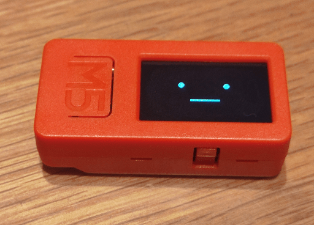</div>  

ダイソーのスピーカーです、片方だけ使います。改造してM5StickCにつなぎます。  
<div>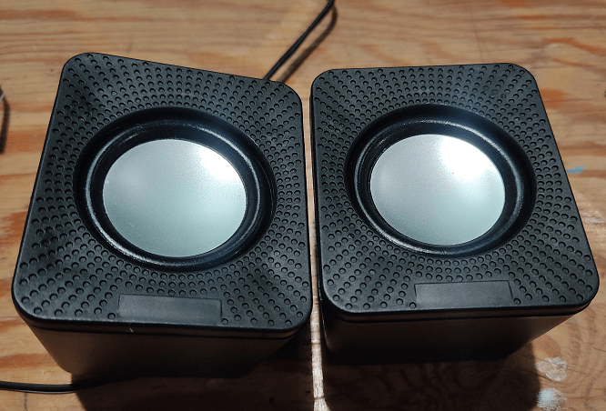</div>  

HDMIケーブルとGroveコネクタを合体したものです。HDMIの中のCECラインでテレビと通信してON/OFFを判別します。  
<div>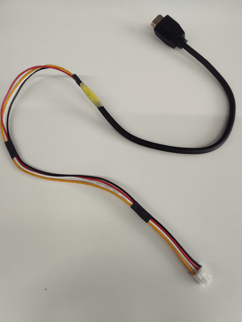</div>  


## ハード構成と作成手順

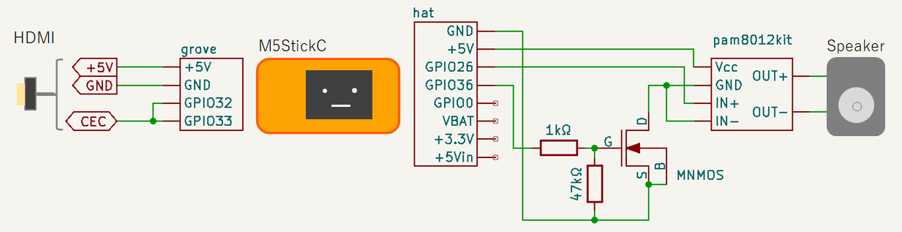  


無音時にもスピーカーにノイズが乗るので、5V電源にローサイドスイッチを入れて、音声出力時だけONしています。  


### 1. スピーカーを分解

スピーカーは片方だけ使います。  
ドライバーで分解すると、ケース＋スピーカーのシンプル構造になっています。  

<div>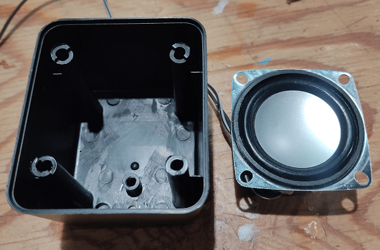</div>  

意外と立派なスピーカーが入っています。  
2pついてきてで300円は安いかも？  
<div>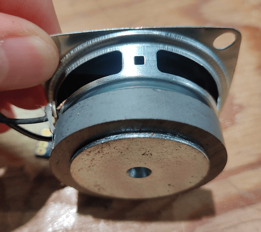</div>  


### 2. D級アンプをはんだ付け

スピーカーにつながっている線を切断して、上記の回路図通りにD級アンプをはんだ付けします。  
<div>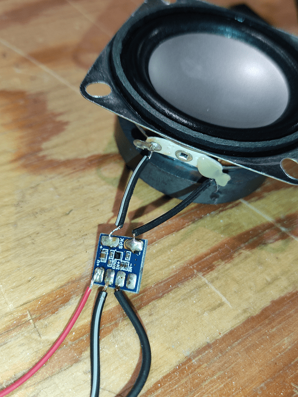</div>  

### 3. ローサイドスイッチをはんだ付け

D級アンプのGNDと、M5StickCのGNDの間にNch MOSFETを入れて、ゲートにGPIO25を接続します。  
これで、GPIO25がHIGHでアンプの電源がON、LOWでOFFになります。  

HAT側のコネクタをピンヘッダとユニバーサル基板で自作して、ローサイドスイッチ用のスペースを作ります。  
<div>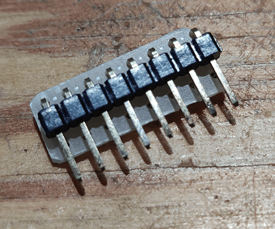</div>  

はんだ付けしました。  
もう少し広く作ってもよかったかも。
<div>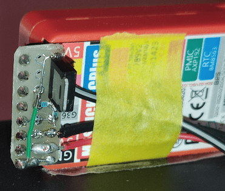</div>  

### 4. GroveケーブルとHDMIケーブルのCECをはんだ付け

M5StickCのGroveコネクタ用ケーブルと、HDMIケーブルのCECをはんだ付けします。  

HDMIケーブルを剥くとこんな感じ、ここからテスタを使ってCEC/VCC/GNDの線を探していきます。  
HDMIのピン配置は <span class="link"></span>[こちらが詳しい](http://www.hdmi-navi.com/pin_assignment_of_hdmi_connectors/)です。
<div>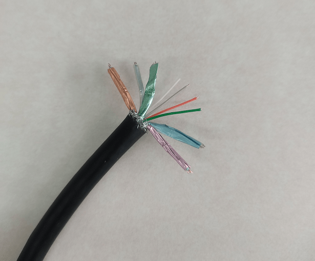</div>  

CECはオープンドレインの1線双方向バスです。  
M5StickC側はGPIO32を入力端子（PullUp）、GPIO33を出力端子（OpenDrain）として使います。  
CECにGPIO32/33を両方はんだ付けします。  
<div>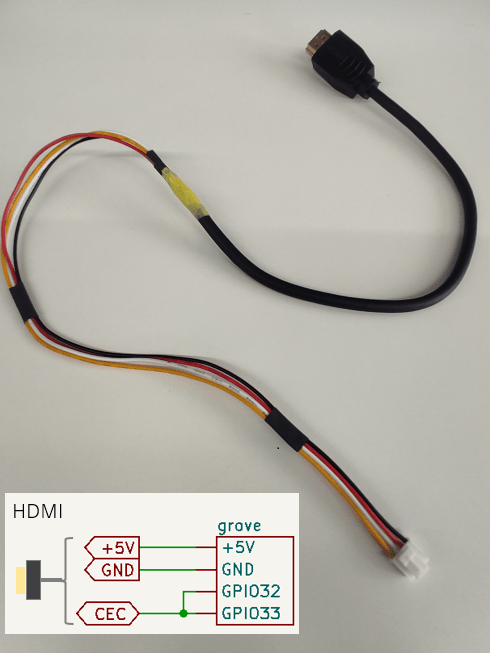</div>  


これでハードは完成です。  


## ソフトウェアの作成

以下のオープンソースを使用しています。 
1. CEC通信 
<a href="https://github.com/floe/CEC" style="text-decoration: none;">
<div class="link-box"><div class="img-box"><div style="background-image: url('https://opengraph.githubassets.com/8f0e172f1f88822948e687c86f1b40deb8601a0771cb61f3a3a8c13d19feaf06/floe/CEC');"></div></div><div class="text-box"><p class="title">GitHub - floe/CEC: Arduino library for HDMI CEC communication</p><p class="description">Arduino library for HDMI CEC communication.</p></div></div>
</a>  

2. MP3再生
<a href="https://github.com/m5stack/M5Unified" style="text-decoration: none;">
<div class="link-box"><div class="img-box"><div style="background-image: url('https://opengraph.githubassets.com/1c43dd78ac745c1f72fe89bfc40456efddc13446d038dd3fedeb629a630e3fa4/m5stack/M5Unified');"></div></div><div class="text-box"><p class="title">GitHub - m5stack/M5Unified: Unified library for M5Stack series</p><p class="description">Unified library for M5Stack series.</p></div></div>
</a>
<a href="https://github.com/earlephilhower/ESP8266Audio/" style="text-decoration: none;">
<div class="link-box"><div class="img-box"><div style="background-image: url('https://opengraph.githubassets.com/8ca4648a045832913e0ec701620821e258e17d4f1974ce78b739e85d48d8f1ae/earlephilhower/ESP8266Audio');"></div></div><div class="text-box"><p class="title">GitHub - earlephilhower/ESP8266Audio: Arduino library to play MOD, WAV, FLAC, MIDI, RTTTL, MP3, and AAC files on I2S DACs or with a software emulated delta-sigma DAC on the ESP8266 and ESP32</p><p class="description">Arduino library to play MOD, WAV, FLAC, MIDI, RTTTL, MP3, and AAC files on I2S DACs or with a software emulated delta-sigma DAC on the ESP8266 and ESP32</p></div></div>
</a>

3. 顔の表示
<a href="https://github.com/meganetaaan/m5stack-avatar" style="text-decoration: none;">
<div class="link-box"><div class="img-box"><div style="background-image: url('https://opengraph.githubassets.com/7c98186332f729a913ef171ff6f6fb8c69d85a43cd1d12440a2ac87a1511c72b/meganetaaan/m5stack-avatar');"></div></div><div class="text-box"><p class="title">GitHub - meganetaaan/m5stack-avatar: An M5Stack library for rendering avatar faces</p><p class="description">An M5Stack library for rendering avatar faces.</p></div></div>
</a>

### 1-1. CEC通信について

テレビのON/OFFを判定するのに、HDMIの中にあるCECという通信ラインを使用します。  
CECは一線双方向の通信バスになっていて、コマンドをテレビに送ることで情報を読み出したり、ON/OFFやボリューム調整などの操作をすることができます。  

CECの仕様書はこちら  
<a href="https://github.com/floe/CEC/blob/master/extras/CEC_Specs.pdf" style="text-decoration: none;">
<div class="link-box"><div class="img-box"><div style="background-image: url('https://opengraph.githubassets.com/8f0e172f1f88822948e687c86f1b40deb8601a0771cb61f3a3a8c13d19feaf06/floe/CEC');"></div></div><div class="text-box"><p class="title">CEC/CEC_Specs.pdf at master · floe/CEC</p><p class="description">Arduino library for HDMI CEC communication. Contribute to floe/CEC development by creating an account on GitHub.</p></div></div>
</a>

今回は、テレビのON/OFFを判別するコマンドを定期的に送って、ONのときの時間をカウントしています。  

以下は仕様書抜粋です。  
Give Device Power Status コマンドを送ると、Power Status が返ってきます。  
<div>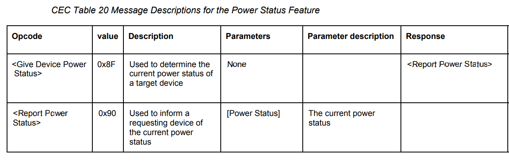</div>  

Power Statusが"0"でTV ON、"1"でTV OFFです。  
<div>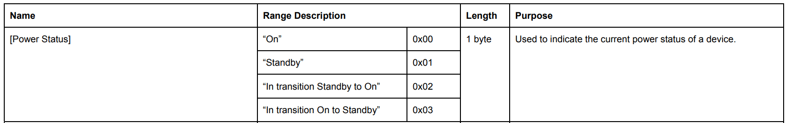</div>  

### 1-2. CECライブラリの修正

上記で紹介したCECライブラリはそのままでは使えず、以下の修正が必要です。  

* 論理の反転
* コンパイル通らない箇所の削除

■ 論理反転  

このCECライブラリのGithubページに飛ぶと、一番下に動作回路図があります。  
これはArduino向けの回路で、双方向通信のためのOpenDrainを作っているものと思います。  
今回、M5StickC（ESP32）側で端子をOpenDrainに設定できるため、この回路は不要になります。  
回路をとっぱらうと通信の論理が逆になるので、ライブラリ側も合わせて修正する必要があります。  

CEC_Device.cppの以下3点を修正します。  

```Cpp
変更点①
void CEC_Device::Initialize(CEC_DEVICE_TYPE type)
{
  //pinMode(_out_line, OUTPUT);
  //pinMode( _in_line,  INPUT);
  pinMode(_out_line, OUTPUT_OPEN_DRAIN);  //out端子をOpenDrainにする
  pinMode( _in_line, INPUT_PULLUP);       //in端子はPullUpする

  //digitalWrite(_out_line, LOW);
  digitalWrite(_out_line, HIGH);          //論理反転


変更点②
bool CEC_Device::LineState()
{
  int state = digitalRead(_in_line);
  //return state == LOW;
  return state == HIGH;                  //論理反転
}

変更点③
void CEC_Device::SetLineState(bool state)
{
  //digitalWrite(_out_line, state?LOW:HIGH);
  digitalWrite(_out_line, state ? HIGH : LOW);   //論理反転
```

■ コンパイル通らない箇所の削除

コンパイルするとエラー箇所がわかると思いますので、削除していきます。  
下記は一例です。  

・Common.cppのavr関連のinclude  
・CEC.inoのキーボード関連の処理  

### 2. MP3再生について

Mp3再生はM5Unifiedのサンプルを使用します。  

<a href="https://github.com/m5stack/M5Unified/blob/master/examples/Advanced/MP3_with_ESP8266Audio/MP3_with_ESP8266Audio.ino" style="text-decoration: none;">
<div class="link-box"><div class="img-box"><div style="background-image: url('https://opengraph.githubassets.com/77e63b157ef42188870100932c81678c55a13cde6aa5213234e3c2fa094a95b5/m5stack/M5Unified');"></div></div><div class="text-box"><p class="title">M5Unified/MP3_with_ESP8266Audio.ino at master · m5stack/M5Unified</p><p class="description">Unified library for M5Stack series.</p></div></div>
</a>

このうち、画面表示系の処理は今回使わないので削除します。  
また、M5Stack-AvatarのLipsync用に、"_m5sound->playRaw"の処理の手前に、以下の変数(outLevel)を追加しておきます。  

```cpp
int16_t outLevel;
　・
　・
　・
if (_tri_buffer_index)
{
  outLevel = abs(_tri_buffer[_tri_index][_tri_buffer_index]);  //★lipsync用に追加
  _m5sound->playRaw(_tri_buffer[_tri_index], _tri_buffer_index, hertz, true, 1, _virtual_ch);
　・
　・
　・
```

### 3. 顔の表示について

issueにM5StickCでの使用例があがっていますので、これを使用します。  

<a href="https://github.com/meganetaaan/m5stack-avatar/issues/59" style="text-decoration: none;">
<div class="link-box"><div class="img-box"><div style="background-image: url('https://opengraph.githubassets.com/348bd0cdd472ce24ec2793be66e69d1d7ed3265324fc906fe665225ec9c611dd/meganetaaan/m5stack-avatar/issues/59');"></div></div><div class="text-box"><p class="title">Work with M5StickC · Issue #59 · meganetaaan/m5stack-avatar</p><p class="description"></p></div></div>
</a>

セリフを出すのは「avatar.setSpeechText」、表情を変えるのは「avatar.setExpression」を使用します。  
また、口の大きさを変える（LipSync）には「avatar.setMouthOpenRatio」を使用します。  

### ソフトウェア全体

以下のGithubにソースコード上げていますので、よかったら参照ください。  

<a href="https://github.com/yamaccu/M5StickC-TVOnCounter" style="text-decoration: none;">
<div class="link-box"><div class="img-box"><div style="background-image: url('https://opengraph.githubassets.com/45517690eac239e87ff418c858914f0e25f30040e91833eac1459438a196da5a/yamaccu/M5StickC-TVOnCounter');"></div></div><div class="text-box"><p class="title">GitHub - yamaccu/M5StickC-TVOnCounter: テレビのON時間をM5StickCを使ってカウントします。</p><p class="description">テレビのON時間をM5StickCを使ってカウントします。</p></div></div>
</a>

## まとめ

HDMIの中のCECラインを使ってテレビのON時間をカウントしてみました。  
CECはあまり馴染みがないかもしれませんが、ブラビアリンクとか、ファミリンクとか、テレビの遠隔操作系に使われているものです。  
その気になれば、1時間でテレビ強制OFFとかもできるのですが、子供の自主性を尊重して声掛けだけにしておきました。  

実際、導入してみると効果がありまして、親に言われるより素直に聞いてくれています。  
近い未来、家庭用ロボットがこんな風に子供の生活を管理してくれるようになるかもしれませんね。  

<br>

以上です。  

<br>
<br>

---
