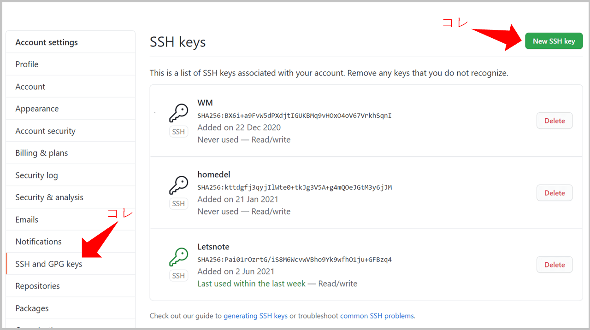
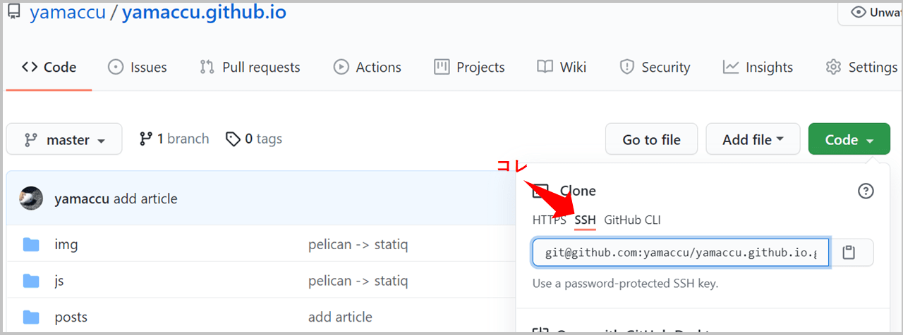

title: Githubで初pushまでの設定
tag: github
RedirectFrom: posts/20210819-Git-push
---

2021/8/19
# githubで初pushまでの設定

---

githubにアクセスする際の認証には、"HTTP"と"SSH"の2種類あります。  
ここでは、SSHの方法を記載します。

## 1. 端末のSSH公開鍵の設定

git bushでSSH公開鍵を生成します。
下記のコマンドで生成できます。

```C#
ssh-keygen -t rsa
```

githubのページにサインインし、Setting => SSH and GPG keys で生成したSSH鍵を登録します。  




## 2. ローカル環境設定

git bushで下記のコマンドを実行して、ローカル環境設定を行います。

```C#
git config --global user.name "ユーザー名"
git config --global user.email "メールアドレス"
```

ユーザー名、メールアドレスはgithubの登録情報と同じものです。

## 3. githubのレポジトリをクローン
githubのページでレポジトリ作成して、作成したレポジトリをローカル環境にクローンします。  

```C#
git clone <アドレス>
```

このとき、アドレスはSSHのものにします。



## 4. commit＆push
ファイルの追加、修正をしたら、以下のコマンドでcommit＆pushします。

```C#
git add <ファイル名>
git commit -m "コメント"
git push (-f) origin main
```  
※-fは強制プッシュなので取り扱い注意です

※originの設定は、クローン時に自動で設定されます。

※2020/10から、デフォルトブランチがmaster ⇒ main に変わりました。

<br>

以上です。

<br>
<br>

---