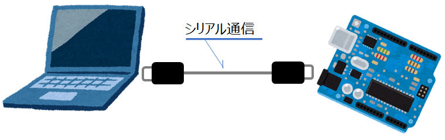
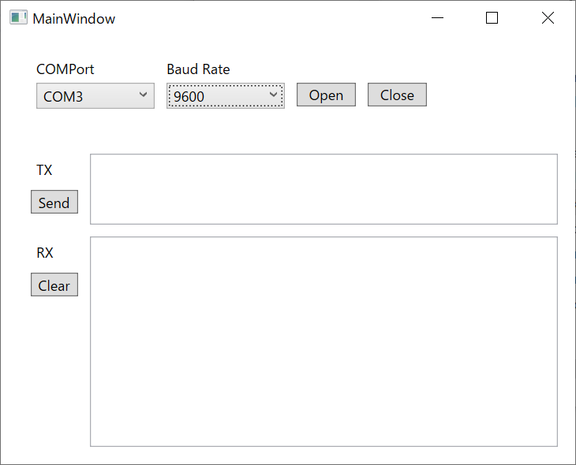

Title: C# WPFでシリアル通信する
Tag: Csharp/WPF
---

2021/08/25

# C#/WPFでシリアル通信を行う

---

シリアル通信とは、機器間で通信する方法の一つで、データを1bitづつ送信する形式のものです。  
代表的な規格はRS-232です。  
PCとマイコンボード（arduinoなど）間で通信するのによく使われています。  

C#には、シリアル通信を行うクラスがすでに用意されています。    
これを使うと簡単にシリアル通信ができます。  

<br>

&nbsp;

<br>

今回、シリアル通信をするGUIアプリをWPFで作ってみました。  
<span class="link"></span> [github](https://github.com/yamaccu/WPF-SerialCommunication/tree/main)   

&nbsp;  

<br>

アプリ作成にあたってReactivePropertyというライブラリを使用しています。  
データバインディングを補佐してくれるもので、大量のINotifyPropertyChangedを実施しなくて済むようになるのでお勧めです。  

また、ReactivePropertyはコマンドバインディングも対応していますが、こちらは今回のアプリでは使用していません。  
正直、規模の小さなアプリではコマンドバインディングするよりコードビハインドにイベント処理を書いてしまった方がシンプルで可読性が良いかと思います。  
（異論はありそうですが。。）

参考1 <span class="link"></span> [公式](https://github.com/runceel/ReactiveProperty)  
参考2 <span class="link"></span> [qiita ReactiveProperty全然分からねぇ！って人向けのFAQ集](https://qiita.com/YSRKEN/items/5a36fb8071104a989fb8)

<br>

以下、作ったアプリの説明になります。 


## 使用Class
<span class="link"></span> [SerialPort class](https://docs.microsoft.com/ja-jp/dotnet/api/system.io.ports.serialport?view=dotnet-plat-ext-5.0)を使用します。  
NugetでSystem.IO.Portsをインストールすると使えるようになります。  
複数ポートを同時に使用しない場合は、staticで宣言することが多いようです。  

使用するメソッドは下記です。

| 機能 | メソッド |
| --- | --- |
| 使用可能ポート取得 | GetPortNames() |
| シリアルポートオープン | Open() |
| シリアルポートクローズ | Close() |
| データ送信 | Write(string) |
| データ受信 | ReadExisting() |


## 使用可能なポートの取得
以下は、使用可能なCOMポートを取得し、アプリ画面のComboBoxに取得データをbindingするコードです。

<span Class="cbtitle">*ViewModel.cs*</span>
```C#
//DataBindig用変数
public ReactiveCollection<string> COMPorts { get; set; }
      = new ReactiveCollection<string>(); 

public void GetCOMPorts()
{
  COMPorts.Clear();
  string[] ports = SerialPort.GetPortNames();
  foreach (var port in ports)
  {
    COMPorts.Add(port);
  }
}
```

<span Class="cbtitle">*MainWindow.xaml*</span>
```C#
<ComboBox ItemsSource="{Binding COMPorts}" />
```

<br>


COMポートを取得するメソッドは、ComboBoxのDropDownOpenedイベントに登録しておくと、ドロップダウンを開く度に使用可能ポートを更新してくれて便利です。  

<span Class="cbtitle">*MainWindow.xaml*</span>
```C#
<ComboBox DropDownOpened="ComboBoxDropDownOpened_COMPort"/>
```

<span Class="cbtitle">*MainWindow.xaml.cs*</span>
```C#
private void ComboBoxDropDownOpened_COMPort(object sender, EventArgs e)
{
  viewModel.GetCOMPorts();
}
```

## シリアルポートのオープン
シリアルポート通信の各種設定をしたのち、接続をOpenします。  
コードは以下です。

```C#
public void SerialOpen()
{
  try
  {
    serialPort.PortName = port;        //選択したport名
    serialPort.BaudRate = baudrate;    //選択したbaudrate
    serialPort.DataBits = 8;
    serialPort.Parity = Parity.None;
    serialPort.StopBits = StopBits.One;
    serialPort.WriteTimeout = 1000;
    serialPort.ReadTimeout = 1000;
    serialPort.Encoding=Encoding.UTF8;
    serialPort.Open();
  }
  catch (Exception ex)
  {
    MessageBox.Show(ex.Message);
  }
}
```


## シリアルポートのクローズ
シリアルポート接続をCloseします。  

```C#
public void SerialClose()
{
  try
  {
    serialPort.Close();
  }
  catch (Exception ex)
  {
    MessageBox.Show(ex.Message);
  }
}
```


## データの送信
文字列を送信します。

```C#
public void Send()
{
  if (serialPort.IsOpen)
  {
    serialPort.Write(TXData);
  }
}
```


## データの受信
文字列を受信します。  
受信データの取り出しは、割込みを使って行います。  
データを受信したらすぐにデータを取り込んでくれます。


```C#
SerialCom.serialPort.DataReceived += OnReceived;

private void OnReceived(object sender, SerialDataReceivedEventArgs e)
{
  RXData += serialPort.ReadExisting();
}
``` 


## 動作確認のためのシリアル通信折り返し方法

シリアル通信で送信したデータを折り返してそのまま受信すると、送信と受信の確認を同時にできて効率的です。  
以下のUSB-シリアル変換を使用すれば確認可能です。  
TxピンとRxピンを導線で繋いで動作確認します。

<span class="link"></span> [秋月電子 FT-232RQ USBシリアル変換モジュール](https://akizukidenshi.com/catalog/g/gM-11007/)

<br>

Arduinoなどが手元にあれば、折り返しするようプログラミングしても良いですね。

<br>

以上です。

<br>
<br>

---
