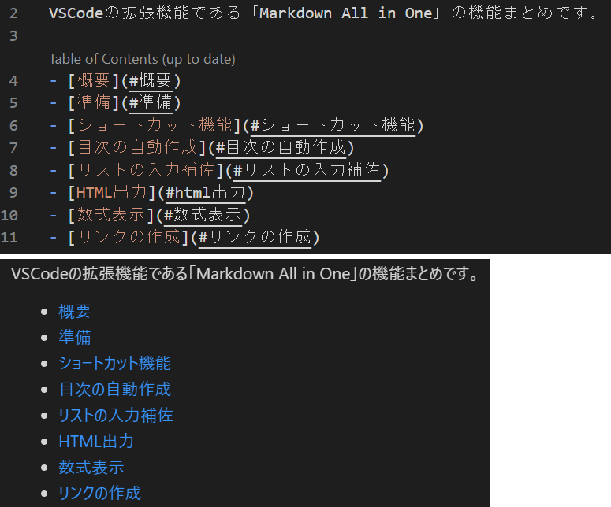
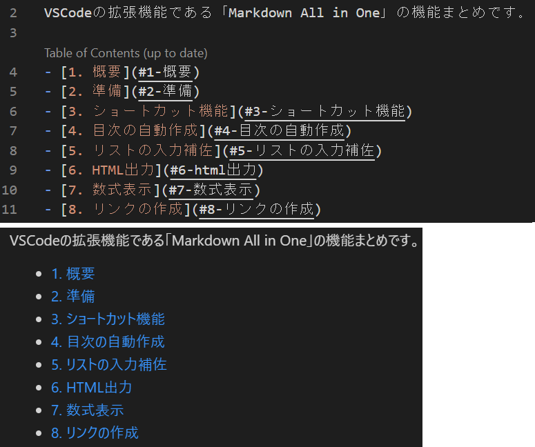
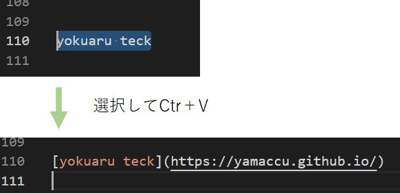

Title: VSCodeの拡張機能「Markdown All in One」を使う
Tag: MarkDown
---

2021/08/30

# VSCodeの拡張機能「Markdown All in One」を使う

---

VSCodeでMarkDownを書くのに、拡張機能「Markdown All in One」を導入すると便利です。

Markdownの記法メモもまとめてみました。  

[MarkDown記法のメモ](/tils/20210816-MarkDown-tips)

## ショートカット機能

 

| キーボード操作 | 機能                                            |
| -------------- | ----------------------------------------------- |
| Ctr+B          | 太字 (**)                                       |
| Ctr+I          | イタリック(*)                                   |
| Ctr+Shift+]    | 見出し(#)、実行ごとに#が増える                  |
| Ctr+Shift+[   | 見出し(#)、実行ごと#が減る                      |
| Ctr+M          | 数式挿入($)                                     |
| Alt+C          | チェックボックスのON（[x]）、もう一度押すと解除 |
| Alt+S          | 取り消し(~~)                                    |
| Alt+Shift+F    | 表の表記のフォーマット整形                      |

 

以下はもともとVSCodeに入っており便利なショートカット

| キーボード操作 | 機能                   |
| -------------- | ---------------------- |
| Ctr+K → v      | サイドにプレビュー表示 |
| Ctr+shift+v    | タブにプレビュー表示   |

## 目次の自動作成
見出し(#)の目次を自動で作成してくれます。  
- 自動作成：Ctr+Shift+p → Markdown All in One: Create Table of Contents
- 更新　　：Ctr+Shift+p → Markdown All in One: Update Table of Contents

↓こんな感じです。  
  

 

また、見出しに自動で番号を振ってくれます。  
- 番号追加：Ctr+Shift+p → MarkDown All in One: Add/Update section numbers
- 番号削除：Ctr+Shift+p → MarkDown All in One: Remove section numbers

↓こんな感じです。  
  

 

目次に入れたくない見出しがある場合は、見出しの前の行に「\<!-- omit in toc -->」を追加します。

## リストの入力補佐
\- や1. などのリストを作成しているときに、行追加時に自動でリストが追加されます。  
また、tabでインデントされます。  
地味に便利なやつ。

## HTML出力
現在開いているMarkDownファイルをHTMLへ変換できます。  
Ctr+Shift+p → Markdown All in One: Print current document to HTML

## リンクの作成
HPなどのアドレスをコピーした状態で、テキストを選択してCtr+Vすると、リンクを自動作成してくれます。

  

 

以上です。

 
 

---