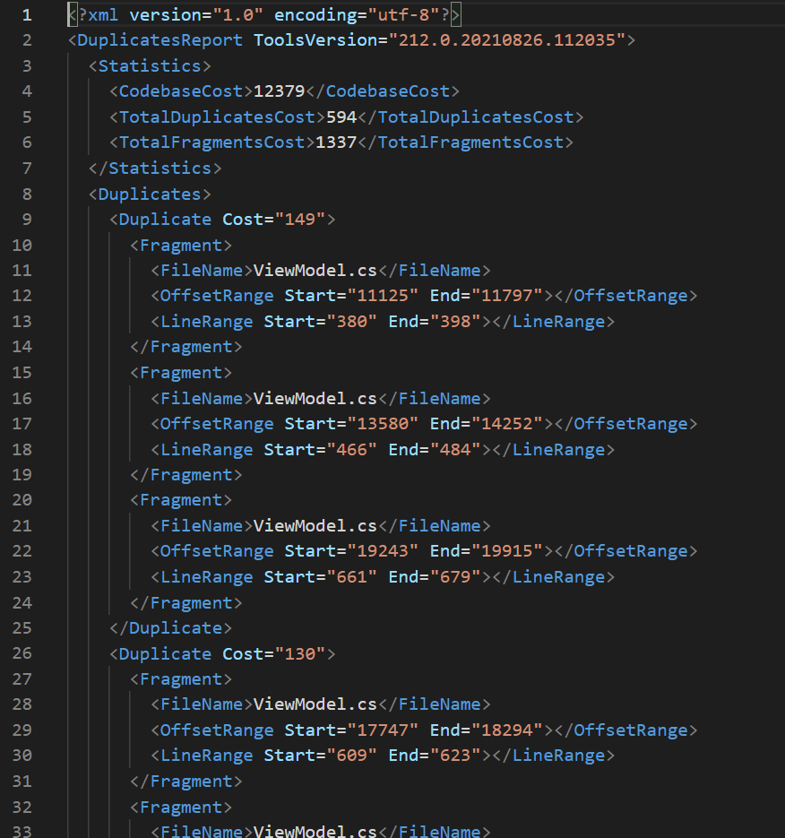
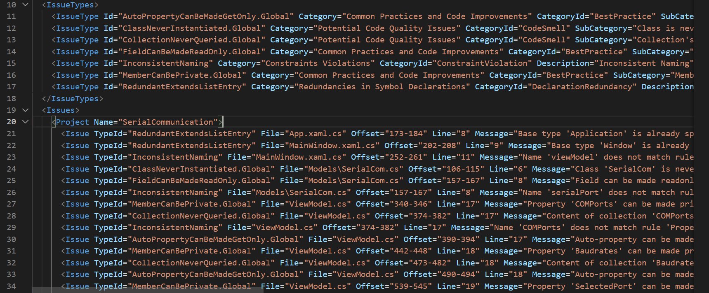

Title: C# Resharperコマンドラインツールを使う
Tag: Csharp/ツール
---

2021/09/03

# C#の開発支援ツール「Resharper」のコマンドラインツールを使う

---

Resharperとは、JetBrains社が販売しているC#開発支援ツールです。  
Visual Studio向けのアドオンと、コマンドラインで実行できるコマンドラインツールがあります。  

Visual Studio向けのアドオンは基本有料で、コーディングのヒントや、ネーミング規則に違反した箇所の指摘などをアクティブに実施してくれます。  

コマンドラインツールは無料で、コードを静的に解析するものです。コードレビュー等に有用です。

本記事では、無料のコマンドラインツールについてまとめています。  


## 準備
Resharper公式から、コマンドラインツールをダウンロードしておきます。

<span class="link"></span> [ダウンロード先](https://www.jetbrains.com/ja-jp/resharper/download/#section=commandline)  


## コマンドラインツールの3つの機能

Resharperのコマンドラインツールには3つの機能があります。  

- CleanupCode：コードの整形
- dupFinder  ：コードの重複の検出
- InspectCode：コードの検査


## CleanupCode
インデントの修正、修飾子の修正、不要Usingディレクティブの削除など、コードの可読性を改善してくれます。  

```C#
<実行コマンド>
cleanupcode.exe YourSolution.sln
```

<br>

既存のファイルに修正結果が上書きされますので、実行時は注意してください。

<br>

公式doc日本語訳  
<span class="link"></span> [CleanupCodeコマンドラインツール](https://pleiades.io/help/resharper/CleanupCode.html)


## dupFinder
コードの重複を調べてレポートファイルをxml形式で出力してくれます。  

```C#
<実行コマンド>
dupFinder.exe <source> --output=<FileName>
```

<br>

```C#
<レポートに重複コードまで含める場合の実行コマンド>
dupFinder.exe <source> --output=<FileName> --show-text
```

<br>

レポートファイルは下記のような感じです。  
- statistics：重複コードの相対サイズがわかります。  
- duplicates：重複箇所を示します。  


  

<br>
<br>

公式doc日本語訳  
<span class="link"></span> [dupFinderコマンドラインツール](https://pleiades.io/help/resharper/dupFinder.html)


## InspectCode
コードを解析して、結果をxml形式で出力してくれます。  

```C#
<実行コマンド>
InspectCode.exe YourSolution.sln --output=<FileName>
```

<br>

レポートファイルは下記のような感じです。  
(小さくて見えづらいかもしれません)  
- TypeId：指摘のカテゴリ
- Message：指摘詳細
- File/Offset/Line：指摘の場所

  

<br>
<br>

例えば、「TypeId：InconsistentNaming」は、ネーミングルール違反を教えてくれています。

<br>

公式doc日本語訳  
<span class="link"></span> [InspectCodeコマンドラインツール ](https://pleiades.io/help/resharper/InspectCode.html)  
<span class="link"></span> [C# のコードインスペクション](https://pleiades.io/help/resharper/Reference__Code_Inspections_CSHARP.html)

<br>

---

