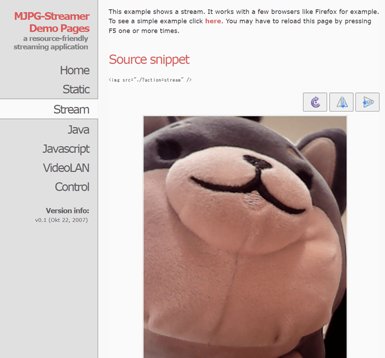

title: RaspberryPiで動画をストリーミングする
tag: RaspberryPi
Date: 2021/10/18
description: RaspberryPiに"mjpg-streamer"を入れて動画をストリーミング配信します。
---

2021/10/18
# RaspberryPiで動画を撮影してストリーミングする

---

mjpg-streamerというフリーソフトを使うと、ラズパイ＋カメラで撮影している映像をwebブラウザ上に表示できます。  
また、他のPCからもラズパイにアクセスすることで、その映像を見ることができます。

参考　<span class="link"></span>[github mjpg-streamer](https://github.com/jacksonliam/mjpg-streamer) 

<br>

以下、手順になります。

## 1. ラズパイに必要なソフトをインストールします。

下記コマンドをターミナルで実行します。
```C#
sudo apt-get update
sudo apt-get install cmake libjpeg8-dev
sudo apt-get install gcc g++
```


## 2. githubからソースをクローンしてビルドします。

下記コマンドをターミナルで実行してビルドします。

```C#
git clone https://github.com/jacksonliam/mjpg-streamer.git
cd mjpg-streamer/mjpg-streamer-experimental
make
sudo make install
```


## 3. 起動します。

起動には、同じフォルダにあるStart.shファイルを使用すると簡単です。  
起動設定を変えたい場合は、Start.shファイルの中身を修正します。

```C#
bash Start.sh
```

ラズパイカメラを使用する場合は、実行するコマンドのインプット設定を以下のようにします。    
※元のコマンド（input_uvc）のままラズパイカメラを使用すると、解像度が悪いなど設定が変になる可能性があります。  

```C#
./mjpg_streamer -i "./input_raspicam.so" -o "./output_http.so -w ./www"
```

コマンドのオプションは下記を参照ください。  
<span class="link"></span>[input_raspicam/README.md](https://github.com/jacksonliam/mjpg-streamer/blob/master/mjpg-streamer-experimental/plugins/input_raspicam/README.md)  

<br>

## 4. 映像を確認します。

ラズパイでChromeなどのwebブラウザを起動して "localhost:8080" にアクセスすると、以下のような画面になります。  
また、ラズパイがネットワークにつながっていれば、他のPCから "ラズパイのIPアドレス:8080" にアクセスすると同じ画面が見れます。  




## 静止画保存

```C#
wget -O /tmp/picture.jpg http://localhost:8080/?action=snapshot
```


## 動画保存
ffmpegというソフトを使用します。  
まず、以下のコマンドでインストールします。

```C#
sudo apt-get install ffmpeg
```

動画の保存は以下のコマンドを実行します。

```C#
ffmpeg -i http://localhost:8080/?action=stream file.avi
```

<br>

以上です。  

<br>
<br>

---