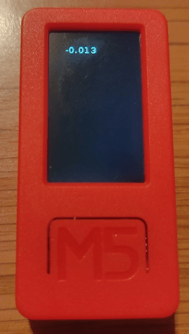

Title: 「M5StickC」6軸センサをつかう
Tag: M5StickC
Date: 2022/3/7
description: M5StickCで6軸センサを使う方法とまとめました。
---

2022/3/7

# M5StickCの6軸センサを使う

---

&nbsp;
← M5StickCはこんなやつ。  

M5StickCとは、小型（消しゴムサイズくらい）ながら多機能を備えたマイコンボードです。  
LCD、Wifi、6軸センサなどが搭載されています。  

## 6軸センサについて

6軸センサとは、3軸の加速度センサ（x方向、y方向、z方向）と3軸の角速度センサ（x方向、y方向、z方向）が搭載されているセンサです。  
これを使うと、水平方向にどのくらい動いたか、どのくらい回転したか、などを検出することができます。  

以降、この6軸センサの使い方を説明していきます。  

 

また、プログラムはUIFlowを使用します。  
UIFlowについてはこちらを参照ください。

[UIFlow Use](https://m5stack.github.io/UIFlow_doc/ja/)  
[M5Stack向けのVisual Programming「UIFLOW」でカスタムブロックを作成する](https://yamaccu.github.io/tils/20210823-UIFLOW-CustomBlock)

## UIFlowで6軸センサの値を取得する

まずUIFlowを開きます。  
web版のURLは↓↓です。  

 [M5Flow](https://flow.m5stack.com/)  

ブロックを選ぶメニューで「ハードウェア」⇒「加速度＆ジャイロ」を開くと、x/y/z それぞれの加速度、角速度のブロックが表示されます。  
また、水平に対する現在の角度はピッチ角とロール角で取得できます。  

 
 

次に、これらの値をLCDに表示するプログラムを作ります。  

 
 

これをM5StickCへ転送すると、画面にx軸方向の加速度が表示されます。  
他のパラメータも同様に表示ができます。

## 加速度の見方

何も動かさない状態では、重力のみを検知します。  
重力は1Gです。  

 
 

M5StickCを振ったりして動かすと、それに応じた加速度が観測できます。  
観測値の単位は「G」です。

## 角速度の見方

何も動かさない状態では角速度は0です、と言いたいのですが初期値が0からずれていることが多いようです。  
少しくらいなら気にする必要はないと思いますが、気になる方は0になるよう値をオフセットしておくと良いと思います。  

回転方向に動かすと、それに応じた角速度が観測できます。  
観測値の単位は「dps: degrees per second」です。

## 現在の角度の見方

画面を上に向けた状態で水平に置くと、ピッチ角とロール角が共に0°になります。  
ここからM5StickCを傾けていくと、ピッチ角とロール角の値が変わっていきます。  
観測値の単位は「度(°)」ですので、垂直に立たせると値は90になります。

ピッチ角とロール角の値は、加速度と角速度から計算しています。  
複雑な計算式があるようですが、UIFLowではブロックを使用すれば、計算を意識する必要はありません。  

このピッチ角とロール角を使用することで、M5StickCの傾きによった処理を実行できます。  
例えば、下記のような倒立振子などを作成することができます。  

 [qiita 【改良】M5StickC UiFLOWブロックプログラミングで倒立振子(ピッチ角版)](https://qiita.com/Google_Homer/items/e88eedd951c7e5cea865)

## M5StickC購入先

秋葉原へ行くと秋月電子やマルツで購入できます。  
また、オンラインですとamazonのスイッチサイエンスショップでも購入できます。

<!-- START MoshimoAffiliateEasyLink -->

リンク

<!-- MoshimoAffiliateEasyLink END -->

## （参考）6軸センサのIC

MPU6886というICが使われています。  
UIFlowを使う場合はICを意識する必要はありませんが、arduinoなどでプログラミングする際はレジスタマップなどを確認すると、更に詳細な制御ができるようになります。  
一応データシートのリンクを載せておきます。

[DataSheet](https://m5stack.oss-cn-shenzhen.aliyuncs.com/resource/docs/datasheet/core/MPU-6886-000193%2Bv1.1_GHIC_en.pdf)

加速度は±2g/±4g/±8g/±16g  
角速度は±250dps/±500dps/±1000dps/±2000dps（dps: degrees per second）
の測定レンジを設定可能のようです。  

 
 

以上です。

---