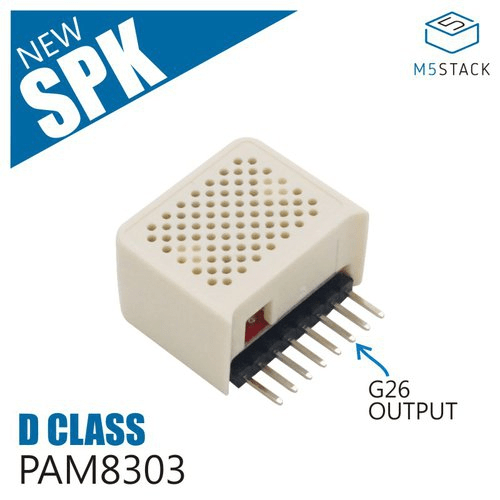
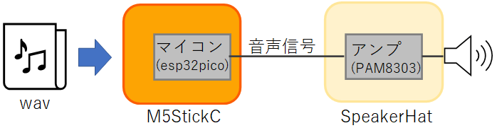
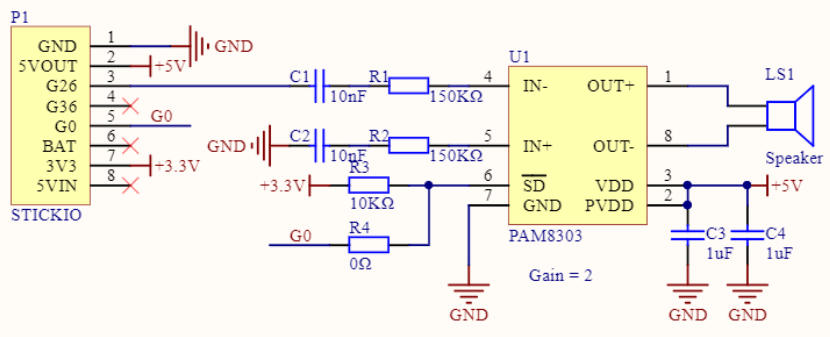
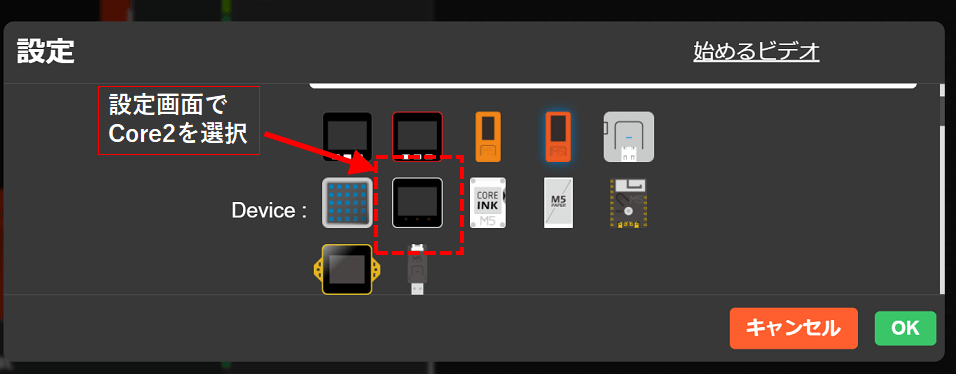
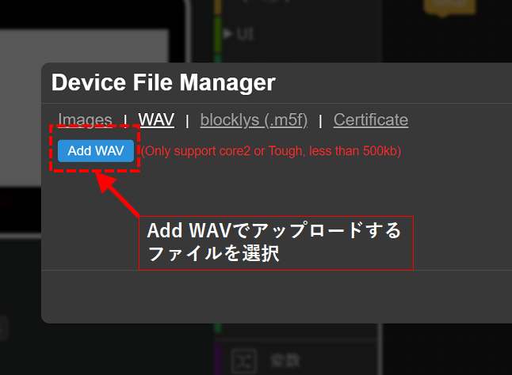
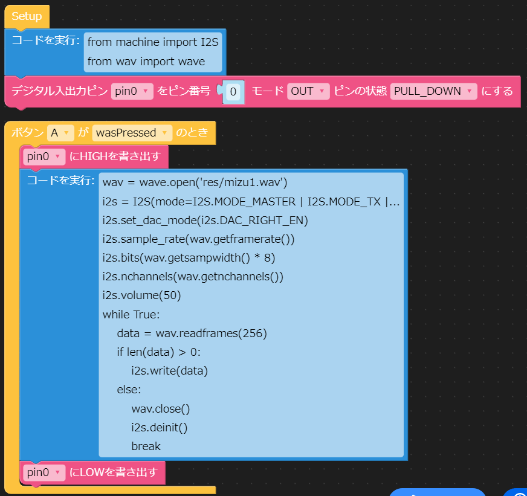

Title: 「M5StickC」SpeakerHatでwavを再生する
Tag: M5StickC
Date: 2022/3/10
description: M5StickCとSpeaker Hatでwavファイルを再生します。
---

2022/3/10

# M5StickCとSpeakerHatでwavを再生する

---

&nbsp;
 ←M5StickCです

M5StickCとは、小型（消しゴムサイズくらい）ながら多機能を備えたマイコンボードです。  
M5StickCには「HAT」と呼ばれる拡張モジュールが用意されており、HATを装着することにより、様々な機能を追加できます。  
本記事では、SpeakerHatを使用して、wavファイルを再生していきます。

<span class="link"></span>[HATの種類](https://shop.m5stack.com/collections/m5-sensor/HAT)

また、プログラムはUIFlowを使用します。  
UIFlowについてはこちらを参照ください。

<span class="link"></span>[UIFlow Use](https://m5stack.github.io/UIFlow_doc/ja/)  

<br>

※注  

本記事の方法でwav再生できるのは、UIFLOWのバージョンが1.7.5のものになります。  
1.9以上のものはI2Sクラスの中身が異なっており、再生することができませんのでご注意ください。  
詳しくは末尾の "（参考）micropythonについて" を参照ください。  


## SpeakerHatについて

  
←Speaker Hatはこんなの  

<br>

SpeakerHatの中にはアンプとスピーカーが入っています。  
M5StickCのG26ピン（内蔵DAC出力）から音声信号が出力され、Speaker Hat内のアンプで増幅してスピーカーで音を出します。  

  

<br>
<br>

アンプはPAM8303というICを使用しています。  
回路図は↓↓です。  
/SD端子（シャットダウン）がG0に繋がっていて、G0をLowレベルにすると音声出力が止まります。  

  


## UIFlow(micropython)のI2Sクラスについて

M5StickCから音声信号を出すために、machineモジュールのI2Sクラスを使用します。  
I2Sクラスの内容および説明は、下記のページが参考になります。 

<span class="link"></span>[M5StickC UIFlow非公式日本語リファレンス](https://lang-ship.com/reference/unofficial/M5StickC_UIFlow/class/machine.I2S/)  
<span class="link"></span>[espressif Inter-IC Sound (I2S)](https://docs.espressif.com/projects/esp-idf/en/latest/esp32/api-reference/peripherals/i2s.html)

これらを使ってwavファイルを再生します。

## wavファイルを再生するプログラム

まず最初に、wavファイルをM5StickCへアップロードします。  
UIFlowの設定画面でCore2を選択します。(M5StickCの設定だと50kbまでしか転送できないので)  

※M5StickCが使えるメモリは少なく、転送ファイルは合計1Mb以下程度に納めることをお勧めします。  

　<br>

その後、MANAGERアイコンをクリックし、wavファイルを転送します。  
画面はCore2になっていますが、ちゃんとM5StickCへファイル転送できます。  

　<br>
　<br><br>


wavファイルを再生するには下記のプログラムを実行します。  

```python
from machine import I2S
from wav import wave

wav = wave.open('res/<ファイル名.wav>')
i2s = I2S(mode=I2S.MODE_MASTER | I2S.MODE_TX | I2S.MODE_DAC_BUILT_IN)
i2s.set_dac_mode(i2s.DAC_RIGHT_EN)
i2s.sample_rate(wav.getframerate())
i2s.bits(wav.getsampwidth() * 8)
i2s.nchannels(wav.getnchannels())
i2s.volume(50)

while True:
    data = wav.readframes(256)
    if len(data) > 0:
        i2s.write(data)
    else:
        wav.close()
        i2s.deinit()
        break
```

UIFlowで実行するには下記のようにします。  
pin0は、SpeakerHat内のアンプのON/OFFをしています。  
wavファイル名指定のところを変えるのを忘れずに。  

　<br><br>

これをM5StickCへ転送してボタンを押せば、wavファイルを再生できます。

## カスタムブロックの作成

UIFlowにはブロックを自作する機能があります。  
先ほどのwav再生のプログラムのブロックを作成しておくと、何度も使うときにいちいちコピペしなくて良くなり便利です。  
ブロックの作り方は以下を参照ください。  
例として、wavファイルを再生するブロックの作成方法の説明があります。  

<span class="link"></span>[M5Stack向けのVisual Programming「UIFLOW」でカスタムブロックを作成する](https://yamaccu.github.io/tils/20210823-UIFLOW-CustomBlock)


## M5StickC購入先

秋葉原へ行くと秋月電子やマルツで購入できます。  
また、オンラインですとamazonのスイッチサイエンスショップでも購入できます。

<!-- START MoshimoAffiliateEasyLink -->
<script type="text/javascript">
(function(b,c,f,g,a,d,e){b.MoshimoAffiliateObject=a;
b[a]=b[a]||function(){arguments.currentScript=c.currentScript
||c.scripts[c.scripts.length-2];(b[a].q=b[a].q||[]).push(arguments)};
c.getElementById(a)||(d=c.createElement(f),d.src=g,
d.id=a,e=c.getElementsByTagName("body")[0],e.appendChild(d))})
(window,document,"script","//dn.msmstatic.com/site/cardlink/bundle.js?20210203","msmaflink");
msmaflink({"n":"M5StickC Plus","b":"スイッチサイエンス","t":"","d":"https:\/\/m.media-amazon.com","c_p":"","p":["\/images\/I\/41H4Q+Pi1zL._SL500_.jpg"],"u":{"u":"https:\/\/www.amazon.co.jp\/dp\/B09MVQD8QJ","t":"amazon","r_v":""},"v":"2.1","b_l":[{"id":2,"u_tx":"Amazonで見る","u_bc":"#f79256","u_url":"https:\/\/www.amazon.co.jp\/dp\/B09MVQD8QJ","a_id":2991341,"p_id":170,"pl_id":27060,"pc_id":185,"s_n":"amazon","u_so":0}],"eid":"YvUpd","s":"s"});
</script>
<div id="msmaflink-YvUpd">リンク</div>
<!-- MoshimoAffiliateEasyLink END -->

<!-- START MoshimoAffiliateEasyLink -->
<script type="text/javascript">
(function(b,c,f,g,a,d,e){b.MoshimoAffiliateObject=a;
b[a]=b[a]||function(){arguments.currentScript=c.currentScript
||c.scripts[c.scripts.length-2];(b[a].q=b[a].q||[]).push(arguments)};
c.getElementById(a)||(d=c.createElement(f),d.src=g,
d.id=a,e=c.getElementsByTagName("body")[0],e.appendChild(d))})
(window,document,"script","//dn.msmstatic.com/site/cardlink/bundle.js?20210203","msmaflink");
msmaflink({"n":"M5StickC Speaker Hat（PAM8303搭載）","b":"スイッチサイエンス","t":"M5STACK-SPK-HAT","d":"https:\/\/m.media-amazon.com","c_p":"\/images\/I","p":["\/21UuNuhxH0S._SL500_.jpg","\/31T9KCO8MNL._SL500_.jpg"],"u":{"u":"https:\/\/www.amazon.co.jp\/dp\/B07Z4VD4DX","t":"amazon","r_v":""},"v":"2.1","b_l":[{"id":2,"u_tx":"Amazonで見る","u_bc":"#f79256","u_url":"https:\/\/www.amazon.co.jp\/dp\/B07Z4VD4DX","a_id":2991341,"p_id":170,"pl_id":27060,"pc_id":185,"s_n":"amazon","u_so":1}],"eid":"5eu3P","s":"s"});
</script>
<div id="msmaflink-5eu3P">リンク</div>
<!-- MoshimoAffiliateEasyLink END -->

## （参考）micropythonについて

UIFLowはmicropythonをベースに作成されています。  
micropythonとは、pythonをマイコン上で動かせるように最適化したものです。  
主にesp32系のマイコンでよく使われているようです。  

特徴として、pythonで書けるので記述がシンプルになるのと、REPLと呼ばれるインタープリタが使用できデバッグしやすいなどがあります。  
また、オープンソースで以下で公開されています。  

<span class="link"></span>[github micropython](https://github.com/micropython/micropython)

micropythonには、loborisという派生バージョンがあります。  
色々違いはあるのですが、I2Sクラスを使って内蔵DACで音声再生ができる機能が追加されています。  

<span class="link"></span>[github MicroPython_ESP32_psRAM_LoBo](https://github.com/loboris/MicroPython_ESP32_psRAM_LoBo)

UIFlowはver 1.7.5ではloboris版をベースに作成されていますが、最新版ではmainstream版で作成されています。  
mainstream版では、I2Sクラスで内蔵DACから音声データを出力することができません。  
なので、本記事の方法でwavデータを再生することができなくなっています。  

<span class="link"></span>[参考 M5Stack Community](https://community.m5stack.com/topic/3216/updated-micropython)

再生する他の方法としては、UIFlowではなくArduinoを使う、外部にI2S対応アンプをつなげてI2Sで音声を出力するなどがあるかと思います。  


<br>

以上です。

<br>
<br>

---