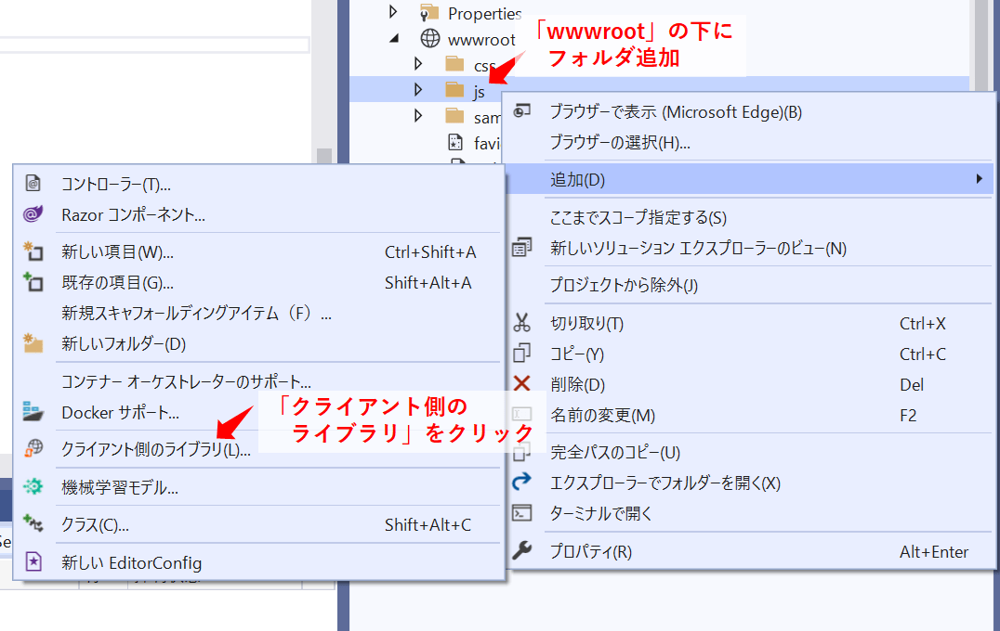
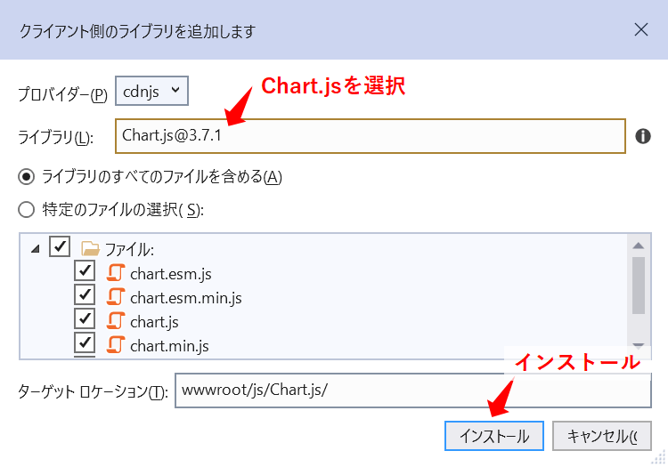
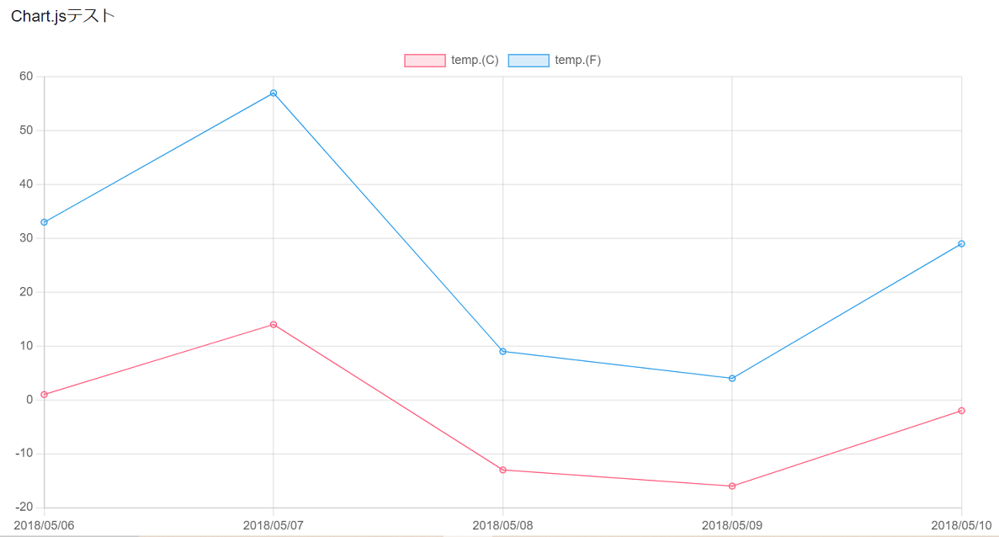

Title: 「Blazor」Chart.jsでグラフを描く
Tag: Csharp/Blazor
Date: 2022/3/16
description: Blazor上でChart.jsでグラフを描く方法をまとめました。
---

2022/3/16

# BlazorでChart.jsを使ってグラフを描く

---

BlazorでChart.jsを使う方法をまとめました。  
環境：dotnet 5.0.300 / Chart.js 3.7.1  

githubにプログラムを上げていますので、参考にしてください。  
<span class="link"></span>[github](https://github.com/yamaccu/Blazor-CharjsTest)

## 手順

1. Chart.jsをインストール
2. グラフの設定データの準備
3. Javscriptでグラフを描くfunctionを作成
4. グラフを挿入したい場所に\<canvas>を追加
5. 「JSRuntime.InvokeAsync」でJavaScriptを実行

## 1.Chart.jsをインストール

VisualStudioで、「wwwroot」の下にインポート用のフォルダを作成し、右クリックして「クライアント側のライブラリ」を選択します。  

  

<br>

ライブラリで「Chart.js」を選択しインストールします。  

  

これでインストール完了です。


## 2.グラフの設定データの準備

chart.jsのグラフのデータは、jsonファイルで設定します。  

jsonファイルの例  
```json
{
    "type":"line",
    "data":{
        "labels":["2018/05/06","2018/05/07","2018/05/08","2018/05/09","2018/05/10"],
        "datasets":[{
            "label":"temp.(C)",
            "data":[1,14,-13,-16,-2],
            "backgroundColor":"rgba(255, 99, 132, 0.2)",
            "borderColor":"rgba(255, 99, 132, 1)",
            "borderWidth":1
        },
        {
            "label":"temp.(F)",
            "data":[33,57,9,4,29],
            "backgroundColor":"rgba(54, 162, 235, 0.2)",
            "borderColor":"rgba(54, 162, 235, 1)",
            "borderWidth":1
        }]
    }
}
```

<br>

C#でjsonファイルを作るには、クラスで階層構造を作成し、JsonSerializer.Serializeメソッドを使用して作ったクラスをJsonファイルに変換します。  

クラスの例  
```C#
public class ChartJson
{
    public string type { get; set; }
    public Data data { get; set; }
}

public class Data
{
    public IEnumerable<string> labels { get; set; }
    public Dataset[] datasets { get; set; }
}

public class Dataset
{
    public string label { get; set; }
    public IEnumerable<int> data { get; set; }
    public string backgroundColor { get; set; }
    public string borderColor { get; set; }
    public int borderWidth { get; set; }
}
```

<br>

グラフをカスタマイズしたいときは、下記のサイトを参考にメンバ変数を追加していきます。  
例えば、縦軸の範囲を固定したり、メモリを調整したり、表示時のアニメーションを追加したりできます。  

<span class="link"></span>[Chart.js公式](https://www.chartjs.org/docs/latest/)  
<span class="link"></span>[とほほのChart.js入門](https://www.tohoho-web.com/ex/chartjs.html#sample)  


## 3.Javscriptでグラフを描くfunctionを作成

JavaScriptでグラフを描くスクリプトを作成します。  
Blazor Webassenblyの場合は「index.html」、Blazor Serverの場合は「_Host.cshtml」の\<body>に追加していきます。  

まず、Chart.jsを呼び出せるようにします。  

```JavaScript
<script type="text/javascript" src="js/Chart.js/chart.min.js"></script>
```

グラフを描くプログラムは下記です。  
```JavaScript
<script>
    function renderChart(data) {
        if (window.chartObj) {
            window.chartObj.destroy();
        }
        var ctx = document.getElementById('myChart');
        window.chartObj = new Chart(ctx, JSON.parse(data));
    };
</script>
```

## 4.グラフを挿入したい場所に\<canvas>を追加

グラフを挿入したい場所に、以下のように\<canvas>を追加します。

```HTML
<div>
    <canvas id="myChart"></canvas>
</div>
```

## 5.「JSRuntime.InvokeAsync」でJavaScriptを実行

まず、jsonファイル用のクラスにグラフのパラメータを設定します。  
ここでは、データはBlazorデフォルトプロジェクトのWeather forecastのものを使用しています。  

```C#
@using System.Linq

var DataSets1 = new Dataset()
{
    label = "temp.(C)",
    data = forecasts.Select(f => f.TemperatureC),
    backgroundColor = "rgba(255, 99, 132, 0.2)",
    borderColor = "rgba(255, 99, 132, 1)",
    borderWidth = 1,
};

var DataSets2 = new Dataset()
{
    label = "temp.(F)",
    data = forecasts.Select(f => f.TemperatureF),
    backgroundColor = "rgba(54, 162, 235, 0.2)",
    borderColor = "rgba(54, 162, 235, 1)",
    borderWidth = 1,
};

chartJson = new ChartJson()
{
    type = "line",
    data = new Data()
    {
        labels = forecasts.Select(f => f.Date.ToShortDateString()),
        datasets = new Dataset[2] { DataSets1, DataSets2 },
    },
};
```

このクラスをJsonSerializer.SerializeでJsonファイルに変換してJSRuntime.InvokeAsyncを実行します。  
すると、「renderChart」functionが実行されて、Canvasにグラフが表示されます。 

<span class="link"></span>[参考 ASP.NET Core Blazor で .NET メソッドから JavaScript 関数を呼び出す](https://docs.microsoft.com/ja-jp/aspnet/core/blazor/javascript-interoperability/call-javascript-from-dotnet?view=aspnetcore-6.0)

```C#
@inject IJSRuntime JSRuntime
@using System.Text.Json

var jsonStr = JsonSerializer.Serialize(chartJson);
await JSRuntime.InvokeAsync<string>("renderChart", jsonStr);
```

画面がレンダリングされると同時にグラフを表示するには、下記のメソッドで上記コードを実行します。  

```C#
protected override async Task OnInitializedAsync()
{
    ~~~~~
}
```

<br>

これで、以下のようなグラフが表示されます。

  


<br>
<br>

以上です。

---