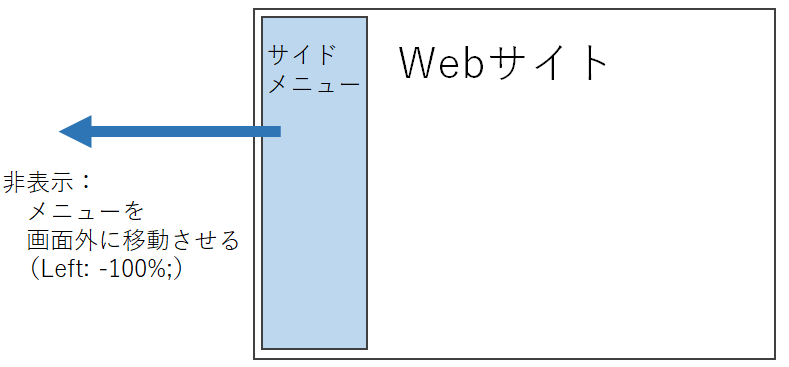

title: 「JavaScript」サイドメニューの表示/非表示
Date: 2022/3/28
Tag: HTML/CSS/JS
description: webサイトで、サイドメニューを表示したり非表示にしたりする方法とまとめました。
---

2022/03/28
# JavaScriptを使ってサイドメニューを表示したり非表示にしたりする
---

webサイトでよくある、サイドメニューを開閉して、折りたたむ方法です。  
本サイトでも実装しており、携帯のブラウザなど表示幅が小さい状態で、左上のハンバーガーメニューを押すとサイドメニューがぐいっと出てきます。  
また、PCでご覧の方は、今開いているwebブラウザの幅を狭めるとサイドメニューがサッといなくなると思います。  

## 実装方法

メニューの非表示は、メニューの位置を画面外に追いやることで実現します。  
イメージはこんな感じです。  

  

cssで transition: .2s; くらいにすると、ほどよいアニメーションになります。  

## ボタンを押して表示/非表示

HTML側は、サイドメニューと、何かしらの要素を用意しておきます。  
下記は、要素をクリックすると、サイドメニューが画面外に移動⇔復帰を繰り返すプログラムです。  
ここでは要素はid: humbergericon、サイドメニューはid: sidemenuとしています。  

javascript

```javascript
var humbergericon = document.getElementById("humbergericon");
humbergericon.onclick = function () {
  if(sidemenu.style.left== "5px")
  {
    sidemenu.style.left = "-100%";
  }
  else
  {
    sidemenu.style.left = "5px";
  }
}
```

humbergericon.onclick： 指定した要素がクリックされた時に実行されるイベントです。ここではid: humbergericonを指定要素としています。  

sidemenu.style.left = "-100%"： id:sidemenuの要素のleftプロパティを-100%に設定しています。これにより、id:sidemenuの要素を左側の画面外へ飛ばしています。  


## ブラウザの幅によって表示/非表示

ブラウザの幅が広いときはメニューを表示して、狭いときは非表示にするプログラムです。  
ウインドウ幅が768pxを境目にしています。  

javascript
```javascript
window.onresize = function(){
  if (window.innerWidth >= 768) 
  {
    sidemenu.style.left = "5px";
  }
  else
  {
    sidemenu.style.left = "-100%";
  }
}
```

window.onresize： ウインドウサイズが変更されたときに実行されるイベント

<br>

以上です。

<br>
<br>

---
