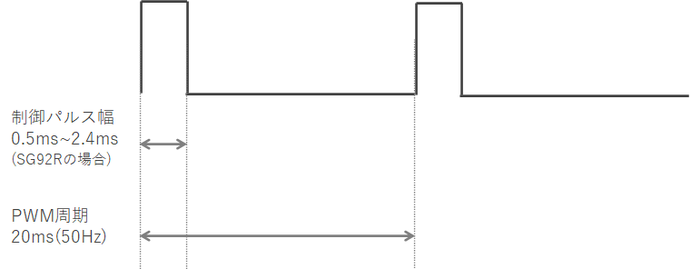
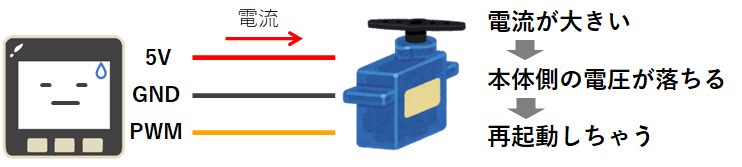
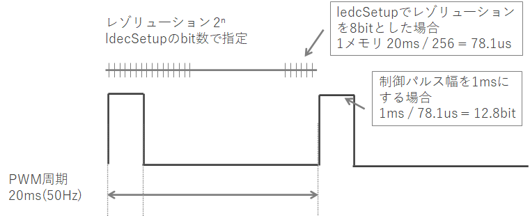

Title: 「M5Stack」サーボモータを使う
Tag: M5Stack
Date: 2022/8/1
description: M5Stack(ESP32)でサーボモータを制御する方法をまとめました。
---

2022/08/01
# M5Stack(ESP32)でサーボモータを使う

---

&nbsp;
← M5Stackはこんなやつ。  

M5Stackでサーボモータを制御する方法をまとめました。  
ESP32マイコンでサーボモータを使う場合も同様の手順で制御できます。  

サーボモータにはPWMサーボと、シリアルサーボがあります。  

- PWMサーボ： PWM信号を送るだけで回転量を制御できるのでお手軽
- シリアルサーボ： 通信によって回転命令だけでなく状態などを取得可能、通信バス上に複数台のサーボを繋げられるのでサーボ数が多い場合に便利

本記事ではPWMサーボの制御について説明しています。  

## サーボモータの制御方法

以降で3通りの方法を紹介します。

1. ESP32マイコンのLED Control機能でPWM信号を生成する
2. ESP32Servoライブラリを使用する
3. ServoEasingライブラリを使用する

M5Stackからサーボモータへ出力するPWM信号は下記のようになります。  
制御パルスの幅で回転角を指定します。  
（周波数50Hz、パルス幅0.5ms～2.5ms辺りで制御することが多いようです。）  

<br>
  
<br>
<br>

使うサーボモータによって制御パルス幅の仕様が違いますので、データシートなどで制御パルス幅をご確認ください。  

※ 本記事では動作確認に「SG92R」というサーボモータを使用していて、制御パルス幅は0.5ms~2.4msになります  
※ M5Stackからサーボモータへ電源を供給する場合、負荷によっては供給しきれずにM5Stackが再起動してしまう場合があります。  
　その場合は、外部から電源を持ってくる必要があります。  

&nbsp;&nbsp;  


## LED Control機能でPWM信号を生成する

M5StackにはESP32というマイコンが搭載されています。  
このESP32に標準装備されている「LED Control」機能でPWMを生成できます。  

&nbsp;&nbsp;<span class="link"></span>[ESP-IDF ProgramingGuide LED Control (LEDC)](https://docs.espressif.com/projects/esp-idf/en/latest/esp32/api-reference/peripherals/ledc.html)  

arduinoでこの機能を使うには、LEDC関数を使用します。  

&nbsp;&nbsp;<span class="link"></span>[arduino-esp32 esp32-hal-ledc.h](https://github.com/espressif/arduino-esp32/blob/5f427c998a5eff55abf163a4fbeab17fff06e348/cores/esp32/esp32-hal-ledc.h)  
&nbsp;&nbsp;<span class="link"></span>[arduino-esp32 esp32-hal-ledc.c](https://github.com/espressif/arduino-esp32/blob/5f427c998a5eff55abf163a4fbeab17fff06e348/cores/esp32/esp32-hal-ledc.c)

ソースコードは以下になります。  

```C
// ledcSetup(uint8_t channel, uint32_t freq, uint8_t resolution_bits)
ledcSetup(0, 50, 8);

// ledcAttachPin(uint8_t pin, uint8_t channel)
ledcAttachPin(2, 0);

// ledcWrite(uint8_t channel, uint32_t duty)
ledcWrite(0, 13);   // 制御パルス1ms
```

ledcSetup  
- channel： PWMの制御チャンネルを指定します。0~15のどれかを選びます。  
- freq： PWM信号の周波数を指定します。  
- resolution_bits： PWM信号の1周期のレゾリュ―ションをbit数で指定します。  
  また、このbit数でfreqで指定可能な最大周波数が制限され、1/{(1/80/10\^6)[s] * 2^n[bit]} [Hz]となります。  
  ※80: ESP32ペリフェラル動作クロック80MHz、n： resolution_bitsの値、n=8のときのPWMの最大周波数は312,500Hz

ledcAttachPin  
- pin： PWM信号を出力するピンを指定します。  
- channel： ledcSetupで指定したチャンネルとします。  

ledcWrite  
- channel： ledcSetupで指定したチャンネルとします。  
- duty： 制御パルス幅を、ledcSetupで指定したresolution_bitsのbit数で指定します。  
  50Hz、8bitで1ms幅とするには 1[ms] / {(1/50*1000)[ms] / 2^8[bit]} = 13[bit] となります。   

<br>
  
<br>
<br>


## ESP32Servoライブラリを使う

上記のLEDC関数は、制御パルス幅を周波数とレゾリュ―ションbitから計算する必要があり、ひと手間かかります。  
これを簡単にしてくれるのがESP32Servoライブラリです。  
setPeriodHertz ⇒ attach ⇒ write で、角度を指定して制御ができます。  
だいぶらくちんですね。  

ちなみに、ライブラリの中身を見てみるとLEDC関数を使ってPWM制御しています。  

&nbsp;&nbsp;<span class="link"></span>[arduino ESP32Servoライブラリ](https://www.arduino.cc/reference/en/libraries/esp32servo/)

```C
#include <ESP32Servo.h>
Servo servo1;

// setPeriodHertz(int hertz)
servo1.setPeriodHertz(50);

// attach(int pin, int min, int max)
servo1.attach(2, 500, 2400);

// write(int value)
servo1.write(90);
```

setPeriodHertz
- hertz： PWM信号の周波数を指定します。  

attach
- pin： PWM信号を出力するピンを指定します。  
- min： 制御パルス幅の最小値を[us]で指定します。  
- max： 制御パルス幅の最大値を[us]で指定します。 

write
- valur： 回転角を[°]で指定します。  


## ServoEasingライブラリを使う

方法1と2では、サーボの回転角の指定はできますが、動かし方（回転速度の設定、最初と最後はゆっくり、など）の制御まではできませんでした。  
ServoEasingライブラリを使用すると、細かな動作の制御までできるようになります。  

&nbsp;&nbsp;<span class="link"></span>[arduino ServoEasingライブラリ](https://www.arduino.cc/reference/en/libraries/servoeasing/)  

注意：ServoEasingは内部でESP32Servoライブラリを使用しているので、ダウンロードしておく必要があります。  

```C
#include <ServoEasing.hpp>
ServoEasing servo1;

// attach(int aPin, int aInitialDegreeOrMicrosecond, int aMicrosecondsForServo0Degree, int aMicrosecondsForServo180Degree)
servo1.attach(G5, 90, 500, 2400);

// setEasingType(uint_fast8_t aEasingType)
servo1.setEasingType(EASE_QUADRATIC_IN_OUT);

// setEaseToD(int aTargetDegreeOrMicrosecond, uint_fast16_t aMillisForMove)
servo1.setEaseToD(90, 500);

// synchronizeAllServosStartAndWaitForAllServosToStop()
synchronizeAllServosStartAndWaitForAllServosToStop();
```

attach
- aPin： PWM信号を出力するピンを指定します。
- aInitialDegreeOrMicrosecond： 初期位置を角度[°]で指定します。
- aMicrosecondsForServo0Degree： 制御パルス幅の最小値を[us]で指定します。  
- aMicrosecondsForServo180Degree： 制御パルス幅の最大値を[us]で指定します。  

setEasingType
- aEasingType： サーボの回転動作のタイプを指定します。タイプは下記から選びます。  
  &nbsp;&nbsp;&nbsp;<span class="link"></span>[ServoEasing.h](https://github.com/ArminJo/ServoEasing/blob/master/src/ServoEasing.h#L280-L359)  
  タイプの説明は以下が参考になります。  
  &nbsp;&nbsp;&nbsp;<span class="link"></span>[Easing functions](https://easings.net/)  

setEaseToD
- aTargetDegreeOrMicrosecond： 回転角を[°]で指定します。  
- aMillisForMove： 動作にかける時間を[ms]で指定します。  

synchronizeAllServosStartAndWaitForAllServosToStop
- サーボの動作が終わるまで待ちます。  

<br>

他にも機能がたくさんあるのですが、ドキュメントがないので<span class="link"></span>[ソース](https://github.com/ArminJo/ServoEasing/blob/master/src/ServoEasing.h#L406)を見て、良さそうな関数があれば使ってみてください。  


## サーボモータの紹介

この記事では、SG82Rというサーボモータを使用しています。  
値段がお手頃で使いやすいです。  

<!-- START MoshimoAffiliateEasyLink -->
<script type="text/javascript">
(function(b,c,f,g,a,d,e){b.MoshimoAffiliateObject=a;
b[a]=b[a]||function(){arguments.currentScript=c.currentScript
||c.scripts[c.scripts.length-2];(b[a].q=b[a].q||[]).push(arguments)};
c.getElementById(a)||(d=c.createElement(f),d.src=g,
d.id=a,e=c.getElementsByTagName("body")[0],e.appendChild(d))})
(window,document,"script","//dn.msmstatic.com/site/cardlink/bundle.js?20220329","msmaflink");
msmaflink({"n":"マイクロサーボ SG92R (1個)","b":"TOWER PRO","t":"SG92R","d":"https:\/\/m.media-amazon.com","c_p":"\/images\/I","p":["\/51NL-P4TrjL._SL500_.jpg","\/41cb4zwcu+L._SL500_.jpg","\/41hv-p9V0NL._SL500_.jpg","\/51Hj2YZFl+L._SL500_.jpg","\/41eNh4qJ9zL._SL500_.jpg","\/51J5DQa8nnL._SL500_.jpg","\/41bVyd7wZYL._SL500_.jpg"],"u":{"u":"https:\/\/www.amazon.co.jp\/dp\/B00WQWZXKW","t":"amazon","r_v":""},"v":"2.1","b_l":[{"id":2,"u_tx":"Amazonで見る","u_bc":"#f79256","u_url":"https:\/\/www.amazon.co.jp\/dp\/B00WQWZXKW","a_id":2991341,"p_id":170,"pl_id":27060,"pc_id":185,"s_n":"amazon","u_so":1}],"eid":"4vJsz","s":"s"});
</script>
<div id="msmaflink-4vJsz">リンク</div>  
<!-- MoshimoAffiliateEasyLink END -->

秋葉原へ行けるのであれば、<span class="link"></span>[秋月電子](https://akizukidenshi.com/catalog/g/gM-08914/)でも購入できます。  


<br>
以上です。
<br>

---