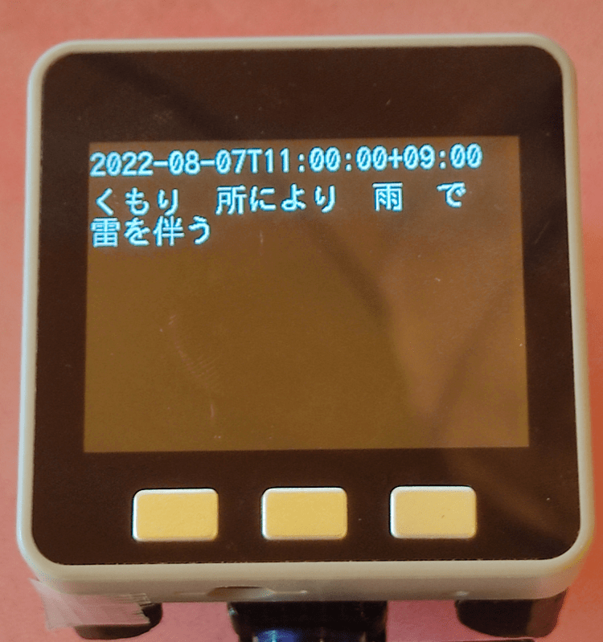

Title: 「M5Stack」wifi接続して天気予報JSONを取得する
Tag: M5Stack
Date: 2022/8/8
description: M5Stack(ESP32)でwifiに接続して天気予報JSONを取得します
---

2022/08/08
# M5Stackでwifiに接続し天気予報JSONを取得する

---

&nbsp;
← これがM5Stack  

M5Stackでwifiに接続し、JSONを取得する方法をまとめました。  
web APIなどはJSON形式であることが多いので、JSONを取り扱うことで様々な情報を取り込むことができます。  
本ページでは例として、天気予報JSONを取得して画面に表示します。   

以下の手順でまとめています。  
1. wifiに接続する
2. HTTPClientライブラリでJSONデータを取得する
3. ArduinoJSONライブラリでJSONデータから情報を抽出する
4. LCDに表示する

## 1. wifiに接続する

M5Stackに搭載されているESP32マイコンには、Wifi機能が標準でついています。  
WiFi.begin でWifiに接続でき、Wifi.Status が”WL_CONNECTED”になれば接続完了です。    

```C
#include <WiFi.h>

const char *ssid = "xxxxxxxxxx";       //接続先wifiのssid
const char *password = "xxxxxxxxxx";   //接続先wifiのパスワード
unsigned long startTime = millis();

WiFi.begin(ssid, password);

while (WiFi.status() != WL_CONNECTED)  // 接続されるまで待つ
{
  delay(500);
  if(millis() - startTime > 10000)     // タイムアウト(10秒)
  {
    // タイムアウト処理があれば入れる
  }
}
```

WiFi.begin(const char *ssid, const char *password)
- ssid： 接続先WiFiのssidを指定します。  
- password： 接続先WiFiのパスワードを指定します。  

Wifi.Status()
- Wifi接続情報を取得します。  
  接続成功したら“WL_CONNECTED”（= 3）となります。  
  他には以下のようなステータスがあるようです。  

```C
typedef enum {
    WL_NO_SHIELD        = 255,   // for compatibility with WiFi Shield library
    WL_IDLE_STATUS      = 0,
    WL_NO_SSID_AVAIL    = 1,
    WL_SCAN_COMPLETED   = 2,
    WL_CONNECTED        = 3,
    WL_CONNECT_FAILED   = 4,
    WL_CONNECTION_LOST  = 5,
    WL_DISCONNECTED     = 6
} wl_status_t;
```

wifiライブラリはArduinoフレームワークに元から入っています。  
関数一式は下記のページが参考になります。  
<span class="link"></span> [WiFiライブラリリファレンス](https://garretlab.web.fc2.com/arduino/esp32/reference/libraries/WiFi/)  


## 2. HTTPClientライブラリでJSONデータを取得する

Wifiに接続したら、webからJSONを取得できます。  
ここでは例として、気象庁の<span Class="link"></span>[天気予報JSON](https://www.jma.go.jp/bosai/forecast/data/forecast/130000.json)を取得してみます。  

操作は単純で、begin ⇒ GET ⇒ getString で読み込むだけです。  

```C
#include <HTTPClient.h>

HTTPClient http;
String payload;

http.begin("https://www.jma.go.jp/bosai/forecast/data/forecast/130000.json");
int httpCode = http.GET();

if (httpCode > 0)
{
  if (httpCode == HTTP_CODE_OK)
  {
    payload = http.getString();
  }
}
else if (httpCode <= 0)
{
  // エラー処理があれば入れる
}

http.end();
```

begin(String url);
- url： アクセスするURLを指定します。  

GET()
- HTTP GETリクエストを送信し、レスポンスコードを取得します。  

getString()
- レスポンスメッセージをStringで取得します。  

HTTPClientライブラリはArduinoフレームワークに元から入っています。  
関数一式は下記のページが参考になります。  
<span class="link"></span> [HTTPClientライブラリリファレンス](https://garretlab.web.fc2.com/arduino/esp32/reference/libraries/HTTPClient/)  


## 3. ArduinoJSONライブラリを使ってJSONデータから情報を抽出する

上記ではJSONデータをStringで読み込んでいますが、ArduinoJSONライブラリを使うとJSONデータの扱いがグっと楽になります。  
下記のソースでは、取得したJSONデータをJsonDocumentへ解析・入力し、その後に日付と予報テキストを抽出しています。  

ArduinoJSONのレポジトリは以下になります。  
<span class="link"></span>[github ArduinoJSON](https://github.com/bblanchon/ArduinoJson)  

```C
#include <ArduinoJson.h>

DynamicJsonDocument doc(4096);

deserializeJson(doc, payload);

String date = doc[0]["reportDatetime"];
String forecast = doc[0]["timeSeries"][0]["areas"][0]["weathers"][0];
```

deserializeJson(JsonDocument &doc, String &input)
- doc： JSONデータの解析結果が入力されます。  
  JSON構造が多次元配列のようになって格納されています。  
- input： 解析するJSONデータを指定します。  

## 4. LCDに表示する

上記において、dateとforecastをLCDに描画すると、日付と天気予報が表示されます。  
描画にはM5Unifiedライブラリを使用すると便利です。  

<span class="link"></span>[github M5Unified](https://github.com/m5stack/M5Unified)

```C
#include <M5Unified.h>

auto cfg = M5.config();
M5.begin(cfg);

M5.Lcd.setFont(&fonts::lgfxJapanGothic_24);
M5.Lcd.setCursor(0, 0);
M5.Lcd.print(date);

M5.Lcd.setCursor(0, 30);
M5.Lcd.print(forecast);
```

そうすると、以下のようにM5Stackの画面に天気予報が表示されます。  

<br>
  
<br>
<br>

プログラム全体は以下のgithubにあげましたので、よろしければ参照ください。  
<span class="link"></span> [github](https://github.com/yamaccu/M5Stack-Sample/blob/main/GetJSONTest/main.cpp)

## おまけ　天気予報JSON公開サイトについて

天気予報JSONを調べたところ、無料で日本語で使用できるのは以下の3つが見つかりました。  
気象庁以外は個人の方が運用しているようです。（感謝！）

1. [気象庁（qiitaの解説記事）](https://qiita.com/michan06/items/48503631dd30275288f7)
2. [天気予報 API（livedoor 天気互換）](https://weather.tsukumijima.net/)
3. [気象庁の天気予報情報を XML で配信](https://www.drk7.jp/weather/)

気象庁のAPIは一般公開用ではないのか、ちょっと使いにくい印象です。  
2か3のJSONを使用すると、もう少し楽に天気予報を表示できるかと思います。  
3番目のサイトでは、レスポンスの形式がJSONPなので少し加工が必要です。  

参考サイト  
<span class="link"></span> [天気予報をM5Stackで表示してみた](https://kuracux.hatenablog.jp/entry/2019/07/13/101143)


<br>
以上です。
<br>
<br>

---