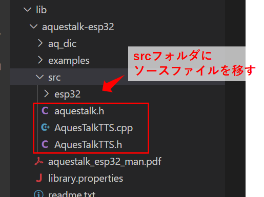

Title: 「M5Stack」AquesTalkを使う
Tag: M5Stack
Date: 2022/8/29
description: M5Stack(ESP32)でAquesTalkを使って音声出力します。
---

2022/08/29
# M5StackでAquesTalkを使って音声出力する

---

&nbsp;
← これがM5Stack  

M5StackでAquesTalkを使用して音声出力する方法をまとめました。  
AquesTalkは音声合成エンジンで、使用するとM5Stackが日本語でしゃべりだします。    
詳細は以下の公式HPを参照ください。  

<span class="link"></span>[AquesTalk公式](https://www.a-quest.com/products/aquestalk.html)


## 注意事項

本ページでは開発環境にVSCode + PlatformIOを使用しています。  

2022/8/29の時点で、開発Platformであるespressif32の最新バージョンは5.1.1ですが、4.1.0（arduino-esp32 2.0.1）でI2S関連のコードが変更されており、それ以降バグがあったり出力にノイズがのったりと安定しないようです。  
この先改善される可能性もありますが、今のところはバージョン4.0.0以前（arduino-esp32 2.0.0）を使用することをお勧めします。  

<span class="link"></span>[参考：The esp32 i2s internal DAC output is not working with the release 2.0.1](https://github.com/espressif/arduino-esp32/issues/5938)

開発Platformのバージョン指定は、platform.iniファイル内の"platform"の項目で指定できます。  

```Cpp
platform = espressif32@4.0.0
```

もしくは、M5Unifiedライブラリを使用すれば、バグを回避されているようで最新バージョンを使用することができます。  
下の方で使用方法を書いています。  
（こちらの方がおすすめかもしれません）


## ライブラリをダウンロード

AquesTalkの公式HPから、ESP32向けのAquesTalkライブラリをダウンロードして、プロジェクトのlibフォルダに保存します。  
また、ダウンロードしたファイル内の、examples/hello_aquestalk_ttsフォルダ内の「AquesTalkTTS.cpp」「AquesTalkTTS.h」を、読み込めるようにaquestalk-esp32\srcフォルダにコピーします。  

<span class="link"></span>[AquesTalk 評価版ダウンロード](https://www.a-quest.com/download.html)  



ライセンス未購入でも使用できますが、「ナ行、マ行」の音韻がすべて「ヌ」になる制限があります。  
ライセンスは <span class="link"></span>[こちら](https://store.a-quest.com/items/10524168) から購入できます。  
1デバイスあたり1ライセンスが必要のようです。  

## 音声出力のプログラム（ローマ字入力）

TTS.create で初期化して、TTS.play で再生します。  

```Cpp
#include <AquesTalkTTS.h>

const char* AQUESTALK_KEY = "XXXX-XXXX-XXXX-XXXX";  

TTS.create(AQUESTALK_KEY);

TTS.play("konnichiwa", 100);
```

create(const char *licencekey)

* AquesTalkを初期化します。
* licencekey：ライセンスキーを指定します。  
  指定したライセンスキーが無効の値の場合は、ライセンスなしで初期化されます。  

play(const char *koe, int speed)

* koe：音声出力する言葉をローマ字で指定します。  
* speed：音声出力スピードを指定します、100でだいたい標準です。   

<br>

ローマ字入力は、下記の公式HPでテストができます。  
音声合成エンジンは「AquesTalk pico」、声種は「pico f1 女声（ゆっくり）」です。  

<span class="link"></span>[AquesTalk オンラインデモ](https://www.a-quest.com/demo/index.html)


## 音声出力のプログラム（ひらがな、漢字入力）

ひらがな、漢字で音声を指定することもできます。  
その場合、ダウンロードしたデータに一緒に梱包されている「aq_dic」フォルダをSDカードにコピーしておく必要があります。  
TTS.createK で初期化して、TTS.playK で再生します。  
SDカードを読み込むので、SD.beginも実行します。  

```Cpp
#include <AquesTalkTTS.h>
#include <M5Stack.h>

const char* AQUESTALK_KEY = "XXXX-XXXX-XXXX-XXXX"; 

SD.begin(GPIO_NUM_4);

TTS.createK(AQUESTALK_KEY);

TTS.playK("こんにちは、良い天気ですね", 100);
```

SD.begin(uint8_t ssPin)

* ssPin：SDカードとのSPI通信のCSピンを指定します。  
  M5Stackの場合は"GPIO4"です。  

createK(const char *licencekey)

* AquesTalkを初期化します。
* licencekey：ライセンスキーを指定します。  
  指定したライセンスキーが無効の値の場合は、ライセンスなしで初期化されます。  

playK(const char *kanji, int speed)

* kanji：音声出力する言葉を漢字、ひらがなで指定します。  
* speed：音声出力スピードを指定します、100でだいたい標準です。 


## AquesTalkの音量変更

AquesTalk.cppの289行目の"val"の値に掛け算すると音量を変更できます。  

```Cpp
sample[0]=sample[1]=val*0.4; // 信号振幅を0.4倍して、音量を小さくしている
```

## M5Stack-Avatarと組み合わせる

M5Stack-AvatarというM5Stackに顔を表示させるライブラリがあるのですが、AquesTalkと組み合わせると、M5Stackがしゃべってる感が出てとてもかわいくなります。  
使用するには、M5Unifiedライブラリもセットで必要になります。  
また、ソースコードに出てくるlipSyncは音声出力に合わせてAvatarの口が動く機能で、M5Stack-Avatarに入っている機能です。  

<span class="link"></span>[github M5Stack-Avatar](https://github.com/meganetaaan/m5stack-avatar)  
<span class="link"></span>[github M5Unified](https://github.com/m5stack/M5Unified)  

```Cpp
#include <AquesTalkTTS.h>
#include <M5Unified.h>
#include <Avatar.h>
#include <tasks/LipSync.h>

using namespace m5avatar;
Avatar avatar;

M5.begin();

avatar.init(); // start drawing

avatar.addTask(lipSync, "lipSync");
```

M5.begin()

* M5Unifiedの初期化です。
  
Avatar.init()

* M5Stack-avatarの初期化、描画開始です。

avatar.addTask(TaskFunction_t f, const char *name)

* TaskFunction_t：マルチタスクに関数を登録します。  
  登録された関数は別タスクとして並行処理されます。  
* *name：マルチタスクに登録する関数名を指定します。  

<br>

<div style="max-width:310px">
<blockquote class="twitter-tweet"><p lang="ja" dir="ltr">おはよー <a href="https://t.co/gWNURFBlal">pic.twitter.com/gWNURFBlal</a></p>&mdash; やまっく (@YY87750722) <a href="https://twitter.com/YY87750722/status/1563998002075025408?ref_src=twsrc%5Etfw">August 28, 2022</a></blockquote> <script async src="https://platform.twitter.com/widgets.js" charset="utf-8"></script>
</div>

かわいいですね！  

<br>

githubにサンプルを上げていますので、良かったら参照ください。  

<span class="link"></span>[github](https://github.com/yamaccu/M5Stack-Sample/blob/main/Aquestalk/main.cpp)

## M5Unifiedライブラリを使用したプログラム  

M5Unifiedとは、M5Stack製品群に使用でき様々な機能を実行できる共通ライブラリです。  
音声出力を工夫されており、使うことでより高音質にできるようです。  
M5Unifiedライブラリおよびサンプルコードは下記になります。  

<span class="link"></span>[AquesTalk M5Unifiedサンプルコード](https://github.com/m5stack/M5Unified/blob/master/examples/Advanced/Speak_with_AquesTalk/Speak_with_AquesTalk.ino)  


## M5Unifiedライブラリを使用してM5Stack-Avatarと組み合わせる

M5UnifiedとM5Stack-Avatarを組み合わせる場合、LipSyncの方法が異なり、avatar.setMouthOpenRatioを使用します。  
talk_task関数の最後に、以下のコードを追加します。  
音声振幅を取得して、その値に従って口のサイズを変更しています。  

```Cpp
float f = abs(wav[tri_index][0]) / 12000.0;
float open = min(1.0f, f);
avatar.setMouthOpenRatio(open);
```

wav
* talk_task内で定義されている音声出力値です。  

avatar.setMouthOpenRatio(float ratio)
* ratio：口のサイズを指定します。  
  0.0～1.0くらいの値になるようにすると良いと思います。

<br>

こちらもgithubにサンプルを上げていますので、良かったら参照ください。  

<span class="link"></span>[github](https://github.com/yamaccu/M5Stack-Sample/blob/main/Aquestalk-M5Unified/main.cpp)

<br>

以上です。

<br>
<br>

---