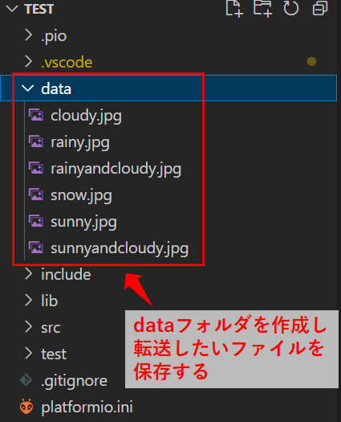
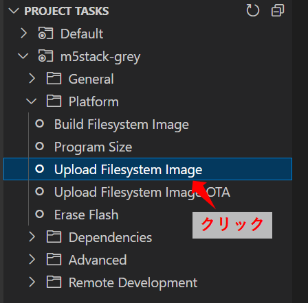

Title: 「M5Stack」LCD画面に画像を表示する
Tag: M5Stack
Date: 2022/9/8
description: M5StackでLCDに画像を表示します
---

2022/09/08
# M5StackでLCD画面に画像を表示する

---

&nbsp;
← M5Stackです。  

M5StackでLCDに画像を表示する方法をまとめました。  

## 画像データの転送方法

画像データの保存先ですが、SDカードと、SPIFFS（M5Stackの内蔵ROM）があります。  
SDカードは、単純にパソコンなどからSDカードへデータをコピーして、M5Stackに刺せば使用できます。  
SPIFFSは、以下の方法でデータの転送ができます。  

### VSCode + PlatformIOを使用する場合

プロジェクトフォルダの直下に"data"フォルダを作成し、そこに転送したいファイルを保存します。  
すると、プログラム書き込み時に一緒にSPIFFSへ書き込んでくれます。  



また、書き込み時でなくても、「Project TaskのPlatform ⇒ upload filesystem image」を使用してもdataフォルダ内のファイルを転送できます。  




### Arduino IDEを使用する場合

下記HPがわかりやすいですので参照ください。  

<a href="https://garretlab.web.fc2.com/arduino/lab/spiffs/" style="text-decoration: none;"><div class="link-box"><div class="img-box"><div style="background-image: url('https://garretlab.web.fc2.com/images/garretlab_ogp.png');"></div></div><div class="text-box"><p class="title">Arduinoで遊ぶページ SPIFFS</p><p class="description">Arduino core for the ESP32を使った、ESP-WROOM-32開発ボードのSPIFFSについての実験です。SPIFFSと、PCのデータをESP-WROOM-32にアップロードするためのアップローダの使い方を調べました。</p></div></div></a>

## 画像の表示方法

M5Unifiedライブラリを使用します。  

<a href="https://github.com/m5stack/M5Unified" style="text-decoration: none;"><div class="link-box"><div class="img-box"><div style="background-image: url('https://opengraph.githubassets.com/5b57357183ebc350338e97ffb2f3a9258dd780eb771b583355e5a2c3630a4c5c/m5stack/M5Unified');"></div></div><div class="text-box"><p class="title">GitHub - m5stack/M5Unified</p><p class="description">Unified library for M5Stack series. Contribute to m5stack/M5Unified development by creating an account on GitHub.</p></div></div></a>

以下の関数を使うと、簡単に画像を表示できます。  

```Cpp
#include M5Unified.h

auto cfg = M5.config();
M5.begin(cfg);

SPIFFS.begin();
SD.begin(GPIO_NUM_4);

M5.Lcd.drawJpgFile(SPIFFS, filePath, 0, 0);
M5.Lcd.drawBmpFile(SPIFFS, filePath, 0, 0);
M5.Lcd.drawPngFile(SD, filePath, 0, 0);
```

M5.begin()
* M5Unifiedの初期化をします。  
  M5.config()はデフォルト設定です。  

SPIFFS.begin()
* SPIFFSの初期化をします。

SD.begin(uint8_t ssPin)
* SDの初期化をします。
* ssPin：SDカードとのSPI通信のCSピンを指定します。
  M5Stackの場合は"GPIO4"です。

M5.Lcd.drawJpgFile(fs::FS &fs, const char *path, uint16_t x, uint16_t y)

* &fs："SPIFFS"もしくは"SD"を指定します。
* *path：画像のパスを指定します。
* x：画像の描画位置のx方向を指定します。省略した場合は0になります。
* y：画像の描画位置のy方向を指定します。省略した場合は0になります。

<br>

サンプルプログラムをgithubに挙げていますので、よろしければ参照ください。  

<a href="https://github.com/yamaccu/M5Stack-Sample/tree/main/DrawImageTest" style="text-decoration: none;"><div class="link-box"><div class="img-box"><div style="background-image: url('https://opengraph.githubassets.com/2aeed0c5c4a2808473bdb83ac34e22af42d13008f6108fa77e60d508b101e70b/yamaccu/M5Stack-Sample');"></div></div><div class="text-box"><p class="title">M5Stack-Sample/DrawImageTest</p><p class="description"></p></div></div></a>

<br>

以上です。

<br>
<br>

---