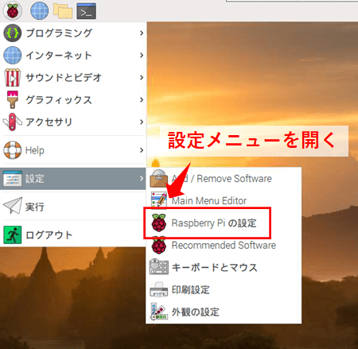
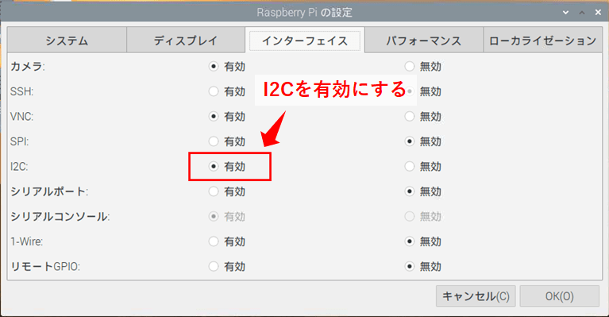
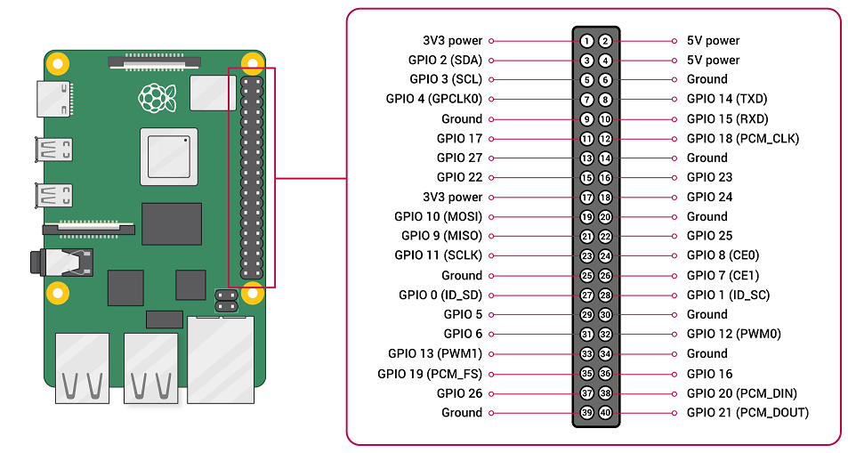
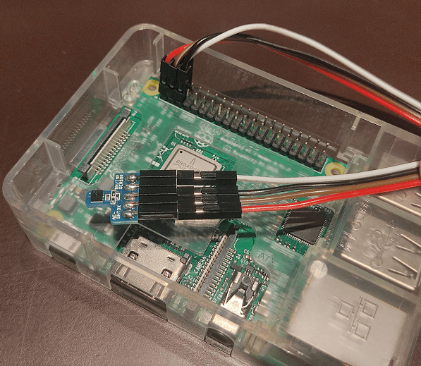
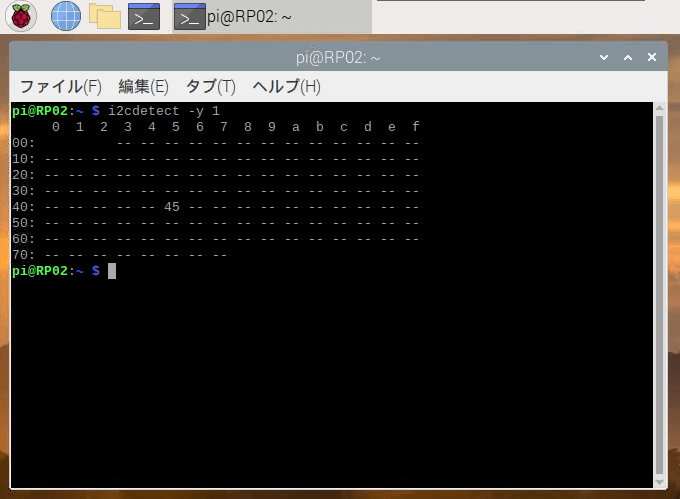
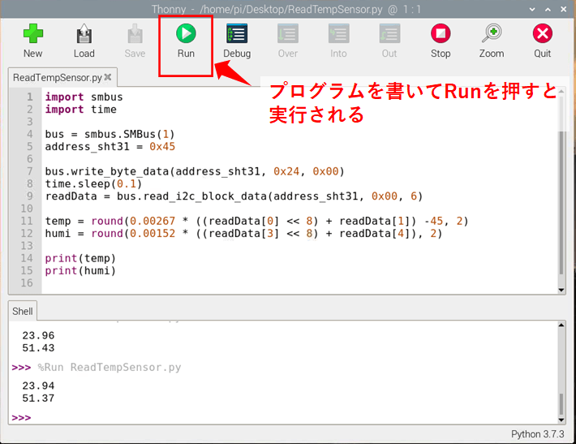
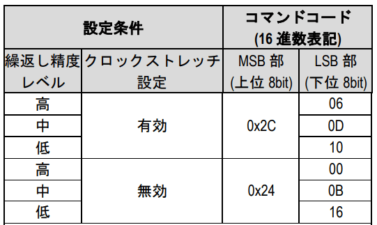

title: 「RaspberryPi」I2Cで温湿度センサSHT31と通信する
tag: RaspberryPi
Date: 2022/9/16
description: RaspberryPiでI2Cを使って温湿度センサSHT31と通信します。
---

2022/09/16
# RaspberryPiでI2Cを使って温湿度センサSHT31と通信する

---

RaspberryPiには、I2Cという通信インターフェースが予め搭載されています。  
I2Cを使うと、様々なセンサやデバイスと通信を行うことができます。  

本記事では、SHT31という温湿度センサとI2Cで通信する方法をまとめています。  
以下の手順で説明しています。  
1. I2Cを有効にする
2. ラズパイとSHT31を導線で繋ぐ
3. 接続確認する
4. pythonでI2C通信を行うプログラムを作成する
5. 取得したセンサ値をテキストファイルに追加していく

## 1. I2Cを有効にする

ラズパイの設定メニューでI2Cを有効化します。  




## 2. ラズパイとSHT31を導線で繋ぐ

ラズパイのI2Cのピンは以下になります。  

* 3.3V：1 pin
* SDA：3 pin
* SCL：5 pin
* GND：6 pin
 


<a href="https://www.raspberrypi.com/documentation/computers/os.html#gpio-and-the-40-pin-header"><span class="link"></span>（公式ページより引用）</a>

<br>

SHT31のI2Cのピンにそれぞれ合うように接続します。  




## 3. 接続確認する

ラズパイのターミナルコマンドで、I2Cの接続確認ができます。  
以下のように打ち込みます。  

```C
i2cdetect -y 1
```

正常に接続できていれば、下記のようにI2Cに接続されているデバイスのアドレスが表示されます。  



## 4. pythonでI2C通信を行うプログラムを作成する

ラズパイのThonny Python IDEを使用します。  





I2C通信には、smbusライブラリを使用します。  
ラズパイに標準でインストールされています。  

<a href="https://pypi.org/project/smbus2/" style="text-decoration: none;">
<div class="link-box"><div class="img-box"><div style="background-image: url('https://pypi.org/static/images/twitter.6fecba6f.jpg');"></div></div><div class="text-box"><p class="title">smbus2</p><p class="description">smbus2 is a drop-in replacement for smbus-cffi/smbus-python in pure Python</p></div></div>
</a>

以下のプログラムを実行すると、IDE下部のターミナル部分に温度と湿度が表示されます。  

```python
import smbus
import time

bus = smbus.SMBus(1)
address_sht31 = 0x45

bus.write_byte_data(address_sht31, 0x24, 0x00)
time.sleep(0.1)
readData = bus.read_i2c_block_data(address_sht31, 0x00, 6)
        
temp = 0.00267 * ((readData[0] << 8) + readData[1]) -45  # 温度情報
humi = 0.00152 * ((readData[3] << 8) + readData[4])      # 湿度情報

print(temp)
print(humi)
```

bus.write_byte_data(deviceAddress, data1, data2)

* deviceAddress：通信先デバイスのI2Cアドレスです。
* data1/data2：書き込むデータです。


bus.read_i2c_block_data(deviceAddress, offset, bytes)

* deviceAddress：通信先デバイスのI2Cアドレスです。
* offset：通信先デバイスのデータ読み込みの開始アドレスです。
* bytes：読み込むバイト数です。

　例えば、read_i2c_block_data(0x45, 0x00, 0x06)ですと、デバイスアドレス0x45のデバイスにアクセスして、データアドレス0x00～0x05までのデータを読み出すことになります。  


### SHT31の制御

詳しくはSHT31の<span class="link"></span>[データシート](https://akizukidenshi.com/download/ds/sensirion/Sensirion_Humidity_Sensors_SHT3x_DIS_Datasheet_V3_J.pdf)を見る必要がありますが、概要を抜き出すと以下のようになります。  

■温湿度の測定実行  

"0x24 0x00"を書き込むと、クロックストレッチなし高精度測定となります。  
データ読み込み前に、毎回実行する必要があります。  

他の命令は下記のようになっています。  



<br>

■データ読み出し  

offsetなしで6byte分のデータを読み出します。  
読み出したデータの1byte目と2byte目が温度データ、4byte目と5byte目が湿度データになっています。  
換算式は以下です。  

* 温度 T = -45 + 175 × data値 / (2^16 - 1)  
* 湿度 RH = 100 × data値 / (2^16 - 1)   

## 5. 取得したセンサ値をテキストファイルに追加していく

取得した温湿度データはテキストファイルに随時出力していくと、後から変化の傾向など確認できます。  

```python
from datetime import datetime

start = datetime.now()

while True:
  now = datetime.now()
  if (now - start).seconds >= 5:    # 5秒おきに測定
    start = datetime.now()
           
    with open('/home/pi/Desktop/test.txt', 'a') as f:
      data = now.strftime('%Y/%m/%d %H:%M:%S') + ',temp,' +  str(temp) + ',humi,' + str(humi) + '\n'
      f.write(data)
```

with open(filepath, mode) as f:

* filepathのファイルをオープンします。  
  処理を抜けたときにファイルをクローズします。  
* mode：ファイルを開くときのモードを指定します。  
  r: 読み取り、w: 書き込み、a: 追加書き込み

f.write(data)

* dataの内容をファイルに書き込みます。  


## ソースコード全体

```python
import smbus
import time
from datetime import datetime

bus = smbus.SMBus(1)
address_sht31 = 0x45
start = datetime.now()

try:
    while True:
        now = datetime.now()

        if (now - start).seconds >= 5:
            start = datetime.now()
            
            bus.write_byte_data(address_sht31, 0x24, 0x00)
            time.sleep(0.1)
            readData = bus.read_i2c_block_data(address_sht31, 0x00, 6)
        
            temp = round(0.00267 * ((readData[0] << 8) + readData[1]) -45, 2)
            humi = round(0.00152 * ((readData[3] << 8) + readData[4]), 2)
    
            print(now.strftime('%Y/%m/%d %H:%M:%S'))
            print(temp)
            print(humi)
        
            with open('/home/pi/Desktop/test.txt', 'a') as f:
              data = now.strftime('%Y/%m/%d %H:%M:%S') + ',temp,' +  str(temp) + ',humi,' + str(humi) + '\n'
              f.write(data)

except KeyboardInterrupt:
    print("finish")
```

## 参考 SHT31について

SHT31は、センシリオン社の高性能な温湿度センサです。  
測定可能レンジは

* 温度：-40℃～+125℃、±0.3℃(@0℃～90℃)
* 相対湿度：0%～100%、±2%(@0℃～90℃)  

とかなり優秀です。  

<a href="https://akizukidenshi.com/catalog/g/gK-12125/" style="text-decoration: none;">
<div class="link-box"><div class="img-box"><div style="background-image: url('https://akizukidenshi.com/img/goods/C/K-12125.jpg');"></div></div><div class="text-box"><p class="title">ＳＨＴ３１使用　高精度温湿度センサモジュールキット: センサ一般 秋月電子通商-電子部品・ネット通販</p><p class="description">ＳＨＴ３１使用　高精度温湿度センサモジュールキット</p></div></div>
</a>

<br>

以上です。  

<br>
<br>

---