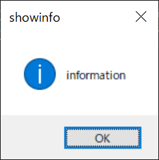
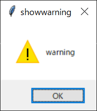
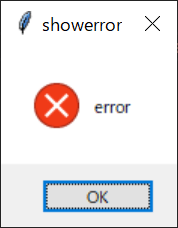
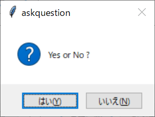
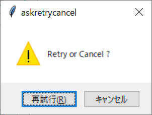
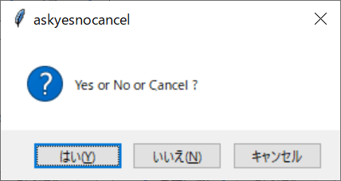
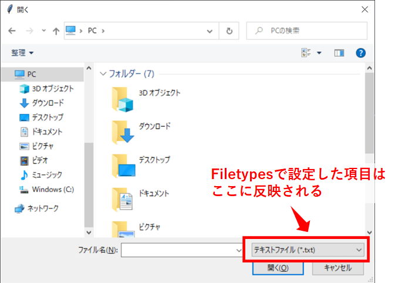

Title: 「python」CUIでポップアップ、ファイルダイアログを出す
Tag: python
Date: 2022/10/10
description: pythonで作成したCUIで、エラー・確認などのポップアップや、ファイル選択のダイアログを出す方法をまとめました
---

2022/10/10

# pythonで作成したCUIでポップアップやファイルダイアログを使う

---

pythonでCUIアプリ（Character User Interface）を作成したときに、エラーなどのポップアップ（メッセージボックス）や、ファイル選択のダイアログを出す方法をまとめました。


## 使用するライブラリ

pythonでポップアップを出すライブラリはいくつかありますが、本ページでは、デフォルトでpythonに含まれている"tkinter"を使用します。  

<a href="https://docs.python.org/ja/3/library/tkinter.html" style="text-decoration: none;">
<div class="link-box">
<div class="img-box">
<div style="background-image: url('https://docs.python.org/ja/3/_static/py.svg');">
</div>
</div>
<div class="text-box">
<p class="title">tkinter</p>
<p class="description">Tcl/Tk の Python インターフェース</p>
</div>
</div>
</a>


## ポップアップ（メッセージボックス）

以下のプログラムでポップアップを実行します。  

```python
import tkinter
from tkinter import messagebox

tk = tkinter
tk.Tk().withdraw()

tk.messagebox.showinfo('showinfo', 'information')
tk.messagebox.showwarning('showwarning', 'warning')
tk.messagebox.showerror('showerror', 'error')

tk.messagebox.askquestion('askquestion', 'Yes or No ?')
tk.messagebox.askokcancel('askokcancel', 'OK or Cancel ?')
tk.messagebox.askretrycancel('askretrycancel', 'Retry or Cancel ?')
tk.messagebox.askyesno('askyesno', 'Yes or No ?')
tk.messagebox.askyesnocancel('askyesnocancel', 'Yes or No or Cancel ?')
```

TK().withdraw()

* tkinterを実行するとウインドウが自動で表示されるのですが、  
  CUIアプリではウインドウを使わないので、この関数でウインドウを消しています。  

messagebox

* 定型のメッセージボックスをポップアップします。  
  ポップアップで押すボタンによって戻り値が異なります。  
  詳細は以下で説明していきます。  


### 1. showinfo

<div style="display:flex; flex-wrap:wrap">

<div style="margin-left:5px; width:100%; max-width:610px;">

```python
messagebox.showinfo('showinfo', 'information')
```
&nbsp;&nbsp;&nbsp;&nbsp;戻り値："ok"
</div>
</div>

### 2. showwarning

<div style="display:flex; flex-wrap:wrap">

<div style="margin-left:5px; width:100%; max-width:610px;">

```python
messagebox.showwarning('showwarning', 'warning')
```
&nbsp;&nbsp;&nbsp;&nbsp;戻り値："ok"
</div>
</div>

### 3. showerror

<div style="display:flex; flex-wrap:wrap">

<div style="margin-left:5px; width:100%; max-width:610px;">

```python
messagebox.showerror('showerror', 'error')
```
&nbsp;&nbsp;&nbsp;&nbsp;戻り値："ok"
</div>
</div>

### 4. askquestion

<div style="display:flex; flex-wrap:wrap">

<div style="margin-left:5px; width:100%; max-width:610px;">

```python
messagebox.askquestion('askquestion', 'yes or no ?')
```
&nbsp;&nbsp;&nbsp;&nbsp;戻り値：  
&nbsp;&nbsp;&nbsp;&nbsp;&nbsp;&nbsp;はい(Y) ⇒ "yes"  
&nbsp;&nbsp;&nbsp;&nbsp;&nbsp;&nbsp;いいえ(N) ⇒ "no"  

</div>
</div>

### 5. askokcancel

<div style="display:flex; flex-wrap:wrap">

<div style="margin-left:5px; width:100%; max-width:610px;">

```python
messagebox.askokcancel('askokcancel', 'OK or cancel ?')
```
&nbsp;&nbsp;&nbsp;&nbsp;戻り値：  
&nbsp;&nbsp;&nbsp;&nbsp;&nbsp;&nbsp;OK ⇒ True  
&nbsp;&nbsp;&nbsp;&nbsp;&nbsp;&nbsp;キャンセル ⇒ False  

</div>
</div>

### 6. askretrycancel

<div style="display:flex; flex-wrap:wrap">

<div style="margin-left:5px; width:100%; max-width:610px;">

```python
messagebox.askretrycancel('askretrycancel', 'Retry or Cancel ?')
```
&nbsp;&nbsp;&nbsp;&nbsp;戻り値：  
&nbsp;&nbsp;&nbsp;&nbsp;&nbsp;&nbsp;再試行(R) ⇒ True  
&nbsp;&nbsp;&nbsp;&nbsp;&nbsp;&nbsp;キャンセル ⇒ False  

</div>
</div>

### 7. askyesno

<div style="display:flex; flex-wrap:wrap">

<div style="margin-left:5px; width:100%; max-width:610px;">

```python
messagebox.askyesno('askyesno', 'Yes or No ?')
```
&nbsp;&nbsp;&nbsp;&nbsp;戻り値：  
&nbsp;&nbsp;&nbsp;&nbsp;&nbsp;&nbsp;はい(Y) ⇒ True  
&nbsp;&nbsp;&nbsp;&nbsp;&nbsp;&nbsp;いいえ(N) ⇒ False  

</div>
</div>

### 8. askyesnocancel

<div style="display:flex; flex-wrap:wrap">

<div style="margin-left:5px; width:100%; max-width:640px;">

```python
messagebox.askyesnocancel('askyesnocancel', 'Yes or No or Cancel ?')
```
&nbsp;&nbsp;&nbsp;&nbsp;戻り値：  
&nbsp;&nbsp;&nbsp;&nbsp;&nbsp;&nbsp;はい(Y) ⇒ True  
&nbsp;&nbsp;&nbsp;&nbsp;&nbsp;&nbsp;いいえ(N) ⇒ False  
&nbsp;&nbsp;&nbsp;&nbsp;&nbsp;&nbsp;キャンセル ⇒ None  

</div>
</div>

## ファイル選択ダイアログ

以下のプログラムでダイアログを実行します。  

```python
import tkinter
from tkinter import filedialog

tk = tkinter
tk.Tk().withdraw()

type = [('テキストファイル','*.txt')] 
path = tk.filedialog.askopenfilename(filetypes = type)  #単一選択のみ
path = tk.filedialog.askopenfilenames(filetypes = type)  #複数選択可

pathdirectory = tk.filedialog.askdirectory()
```

filedialog.askopenfilename

* ファイル選択ダイアログを開き、選択したファイルの絶対パスを戻します。  
* filetypes：選択するファイル形式を指定できます。



<br>

filedialog.askdirectory

* ファイル選択ダイアログを開き、選択したフォルダの絶対パスを戻します。

<br>
<br>

以上です。

<br>
<br>

---