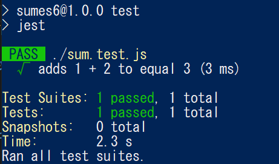

title: 「Node.js」JEST + Babelで自動テストを実施する
tag: HTML/CSS/JS
Date: 2023/01/09
description: JavaScript（Node.js）のテストフレームワークJESTを使ってみます
---

2023/1/9
# JEST + BabelでJavaScript（Node.js）のテストを実施する

---

JESTとは、JavaScript向けのテストフレームワークです。  
JEST用のテストコードを書くことで、コマンド一つでソースコードの自動テストが実施できます。  

本ページでは、Node.js向けのJESTの書き方を説明しています。  
また、JESTはESモジュールに対応していないという問題があるのですが、Babelを使って実行する方法もまとめています。  

<a href="https://jestjs.io/ja/" style="text-decoration: none;"><div class="link-box"><div class="img-box">
<div style="background-image: url('https://jestjs.io/ja/img/opengraph.png');"></div></div><div class="text-box"><p class="title">Jest</p><p class="description">Jest はシンプルさを重視した、快適な JavaScript テスティングフレームワークです。</p></div></div>
</a>

## 準備

* JEST： 下記でインストールできます。  

```javascript
npm install --save-dev jest
```

* babel： ESモジュールをCommonJSにコンパイルするのに使います。  
  　（JSETはCommonJSにしか対応していない）  
  　下記でインストールできます。  

```javascript
npm install --save-dev babel-jest @babel/core @babel/preset-env
```

参考  

<a href="https://jestjs.io/ja/docs/getting-started#babel-%E3%82%92%E4%BD%BF%E7%94%A8%E3%81%99%E3%82%8B" style="text-decoration: none;">
<div class="link-box"><div class="img-box"><div style="background-image: url('https://jestjs.io/ja/img/opengraph.png');"></div></div><div class="text-box"><p class="title">はじめましょう · Jest</p><p class="description">Babel を使用する</p></div></div>
</a>

## 手順

1. テスト対象の準備
2. テストコード作成
3. package.jsonを修正
4. babel.config.jsを作成
5. 実行する

### 1. テスト対象の準備

テスト対象のプログラムを用意します。  
ここでは、シンプルな足し算を行うプログラムを対象にします。  

sum.js
```javascript
export function sum(a, b) {
    return a + b;
  }

export default sum;
```

### 2. テストコード作成

テストコードを作成します。  
ファイル名は 「xxxx.test.js」となります。  
今回はsum.jsが対象なので、sum.test.jsです。  

下記の例では、sumに1と2を代入して、戻り値が3になることを確認しています。  

sum.test.js
```javascript
import sum from "./sum.js";

test('adds 1 + 2 to equal 3', () => {
  expect(sum(1, 2)).toBe(3);
});
```

* test(name, fn, timeout)：   
  　name: テスト名です、任意に設定します。  
  　fn: テストの内容です。  
  　timeout: タイムアウト時間(ms)です。省略可。  
* expect(xxx).toBe(value)： テスト用の処理で、マッチャーと呼ばれています。  
  　toBe(value)は、プリミティブ値の比較に使用します。  

　マッチャーの他の種類については以下を参照ください。  
<a href="https://jestjs.io/ja/docs/expect" style="text-decoration: none;">
<div class="link-box"><div class="img-box"><div style="background-image: url('https://jestjs.io/ja/img/opengraph.png');"></div></div><div class="text-box"><p class="title">Expect · Jest</p><p class="description">テストを作成する時に、値が特定の条件に合致することを確認する必要がよくあるでしょう。 expect によって様々な事柄を検証するための数多くの"マッチャ"を利用することができます。</p></div></div>
</a>


### 3. package.jsonを修正

フォルダのトップにある「package.json」を修正します。  

```json
"type": "module",
"scripts": {
  "test": "jest"
},
```

* type： 使用するモジュール形式を指定します。  
  　"module"とすることで、node.jsでES moduleが使えるようになります。  
* scripts： npmで実行するスクリプトを登録できます。  
  　上記の例では、"npm test"でJESTを実行できます。  


### 4. babel.config.cjsを作成

フォルダのトップに「babel.config.cjs」を作成し、中身を下記の通りにします。  

```javascript
module.exports = {
    presets: [["@babel/preset-env", { targets: { node: "current" } }]],
  };
```
* targets： ソースコードの変換先、node.jsを指定しています。  
  　（これでソースコードがCommonjsにコンパイルされるので、ESモジュールを使用していてもJESTが使えるようになります。）  

ESモジュールを使用している場合、babel.configの拡張子は "js" ではなく "cjs" となります。  

参考
<a href="https://stackoverflow.com/questions/61146112/error-while-loading-config-you-appear-to-be-using-a-native-ecmascript-module-c" style="text-decoration: none;"><div class="link-box">
<div class="img-box"><div style="background-image: url('https://cdn.sstatic.net/Sites/stackoverflow/Img/apple-touch-icon@2.png?v=73d79a89bded');"></div></div><div class="text-box"><p class="title">Error while loading config - You appear to be using a native ECMAScript module configuration file (Jest)</p><p class="description">This error is coming up when I am making a pull request. There is a github workflow audit that runs checks on the pull request and it loads the test file from another repository.</p></div></div>
</a>

### 5. 実行する

コンソールを立ち上げて、「npm test」を実行すると、JESTが立ち上がり、作成したテストコードを実行してくれます。  
結果がFAILかPASSを判定し、コンソールに表示されます。  




## モジュールのモックの作成

JESTには、インポートするモジュールのモックを作成して、実際にモジュールを実行しなくても戻り値を取得できるようにする機能があります。  
例えば、axiosのような通信を伴う関数に対してモックを作成すると、実際に通信を行わなくても戻り値を取得することができ、テストが捗ります。  

試しに、axiosモジュールのモックを作成してみます。  

```javascript
jest.mock("axios");
axios.mockImplementation(() => 1234);
```

* jest.mock(xxx)： モックを作成します。  
* xxx.mockImplementation： モックの戻り値を指定します。  

これで、axiosを実行すると1234が戻り値になります。  

<br><br>

以上です。

<br>

---