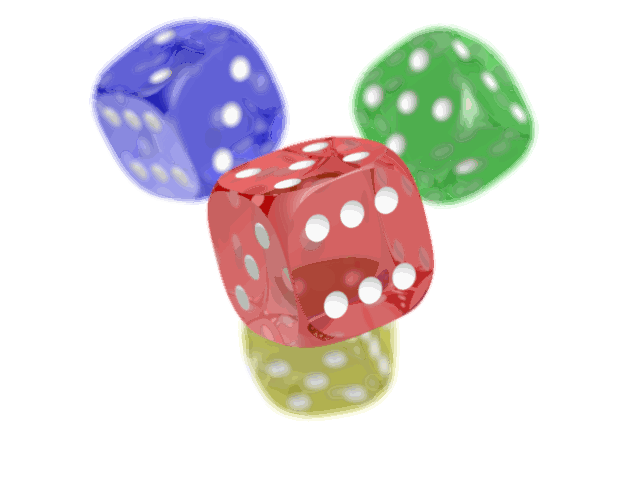
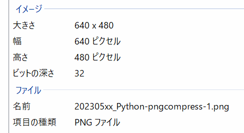

Title: 「python」PillowでPNGを減色して圧縮する
Tag: python
Date: 2023/5/19
description: PNGファイルを256色へ減色することでファイルサイズを圧縮します
---

2023/5/19

# pythonでPillowを使ってPNGファイルを減色・圧縮する

---

PNGファイルのサイズを減らす方法の一つとして、減色する方法があります。  
PythonのPillowライブラリを使用すると、簡単に減色処理を実施することができます。  


## Pillowライブラリについて

Pillowは、豊富な画像処理機能を備えたライブラリです。  
画像のリサイズ、圧縮、変換などを簡単に実行することができます。  

<a href="https://pypi.org/project/Pillow/" style="text-decoration: none;">
<div class="link-box"><div class="img-box"><div style="background-image: url('https://pypi.org/static/images/twitter.abaf4b19.webp');"></div></div><div class="text-box"><p class="title">Pillow</p><p class="description">Python Imaging Library (Fork)</p></div></div>
</a>

## Pillowのインストール

pipコマンドで一発です。  
以下を実行します。  

```python
pip install Pillow
```

pythonでライブラリをインストールする場合、仮想環境を準備することをお勧めします。  

<p style="margin-bottom:-20px">（参考）</p>  
<a href="https://yamaccu.github.io/tils/20210820-Python-pipenv" style="text-decoration: none;">
<div class="link-box"><div class="img-box"><div style="background-image: url('https://yamaccu.github.io/favicon.ico');"></div></div><div class="text-box"><p class="title">「python」仮想環境の作り方</p><p class="description">Pythonでプログラミングを行う際には、作るプログラムごとに仮想環境を構築します。</p></div></div>
</a>

## PNGの減色処理

PNG画像の画質を表すパラメータの一つに、ビット深度というものがあります。  
ビット深度は、画像の色情報を表します。  

ビット深度8の場合は、2の8乗の256色で画像を表示しています。  
ビット深度24の場合は、2の24乗で1677万色です。  
（HTMLのカラーコードはRGB各8bitで色を表現しておりビット深度24です。）  

ビット深度が8より大きいPNGをビット深度8に減色処理することで、PNGのサイズを圧縮することができます。  
以下はPNGの減色処理のソースコードです。  

```python
from PIL import Image

# 画像を開く
img = Image.open(image_path)
    
# 256色に減色する
img = img.quantize(256)
    
# 減色後の画像を保存する
output_path = "reduced_colors.png"
img.save(output_path)
```

Image.open(filepath)：
* filepathで指定した画像イメージを読み込みます。  

quantize(color)
* colorで指定した色数に画像を変換します。256以下のみ指定可能です。  

save(filepath)
* filepathで指定した先に変換した画像を保存します。  

<br>

下記はビット深度24と、ビット深度8の画像です。  
見た目はそこまで変わらないですが、ファイルサイズは約1/5になっています。  

<div style="display:flex; flex-wrap:wrap">
  

</div>

ビット深度は、画像ファイルのプロパティ→詳細で確認できます。  



<br>

Pillowの他の機能は下記を参照ください。  
かなり多機能なライブラリとなっており、画像の合成などもできるようです。  

<a href="https://pillow.readthedocs.io/en/stable/index.html" style="text-decoration: none;">
<div class="link-box"><div class="img-box"><div style="background-image: url('https://raw.githubusercontent.com/python-pillow/pillow-logo/main/pillow-logo-dark-text-1280x640.png');"></div></div><div class="text-box"><p class="title">Pillow</p><p class="description">Pillow is the friendly PIL fork by Jeffrey A. Clark (Alex) and contributors. PIL is the Python Imaging Library by Fredrik Lundh and contributors. Pillow for enterprise is available via the Tidelift...</p></div></div>
</a>

<br>

以上です。

<br>
<br>

---