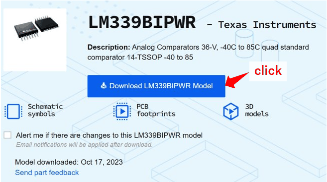
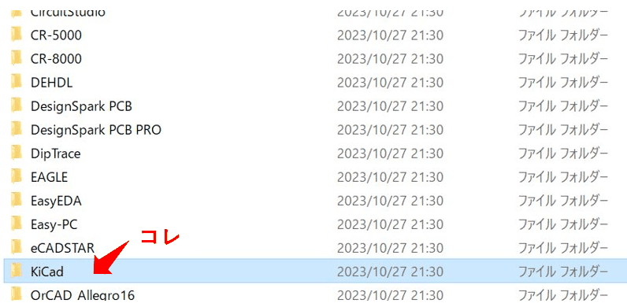
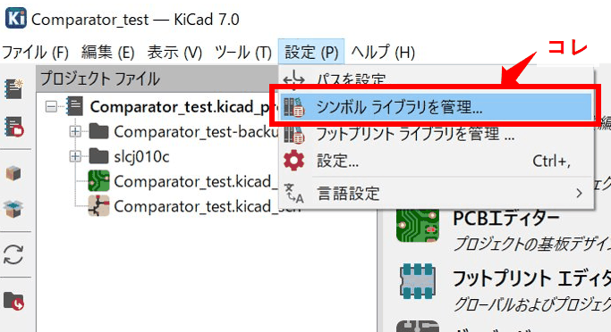
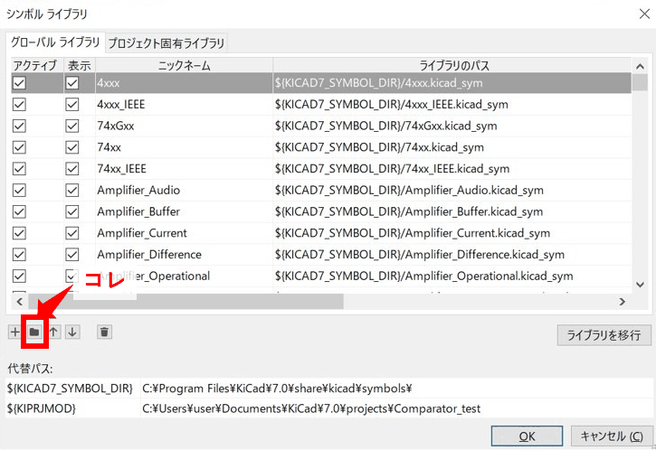
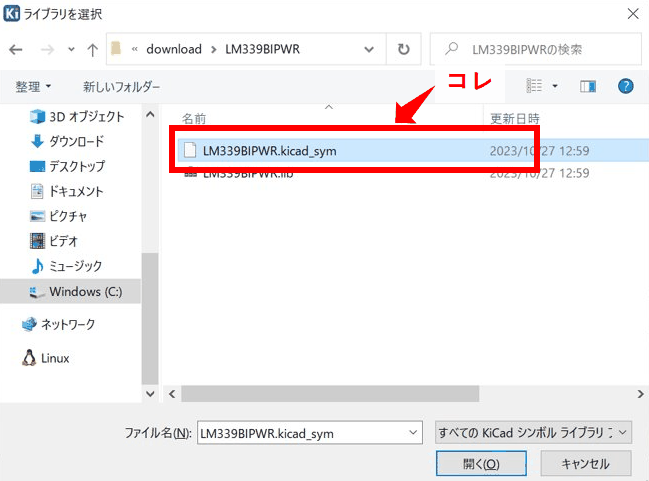
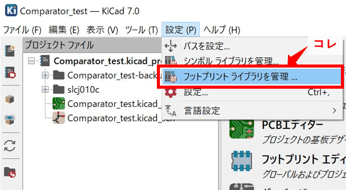
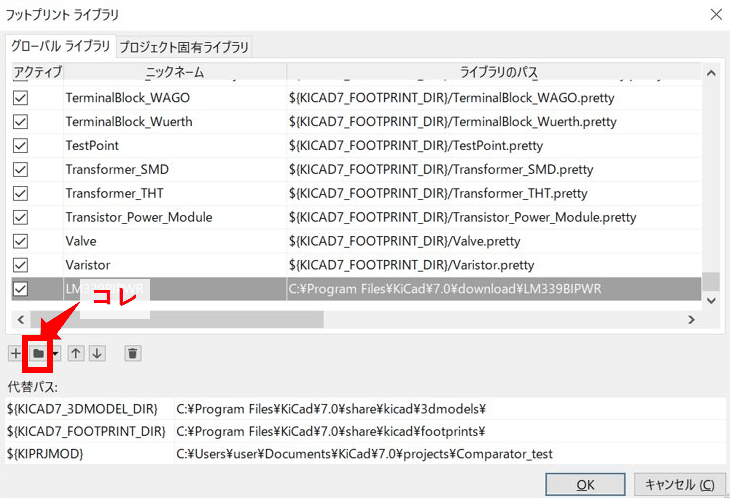
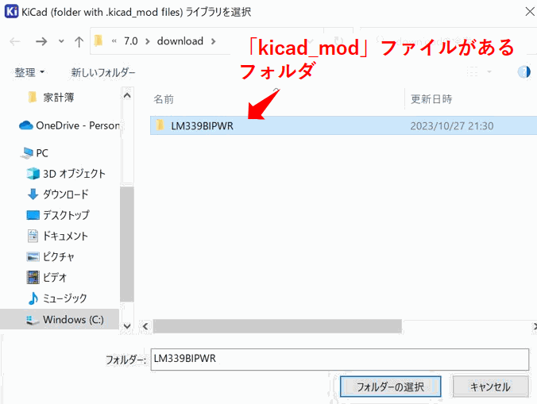

Title: KiCADで回路設計のシンボルを追加をする
Date: 2023/10/29
tag: 回路設計
description: KiCADで、使用するICのシンボルを登録する方法です。
---

2023/10/29

# KiCADで新規シンボルをライブラリに追加する

---

KiCADは、回路設計、回路シミュレーション、プリント基板設計ができるフリーの回路CADです。  
フリーながら様々な機能が使用できるので、ホビー用途だけでなく中小企業などでも使用されているようです。  

本記事では、kiCADで回路設計する際の、新規シンボルを登録する方法をまとめています。  
※KiCAD 7.0を使用しています。  

## モデルのダウンロード

以下のページから、モデルをダウンロードできます。  
（ユーザー登録が必要です。）

<a href="https://componentsearchengine.com/" style="text-decoration: none;">

Electronic Component Search Engine

Free access to schematic symbols, PCB footprints and 3D models

</a> 

ICの名前で検索して、モデルがあればDownloadします。  

モデルがない場合はリクエストもできるようです。  

## KiCADにモデルをインポート

ダウンロードしたファイルを解凍すると、中に「KiCad」というフォルダがあります。  
この中にKiCad用のモデルが入っていますので、フォルダ名をICの名前に変えて適当なフォルダにコピーします。  

### 回路シンボルのインポート

KiCADのメニュー画面を開いて、「設定」→「シンボル ライブラリを管理」をクリックします。  

開いた画面の、左下のフォルダマークを選択して、先ほどダウンロードしたモデルの中にある「.kicad_sym」ファイルを選択します。  

これで、回路CADでシンボルが使えるようになります。  

### PCBフットプリントのインポート

KiCADのメニュー画面を開いて、「設定」→「フットプリント ライブラリを管理」をクリックします。  

開いた画面の、左下のフォルダマークを選択して、先ほどダウンロードしたフォルダを選択します。  
（フォルダ内にある「kicad_mod」ファイルがフットプリントです。）  

これで、PCB CADでシンボルが使えるようになります。  

 

以上です。

 
 

---