Title: KiCADで回路シミュレーションする
Date: 2023/11/5
tag: 回路設計
description: KiCADでspiceによる回路シミュレーションをする方法です。
---

2023/11/05

# KiCADでspiceモデルを使用して回路シミュレーションする

---

KiCADは、回路設計、回路シミュレーション、プリント基板設計ができるフリーの回路CADです。  
フリーながら様々な機能が使用できるので、ホビー用途だけでなく中小企業などでも使用されているようです。  

本記事では、kiCADで回路シミュレーションを行う方法をまとめています。  
以下の手順でまとめています。  

* 回路を書く
* Spiceモデルをダウンロード
* 回路シンボルにSpiceモデルを登録
* 入力信号の設定
* シミュレーションの実行

※KiCAD 7.0を使用しています。  

## 回路を書く

本ページでは例として、TI社のコンパレータIC「LM339B」を使用した回路を使います。  
こんな感じで回路を作成しました。  

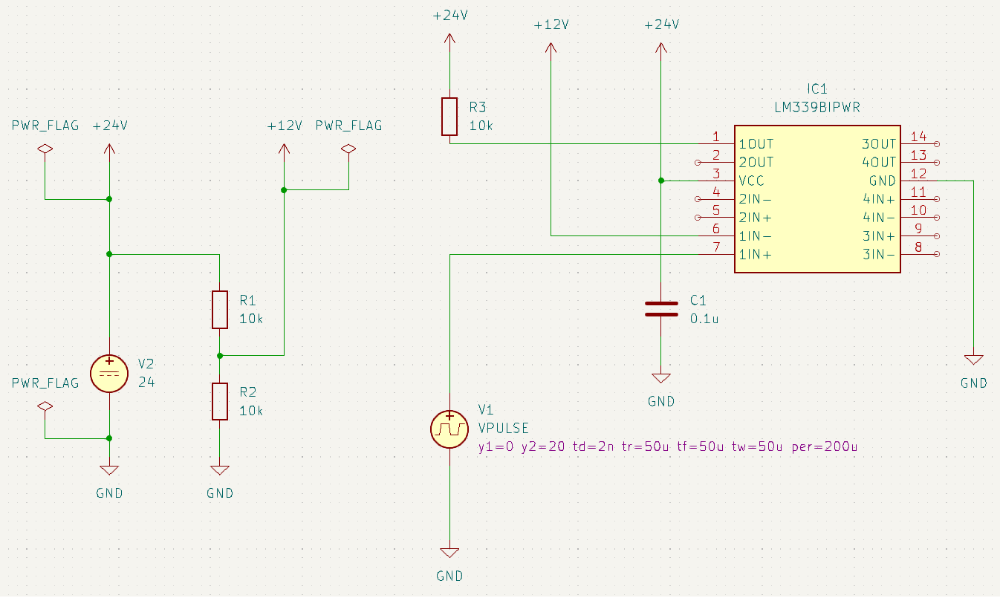

## Spiceモデルをダウンロード

ICメーカーのページを確認し、Spiceモデルをダウンロードします。  
例えば今回使用したコンパレータICは以下です。  

[LM339B 36V、-40℃ ～ 85℃、クワッド、標準コンパレータ](https://www.ti.com/product/ja-jp/LM339B)

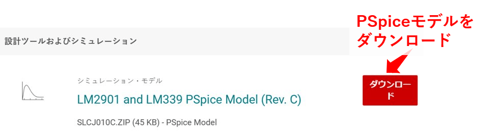

## 回路シンボルにSpiceモデルを登録

まず、先ほどダウンロードしたモデルを、プロジェクトのフォルダにコピーします。  

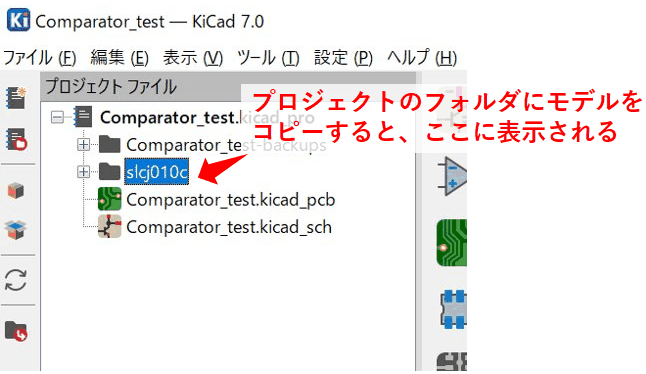
  

回路図上でICのシンボルのプロパティを開き、「シミュレーションモデル」をクリックします。    

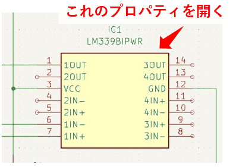

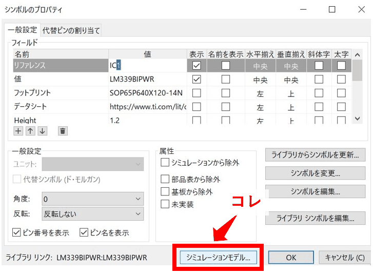

  

「ファイルからSPICEモデルを読み込む」をチェックし、Spiceモデルのフォルダの中にある「.lib」ファイルを選択します。  
その後、使用するモデルを選択します。  

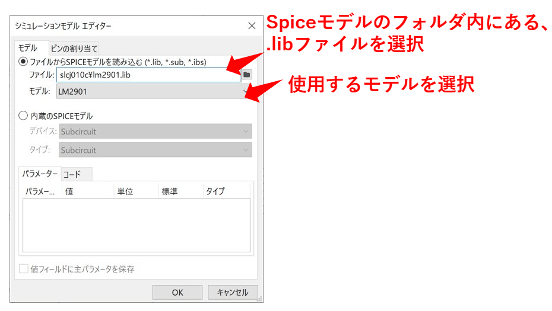
  

同じウィンドウで、「ピンの割り当て」タブを選択して、モデルのピンを設定します。  

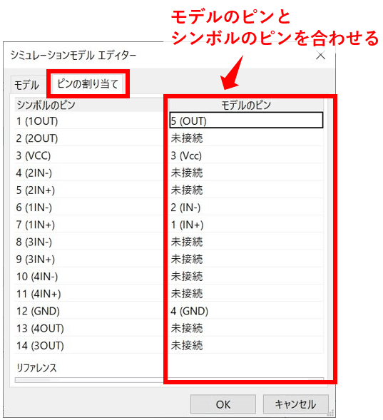
  

これで、シンボルとSpiceモデルの紐づけが完了です。  

## 入力信号の設定

回路図上で、VPULSEのプロパティを開き、「シミュレーションモデル」をクリックします。  
（VPULSEは出力電圧を経過時間によって変化させられる、シミュレーション用の電圧ソースです。）  

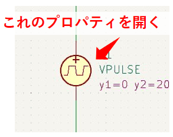

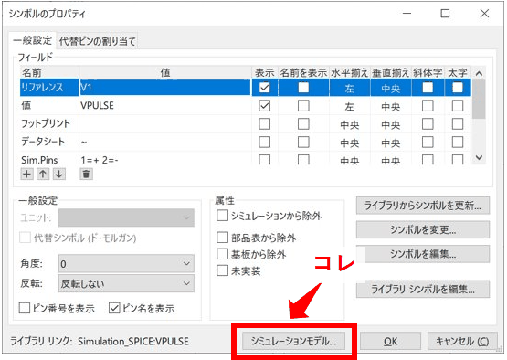

  

VPULSEの設定をします。  
ここでは、400us周期、立上がりと立下りが100us、0-20Vの矩形波としています。  
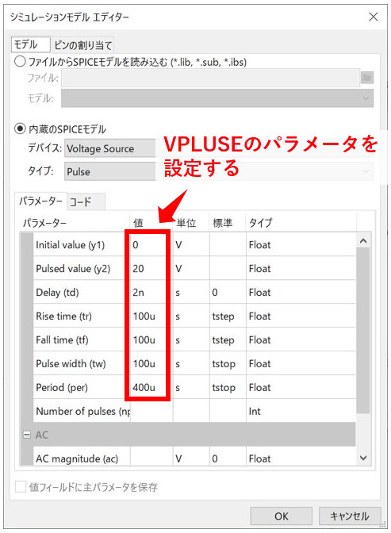

## シミュレーションの実行

回路図で上のタブの「検査」→「シミュレータ」をクリックします。  

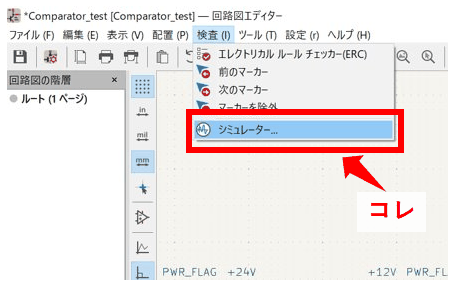
  

「コマンド」をクリックして、シミュレーションコマンドを設定します。  
ここでは、過渡応答（時間経過による変化）のシミュレーションを実施します。  

時間ステップは、シミュレーション時間全体に対して細かすぎると実行に時間がかかるので、注意が必要です。  
互換モードは「PSpiceとLTSpice」を設定しておけば、大抵のケースに対応可能です。 

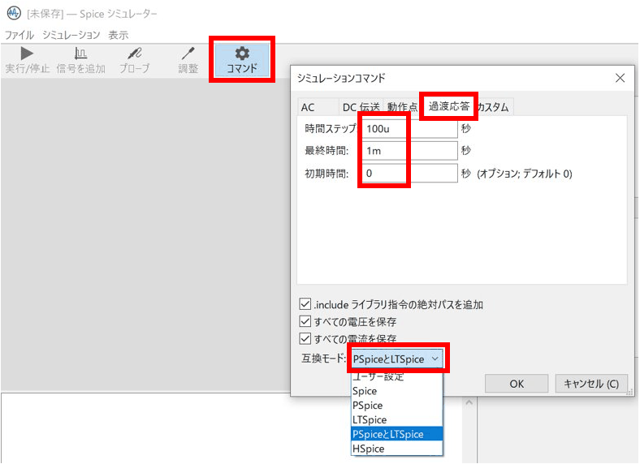
  

「実行/停止」をクリックします。  

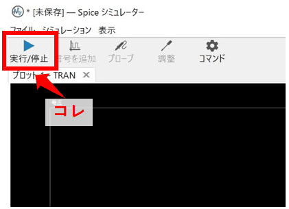
  

シミュレーションの実行が終わったら、「プローブ」をクリックし、電圧波形が見たいラインをクリックします。    
今回は、コンパレータICの入力、出力、基準電圧を見ています。  

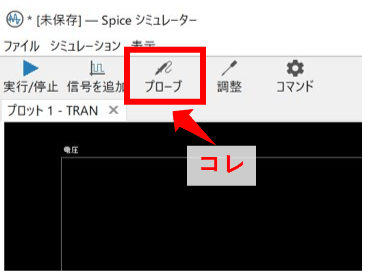

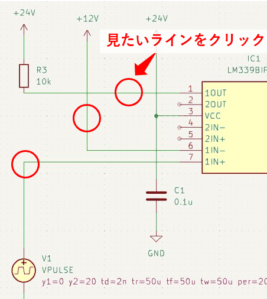

  

そうすると、各ラインのシミュレーション結果をみることができます。  
コンパレータICが正常に動作していることが確認できました。  

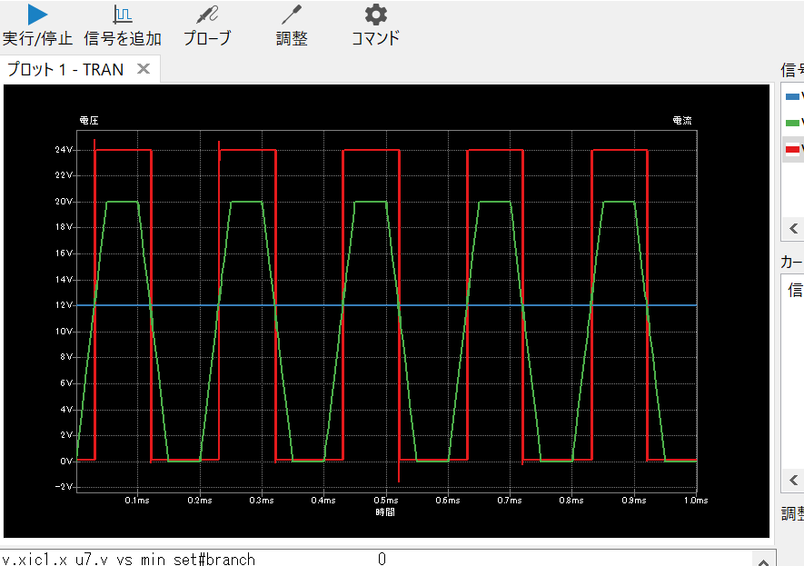

  

以上です。

 
 

---