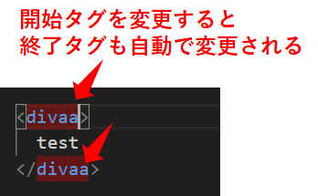
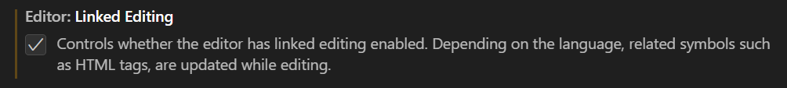

Title: VSCodeのおすすめ設定
Tag: おすすめ VSCode 設定
Date: 2023/5/8
description: VSCodeのおすすめ設定を紹介します。
IndexTitle: 便利なお勧め設定一覧
---

2023/05/08

# VSCodeのおすすめ設定

---

VSCodeには様々な設定があります。  
便利な機能にも関わらずデフォルトでOFFになっているものもあるので、ONにしたほうが良いものを紹介していきます。  
（まだ数が少ないですが、随時追加していきます。）  

## Linked Editing

HTMLのタグの、開始タグと終了タグをリンクさせます。  
片方を変更するともう片方も自動で変更されるようになります。  

  

設定方法は、VSCodeの設定画面を開き"Linked Editing"にチェックを入れます。  

## format on save

作成中。。

## activate Env In Current Terminal

作成中。。

 

以上です。

 
 

---