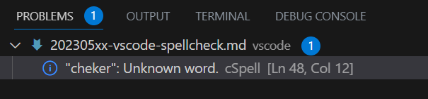

Title: VSCodeの拡張機能「Code Spell Checker」を使う
Tag: Code Spell Checker
Date: 2023/5/12
description: 英単語のスペルチェックを自動で行う「Code Spell Checker」のまとめです。
IndexTitle: 英単語のスペルチェック
---

2023/05/12

# VSCodeの拡張機能「Code Spell Checker」を使う

---

VSCodeに「Code Spell Checker」を導入すると、英単語のスペルミスを防ぐことができます。  

* スペルミスを波線で指摘し、正解候補を表示してくれます。
* スペルチェックのルールはカスタマイズ可能です。
* キャメルケース(testWord)、スネークケース(test_word)にも対応しています。
* ハンガリアン記法(testword)も設定すれば対応可能です。
* 英語以外の言語に対応するための拡張パックも準備されています。

<a href="https://marketplace.visualstudio.com/items?itemName=streetsidesoftware.code-spell-checker" style="text-decoration: none;">
<div class="link-box"><div class="img-box"><div style="background-image: url('https://streetsidesoftware.gallerycdn.vsassets.io/extensions/streetsidesoftware/code-spell-checker/2.20.4/1680519931370/Microsoft.VisualStudio.Services.Icons.Default');"></div></div><div class="text-box"><p class="title">Code Spell Checker - Visual Studio Marketplace</p><p class="description">Extension for Visual Studio Code - Spelling checker for source code</p></div></div>
</a>

## 使い方

インストールするだけでOKです。  
スペルミスを以下のように波線で知らせてくれます。  

  

問題タブにもスペルミスが表示されます。  

  

また、正解候補の表示もしてくれます。  
スペルミスの箇所にカーソルを置いてQuick Fixをクリック、もしくは電球マークをクリックします。  


## 設定

チェックルールの設定方法を紹介します。  
自分用の設定をして使いやすくしたり、ルールをチームで共有したりすることができます。  

### 設定ファイルでの設定

code spell checkerの設定ファイルは3つあります。  
以下の数字は優先順位になっています。  

1. 　作業フォルダに「cspell.json」を作成して設定
2. 　VSCodeのWorkspace Settingsで設定
3. 　VSCodeのUser Settingsで設定

1は自分でファイルを作成します。  
2と3は自分でファイルを編集するほかに、VSCodeの設定画面もしくは右クリックメニューからも編集できます。  

<br>

#### ■cspell.jsonを作成して設定

jsonファイル形式で記述します。  
よく使いそうな設定を下記にリストアップしました。  

| 設定                | 説明                                                                                                                       |
| ------------------- | -------------------------------------------------------------------------------------------------------------------------- |
| words               | 単語を辞書登録します、正解候補にも表示されます                                                                             |
| ignoreWords         | 単語をスペルチェック対象からはずします                                                                                     |
| flagWords           | 指定単語を強制的にエラーにします                                                                                           |
| allowCompoundWords  | ハンガリアン記法に対応します（"spellcheck"などのハンガリアン記法で記述した単語は通常エラーとなるが、エラーにならなくなる） |
| ignorePaths         | チェック対象外にするファイルのパスを指定します                                                                             |
| maxNumberOfProblems | スペルミスを表示する数のMAX値を指定します                                                                                  |
| minWordLength       | スペルチェックする英単語の最低アルファベット数を指定します、デフォルトは4です                                              |

例えば、以下のように使用します。

```json
{
    "words": [
        "aiueo"
    ],
    "ignoreWords": [
        "testword"
    ],
    "flagWords": [
        "spellCheck"
    ],
    "allowCompoundWords": true,
    "ignorePaths": [
        "xxxxxx/**"
    ],
    "maxNumberOfProblems": 4,
    "minWordLength": 7
}
```

その他の項目は下記を参照ください。  

<a href="https://github.com/streetsidesoftware/vscode-spell-checker/blob/main/docs/_includes/generated-docs/configuration.md" style="text-decoration: none;">
<div class="link-box"><div class="img-box"><div style="background-image: url('https://opengraph.githubassets.com/14ee129f5621dfd4be0874b726e8076c6b010b8475cf6b500676812bb59d15b3/streetsidesoftware/vscode-spell-checker');"></div></div><div class="text-box"><p class="title">vscode-spell-checker/configuration.md at main · streetsidesoftware/vscode-spell-checker</p><p class="description">A simple source code spell checker for code. Contribute to streetsidesoftware/vscode-spell-checker development by creating an account on GitHub.</p></div></div>
</a>

#### ■VSCodeの設定画面から設定

VSCode上の拡張機能の設定画面で、Workspace SettingsおよびUser Settingsの各設定が可能です。  


設定可能な項目は上記のcspell.jsonと同じです。  

#### ■右クリックで設定

エラーになった単語にカーソルを合わせて右クリックでメニューを開いて、単語の辞書登録をすることができます。  


* Add Words to WorkSpace Settings / User Settings：  
  　選択した単語をWorkSpaceまたはUserのSettings.jsonファイルに登録します。
* Add All Spelling Issues to Dictionary：  
  　エラーになっている全単語をWorkSpaceのSettings.jsonファイルに登録します。
* Ignore Words：  
  　選択した単語の無視設定をWorkSpaceまたはUserのSettings.jsonファイルに登録します。

また、ショートカットでも辞書登録可能です。  

* Mac:　⌘+. or Cmd+"."
* Windows:　Ctrl+"."

### コード内で設定

「cSpell:xxxxx」をコメントアウトでコード内に記述することでルール設定ができます。  
xxxxxのところに以下の設定欄の単語を入れます。  
コード内に埋め込むのはイマイチかと思いますが。。

| 設定                | 説明                                                                      |
| ------------------- | ------------------------------------------------------------------------- |
| disable             | この記述以降のスペルチェック機能をOFFにします                             |
| enable              | この記述以降のスペルチェック機能をONにします、disableとセットで使用します |
| disable-next-line   | この記述の次のラインのスペルチェック機能をOFFにします                     |
| ignore zzzzz        | "zzzzz"をスペルチェックからはずします                                     |
| flag zzzzz          | "zzzzz"を強制的にエラーにします                                           |
| words zzzzz         | "zzzzz"を辞書登録します、正解候補にも表示されます                         |
| enableCompoundWords | ハンガリアン記法に対応します                                              |


例えば、以下のように使用します。

```c
/* cSpell:disable */
spell chek    ←これはチェックされない
/* cSpell:enable */
```

<br>

以上です。

<br>
<br>

---

