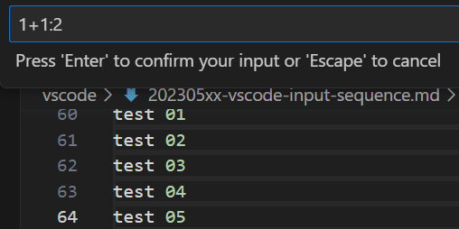
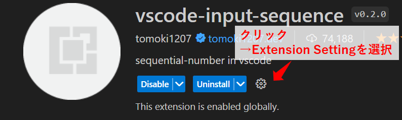
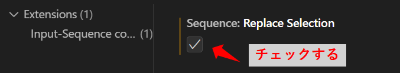

Title: VSCodeの拡張機能「vscode-input-sequence」を使う
Tag: vscode-input-sequence
Date: 2023/5/15
description: 連番挿入ができる「vscode-input-sequence」のまとめです。
IndexTitle: 連番の挿入
---

2023/05/15

# VSCodeの拡張機能「vscode-input-sequence」を使う

---

「vscode-input-sequence」は、文章やソースコードに連番を追加できる拡張機能です。  

* 連番入力のスタートと、増減させるステップの数値を指定できます。
* 連番の演算（＋かー）を指定できます。
* 桁数を指定できます。
* 基数（10進数、2進数など）を指定できます。

<a href="https://marketplace.visualstudio.com/items?itemName=tomoki1207.vscode-input-sequence" style="text-decoration: none;">

vscode-input-sequence - Visual Studio Marketplace

Extension for Visual Studio Code - sequential-number in vscode

</a>

## 使い方  

以下の手順で、連番を追加できます。  

1. 複数選択をする（Alt押しながら選択で複数選択、もしくはShift + Alt同時押しで矩形選択）
2. Ctrl + Alt + 0 を押す
3. 連番設定を入力する

連番設定は以下のフォーマットになっています。  

\<start> \<operator> \<step> : \<digit> : \<radix> 

| 設定     | 説明                                           |
| -------- | ---------------------------------------------- |
| start    | 開始する数です。                               |
| operator | 演算子です。+もしくは-を指定します。           |
| step     | 増減させる数値です。                           |
| digit    | 数字の桁数です。                               |
| radix    | 基数です。2とすると、2進数で数を表示させます。 |

  ※start以外の値は省略可

例）
1+1:2　　1から1ずつカウントアップ、桁数2

1+2:4:2　　1から2ずつカウントアップ、桁数4、2進数

## 設定

長らくメンテナンスされておらず、バグがあるようです。  
回避するために、Replace Selectionの設定をONにする必要があります。    

  

参考  

<a href="https://github.com/tomoki1207/vscode-input-sequence/issues/15" style="text-decoration: none;">

recently,it is repeated for each character entered · Issue #15 · tomoki1207/vscode-input-sequence

</a>

 
 

以上です。

 
 

---