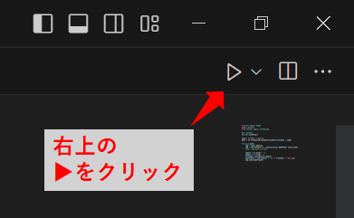
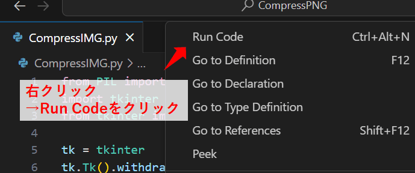
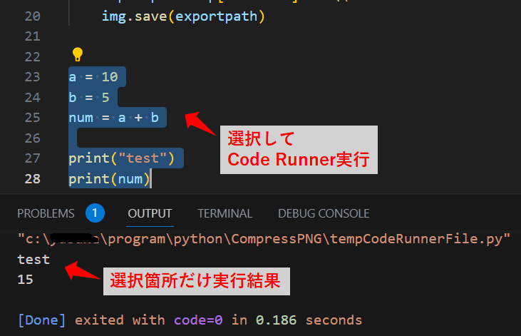
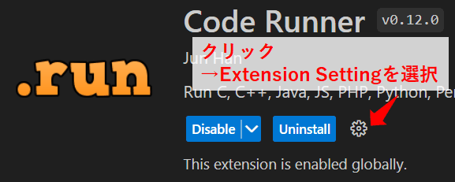

Title: VSCodeの拡張機能「Code Runner」を使う
Tag: Code Runner
Date: 2023/5/26
description: プログラムをお手軽に実行できる「Code Runner」のまとめです。
IndexTitle: プログラムのお手軽実行
---

2023/05/26

# VSCodeの拡張機能「Code Runner」を使う

---

「Code Runner」は、プログラムをお手軽に実行できる拡張機能です。  

* ワンクリックでプログラムを実行できます。
* 選択箇所だけの部分実行が可能です。
* 対応しているプログラム言語が豊富で、ほぼ全ての言語で実行できます。  

<a href="https://marketplace.visualstudio.com/items?itemName=formulahendry.code-runner" style="text-decoration: none;">
<div class="link-box"><div class="img-box"><div style="background-image: url('https://formulahendry.gallerycdn.vsassets.io/extensions/formulahendry/code-runner/0.12.0/1674458451597/Microsoft.VisualStudio.Services.Icons.Default');"></div></div><div class="text-box"><p class="title">Code Runner - Visual Studio Marketplace</p><p class="description">Extension for Visual Studio Code - Run C, C++, Java, JS, PHP, Python, Perl, Ruby, Go, Lua, Groovy, PowerShell, CMD, BASH, F#, C#, VBScript, TypeScript, CoffeeScript, Scala, Swift, Julia, Crystal, OCaml, R, AppleScript, Elixir, VB.NET, Clojure, Haxe, Obj-C, Rust, Racket, Scheme, AutoHotkey, AutoIt, Kotlin, Dart, Pascal, Haskell, Nim,</p></div></div>
</a>

## 使い方  

プログラムの実行方法は何通りかあります。  

* CTRL + ALT + N を押す。
* 右上の▶ボタンをクリックする。  
* 右クリック → Run Codeを選択。

<br><br>

<br><br>


何も選択していなければ全体を実行、選択していれば選択箇所のみ実行されます。  
下の画像は選択箇所のみ実行したときのものです。  

<br><br>


## 設定

設定しておいた方が良い項目をまとめておきます。  
設定はVSCode上の拡張機能の画面からできます。  

<br><br>

### code-runner.executorMap

各言語の実行コマンドを設定できます。  
pythonを使用する場合、デフォルトでは仮想環境での実行に対応していないので、pythonの項目を下記のようにします。  

```json
"code-runner.executorMap": 
{
    "python" : "$pythonPath -u $fullFileName"
},
```

* $pythonPath：  
  pythonのパスです。  
* $fullFileName：  
  現在開いているファイル名です。  

また、select interpreter で、実行する仮想環境を指定する必要があります。  
F1 → 「python: select interpreter」を選択して指定するか、VSCodeのフッター右下のpythonバージョンが書いてあるをクリックして指定できます。  

### code-runner.runInTerminal

プログラムをターミナルで実行するかどうかを設定します。  
デフォルトではfalse（ターミナル未使用）になっています。  
標準入力など使用する場合はターミナルの方が都合がよいので、trueにしておきます。  

```json
"code-runner.runInTerminal": true
```

<br>

以上です。

<br>
<br>

---