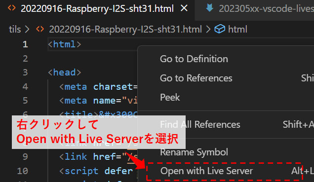
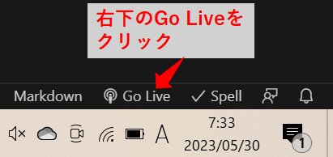
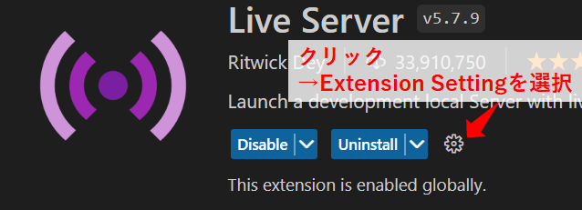

Title: VSCodeの拡張機能「Live Server」を使う
Tag: Live Server
Date: 2023/6/9
description: HTML/CSS/JavaScriptのプログラミングに便利な拡張機能「Live Server」のまとめです。
IndexTitle: local server簡単立ち上げ
---

2023/06/09

# VSCodeの拡張機能「Live Server」を使う

---

VSCodeでHTML/CSS/JavaScriptのプログラミングをする際には、拡張機能「Live Server」を導入すると便利です。  

* ワンクリックでローカルサーバを立ち上げ、ページの表示ができます。  
* 相対パスで指定したimage、CSSなどの反映ができます。  
* ホットリロードに対応しており、元ファイルを変更して保存すると、表示中のページもすぐに変更が反映されます。  
* ホストのアドレスやポート番号、デフォルトブラウザ等の設定ができます。
* 同一ネットワーク内の他のデバイス（携帯など）からもページへアクセスできます。

<a href="https://marketplace.visualstudio.com/items?itemName=ritwickdey.LiveServer" style="text-decoration: none;">

Live Server - Visual Studio Marketplace

Extension for Visual Studio Code - Launch a development local Server with live reload feature for static & dynamic pages

</a>

## 使い方

まず、VSCodeで表示したいファイル群のあるフォルダを開きます。  
Live Serverの実行方法は何通りかあります。  

* ALT+L ⇒ ALT+O
* 右クリックし、「Open with Live Server」を選択
* 右下のステータスバー上の「Go Live」をクリック

 

  

## 設定

VSCode上の、拡張機能の画面で各種設定が可能です。  

各設定の詳細は、github上に説明があります。  

<a href="https://github.com/ritwickdey/vscode-live-server/blob/428e01caf02bfa7ee75741df0f02fc9d2b5b0999/docs/settings.md" style="text-decoration: none;">

vscode-live-server/settings.md · ritwickdey/vscode-live-server

Launch a development local Server with live reload feature for static & dynamic pages.

</a>

使いそうなものを以下にリストアップしました。  

| 設定  | 説明 |
| ---- | ---- |
| port | 使用するポート設定ができます。デフォルトは5500です。0にするとランダムになります。
| root | 表示ページのrootパスを設定できます。デフォルトはworkspace直下になっています("/")。
| CustomBrowser | 実行時に使用するブラウザを指定できます。
| proxy | プロキシの設定ができます。
| fullReload | CSS変更時にページ全体を再読み込みするかどうかを設定できます。デフォルトはOFFです。
| useLocalIp | アドレス表示をlocal IPにします。

 

以上です。

 
 

---